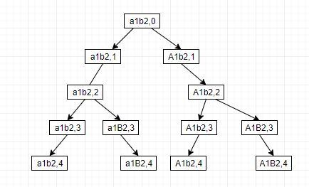

# 784. Letter Case Permutation
<https://leetcode.com/problems/letter-case-permutation/>
Easy

Given a string S, we can transform every letter individually to be lowercase or uppercase to create another string.  Return a list of all possible strings we could create.

    Examples:
    Input: S = "a1b2"
    Output: ["a1b2", "a1B2", "A1b2", "A1B2"]

    Input: S = "3z4"
    Output: ["3z4", "3Z4"]

    Input: S = "12345"
    Output: ["12345"]

Note:

    * S will be a string with length between 1 and 12.
    * S will consist only of letters or digits.

Related Topics: Backtracking; Bit Manipulation

Similar Questions: 
* Medium [Subsets](https://leetcode.com/problems/subsets/)
* Medium [Brace Expansion](https://leetcode.com/problems/brace-expansion/)


### DFS Backtracking Solution: 
Backtracking解法。递归函数中用index表示要处理的位置，如果index == charArr.length, 那么index到S尾，把charArr存入结果列表 resList。否则检查当前位是否是字母，是的话转成小写，调用递归找到当前字母是小写的其他组合。然后把当前字母改回大写，调用递归找到当前字母是大写的其他组合。
Example: S="a1b2"
Recursion Tree:


```java
class Solution {
    public List<String> letterCasePermutation(String S) {
        List<String> ansList = new ArrayList();
        backtrack(ansList, S.toCharArray(), 0);
        return ansList;
    }
    
    public void backtrack(List<String> ansList, char[] charArr, int index){
        if(index == charArr.length){
            ansList.add(new String(charArr));
            return;
        }
        if(Character.isLetter(charArr[index])){
            charArr[index] = Character.toLowerCase(charArr[index]);
            backtrack(ansList, charArr, index+1);
            charArr[index] = Character.toUpperCase(charArr[index]);
        }
        backtrack(ansList, charArr, index+1);
    }
}
```


### BFS Solution: 
把S作为初始存入结果ans。然后循环遍历S的字符，用i记录当前为止,如果不是字母就跳过。否则更新之前的所有组合，把组合中i位的字符转换大小写并存入结果中。

Example: a1b2c3
"a1b2c3" ............................................................................................................. <= initialization
"a1b2c3" {"A1b2c3"}................................................................................................... <= i = 0, a toggled to A
"a1b2c3" "A1b2c3"..................................................................................................... <= i = 1, ignore '1', which is a digit,
"a1b2c3" "A1b2c3"{"a1B2" "A1B2"c3}.................................................................................... <= i = 2, b toggled to B
"a1b2c3" "A1b2c3" "a1B2c3" "A1B2c3"................................................................................... <= i = 3, ignore '2', which is a digit,
"a1b2c3" "A1b2c3" "a1B2c3" "A1B2c3"{"a1b2C3" "A1b2C3" "a1B2C3" "A1B2C3"}.............................................. <= i = 4, c toggled to C
"a1b2c3" "A1b2c3" "a1B2c3" "A1B2c3" "a1b2C3" "A1b2C3" "a1B2C3" "A1B2C3"............................................... <= i = 5, ignore 3, which is a digit.


```java
class Solution {
    public List<String> letterCasePermutation(String S) {
        List<String> ans = new ArrayList<>(Arrays.asList(S));
        for (int i = 0; i < S.length(); ++i) { // Traverse string S char by char.
            if(!Character.isLetter(S.charAt(i))) continue;// S.charAt(i): letter, not digit.
            for (int j = 0, sz = ans.size(); j < sz; ++j) { //update all previous combinations.
                char[] ch = ans.get(j).toCharArray(); // transform to char[] the string @ j of ans.
                ch[i] ^= (1 << 5); // toggle case of charAt(i). 
                ans.add(String.valueOf(ch)); // append to the end of ans.
            }
        }
        return ans;
    }
}
```