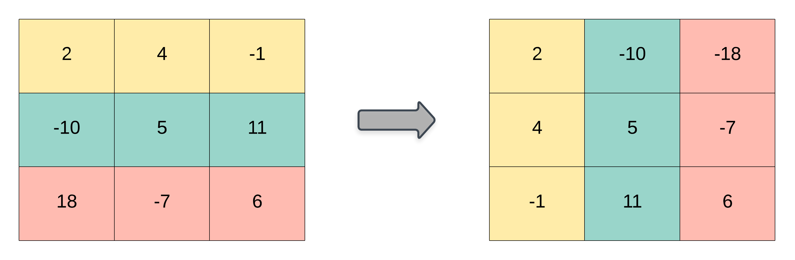

# 867. Transpose Matrix
<https://leetcode.com/problems/transpose-matrix/>
Easy

Given a matrix A, return the transpose of A.

The transpose of a matrix is the matrix flipped over it's main diagonal, switching the row and column indices of the matrix.



Example 1:

    Input: [[1,2,3],[4,5,6],[7,8,9]]
    Output: [[1,4,7],[2,5,8],[3,6,9]]
Example 2:

    Input: [[1,2,3],[4,5,6]]
    Output: [[1,4],[2,5],[3,6]]

Note:

    1. 1 <= A.length <= 1000
    2. 1 <= A[0].length <= 1000


Related Topics: Array


### Solution: 
题目要求对矩阵转置。就是把 mxn 的矩阵变为 nxm 的，并且原本在 A[i][j] 位置的数字变到 A[j][i] 上即可。而且由于此题又限定了矩阵的大小范围为 [1, 1000]，所以不存在空矩阵的情况，因而不用开始时对矩阵进行判空处理，直接去获取矩阵的宽和高即可。又因为之前说了转置会翻转原矩阵的宽和高，所以我们新建一个 nxm 的矩阵，然后遍历原矩阵中的每个数，将他们赋值到新矩阵中对应的位置上即可。

```java
class Solution {
    public int[][] transpose(int[][] A) {
        int[][] res = new int[A[0].length][A.length];
        for(int i = 0; i<A.length; i++){
            for(int j = 0; j<A[0].length; j++){
                res[j][i] = A[i][j];
            }
        }
        return res;
    }
}
```