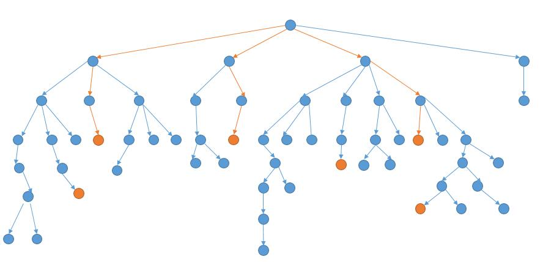
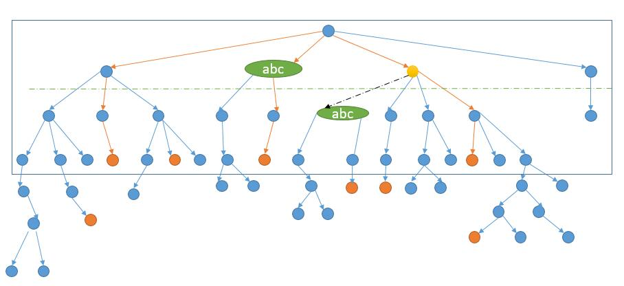
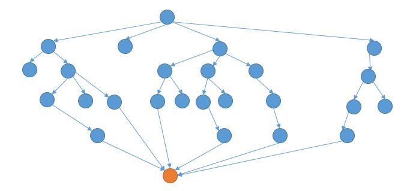
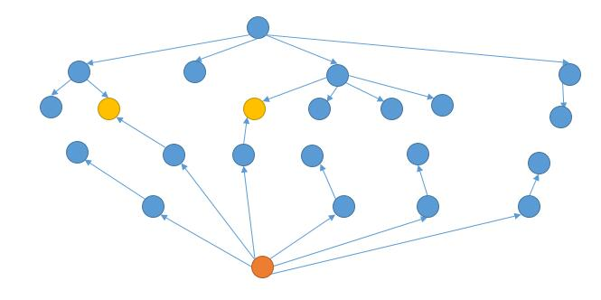

# 126. Word Ladder II
<https://leetcode.com/problems/word-ladder-ii/>
Hard


Given two words (beginWord and endWord), and a dictionary's word list, find all shortest transformation sequence(s) from beginWord to endWord, such that:

Only one letter can be changed at a time
Each transformed word must exist in the word list. Note that beginWord is not a transformed word.

**Note:**

    * Return an empty list if there is no such transformation sequence.
    * All words have the same length.
    * All words contain only lowercase alphabetic characters.
    * You may assume no duplicates in the word list.
    * You may assume beginWord and endWord are non-empty and are not the same.

**Example 1:**

    Input:
    beginWord = "hit",
    endWord = "cog",
    wordList = ["hot","dot","dog","lot","log","cog"]

    Output:
    [
        ["hit","hot","dot","dog","cog"],
        ["hit","hot","lot","log","cog"]
    ]

**Example 2:**

    Input:
    beginWord = "hit"
    endWord = "cog"
    wordList = ["hot","dot","dog","lot","log"]

    Output: []

    Explanation: The endWord "cog" is not in wordList, therefore no possible transformation.

Related Topics: Array; String; Backtracking; Breadth-first Search

Similar Questions: 
* Medium [Word Ladder](https://leetcode.com/problems/word-ladder/)


### Question Explanation:
https://leetcode.wang/leetCode-126-Word-LadderII.html
如果我们从开始的单词，把与之能够转换的单词连起来，它就会长成下边的样子。

橙色表示结束单词，上图橙色的路线就是我们要找的最短路径。所以我们要做的其实就是遍历上边的树，然后判断当前节点是不是结束单词，找到结束单词后，还要判断当前是不是最短的路径。说到遍历当然就是两种思路了，DFS 或者 BFS。


### DFS Solution: 
要找到最短路径，首先要解决的问题是怎么找到节点的所有孩子节点: 将要找的节点单词的每个位置换一个字符，然后看更改后的单词在不在 wordList 中。然后解决找到的是最短的路径，需要一个全局变量来保存当前找到的路径的长度。如果找到的新的路径的长度比之前的路径短，就把之前的结果清空，重新找，如果是最小的长度，就加入到结果中。

这要会TLE，需要优化：
- DFS 的过程的话，结合上图，就是先考虑了最左边的路径，然后再回溯一下，继续到达底部。然后回溯回溯，终于到了一条含有结束单词的路径，然而事实上这条并不是最短路径。综上，我们会多判断很多无用的路径。如果我们事先知道了最短路径长度是 4，那么我们只需要考虑前 4 层就足够了。怎么知道结束单词在哪一层呢？只能一层层的找了，也就是 BFS。此外，因为上图需要搜索的树提前是没有的，我们需要边找边更新这个树。而在 DFS 中，我们也需要这个树，其实就是需要每个节点的所有相邻节点。所以我们在 BFS 中，就把每个节点的所有相邻节点保存到 HashMap 中，就省去了 DFS 再去找相邻节点的时间。此外，BFS 的过程中，把最短路径的高度用 min 也记录下来，在 DFS 的时候到达高度后就可以提前结束。
- 
  假如我们在考虑上图中黄色节点的相邻节点，发现第三层的 abc 在第二层已经考虑过了。所以第三层的 abc 其实不用再考虑了，第三层的 abc 后边的结构一定和第二层后边的结构一样，因为我们要找最短的路径，所以如果产生了最短路径，一定是第二层的 abc 首先达到结束单词。所以其实我们在考虑第 k 层的某一个单词，如果这个单词在第 1 到 k-1 层已经出现过，我们其实就不过继续向下探索了。
  在之前的代码中，我们其实已经考虑了部分这个问题。
  ```java
    if (temp.contains(neighbor)) {
        continue;
    }
  ```
  但我们只考虑了当前路径是否含有该单词，而就像上图表示的，其他路径之前已经考虑过了当前单词，我们也是可以跳过的。根据这个优化思路，有两种解决方案:
  - 第一种，再利用一个 HashMap，记为 distance 变量。在 BFS 的过程中，把第一次遇到的单词当前的层数存起来。之后遇到也不进行更新。
    
    这样我们就可以在 DFS 的时候来判断当前黄色的节点的 distance 是不是比邻接节点的小 1。上图中 distance 都是 1 ，所以不符合，就可以跳过。
  - 在 DFS 中，因为我们每次都根据节点的层数来进行深搜，所以之前保存最短路径的全局变量 min 在这里也就不需要了。

```java
class Solution {
    public List<List<String>> findLadders(String beginWord, String endWord, List<String> wordList) {
        List<List<String>> ans = new ArrayList<>();
        if (!wordList.contains(endWord)) {
            return ans;
        }
        // 利用 BFS 得到所有的邻居节点
        HashMap<String, ArrayList<String>> map = new HashMap<>();
        bfs(beginWord, endWord, wordList, map);
        ArrayList<String> temp = new ArrayList<String>();
        // temp 用来保存当前的路径
        temp.add(beginWord);
        dfs(beginWord, endWord, map, temp, ans);
        return ans;
    }

    private void dfs(String beginWord, String endWord, HashMap<String, ArrayList<String>> map,
                                   ArrayList<String> temp, List<List<String>> ans) {
        if (beginWord.equals(endWord)) {
            ans.add(new ArrayList<String>(temp));
            return;
        }
        // 得到所有的下一个的节点
        ArrayList<String> neighbors = map.getOrDefault(beginWord, new ArrayList<String>());
        for (String neighbor : neighbors) {
            temp.add(neighbor);
            dfs(neighbor, endWord, map, temp, ans);
            temp.remove(temp.size() - 1);

        }
    }

    public void bfs(String beginWord, String endWord, List<String> wordList, HashMap<String, ArrayList<String>> map) {
        Queue<String> queue = new LinkedList<>();
        queue.offer(beginWord);
        boolean isFound = false;
        int depth = 0;
        Set<String> dict = new HashSet<>(wordList);
        Set<String> visited = new HashSet<>();
        visited.add(beginWord);
        while (!queue.isEmpty()) {
            int size = queue.size();
            depth++;
            Set<String> subVisited = new HashSet<>();
            for (int j = 0; j < size; j++) {
                String temp = queue.poll();
                // 一次性得到所有的下一个的节点
                ArrayList<String> neighbors = getNeighbors(temp, dict); 
                Iterator<String> it = neighbors.iterator();//把元素导入迭代器
                while (it.hasNext()) {
                    String neighbor = it.next();
                    if (!visited.contains(neighbor)) {
                        if (neighbor.equals(endWord)) {
                            isFound = true;
                        }
                        queue.offer(neighbor);
                        subVisited.add(neighbor);
                    }else{
                        it.remove();
                    } 
                }
                map.put(temp, neighbors);
            }
            visited.addAll(subVisited);
            if (isFound) {
                break;
            }
        }
    }

    private ArrayList<String> getNeighbors(String node, Set<String> dict) {
        ArrayList<String> res = new ArrayList<String>();
        char chs[] = node.toCharArray();

        for (char ch = 'a'; ch <= 'z'; ch++) {
            for (int i = 0; i < chs.length; i++) {
                if (chs[i] == ch)
                    continue;
                char old_ch = chs[i];
                chs[i] = ch;
                if (dict.contains(String.valueOf(chs))) {
                    res.add(String.valueOf(chs));
                }
                chs[i] = old_ch;
            }

        }
        return res;
    }
}
```

### BFS Solution: 
DFS 解法借助了 BFS 把所有的邻接关系保存了起来，再用 DFS 进行深度搜索。我们可以只用 BFS，一边进行层次遍历，一边就保存结果。当到达结束单词的时候，就把结果存储。省去再进行 DFS 的过程。是完全可以的，BFS 的队列就不去存储 String 了，直接去存到目前为止的路径，也就是一个 List。

大概思路如下：目的是找出所有的路径，这里建立一个路径集 paths，用以保存所有路径，然后是起始路径p，在p中先把起始单词放进去。然后定义两个整型变量 level，和 minLevel，其中 level 是记录循环中当前路径的长度，minLevel 是记录最短路径的长度，这样的好处是，如果某条路径的长度超过了已有的最短路径的长度，那么舍弃，这样会提高运行速度，相当于一种剪枝。还要定义一个 HashSet 变量 words，用来记录已经循环过的路径中的词，然后就是 BFS 的核心了，循环路径集 paths 里的内容，取出队首路径，如果该路径长度大于 level，说明字典中的有些词已经存入路径了，如果在路径中重复出现，则肯定不是最短路径，所以需要在字典中将这些词删去，然后将 words 清空，对循环对剪枝处理。然后取出当前路径的最后一个词，对每个字母进行替换并在字典中查找是否存在替换后的新词，这个过程在之前那道 Word Ladder 里面也有。如果替换后的新词在字典中存在，将其加入 words 中，并在原有路径的基础上加上这个新词生成一条新路径，如果这个新词就是结束词，则此新路径为一条完整的路径，加入结果中，并更新 minLevel，若不是结束词，则将新路径加入路径集中继续循环。
```java
class Solution {
    
    public List<List<String>> findLadders(String beginWord, String endWord, List<String> wordList) {
        List<List<String>> ans = new ArrayList<>();
        // 如果不含有结束单词，直接结束，不然后边会造成死循环
        if (!wordList.contains(endWord)) {
            return ans;
        }
        bfs(beginWord, endWord, wordList, ans);
        return ans;
    }
    public void bfs(String beginWord, String endWord, List<String> wordList, List<List<String>> ans) {
        
        Queue<List<String>> queue = new LinkedList<>();
        List<String> path = new ArrayList<>();
        path.add(beginWord);
        queue.offer(path);
        boolean isFound = false;
        Set<String> dict = new HashSet<>(wordList);
        Set<String> visited = new HashSet<>();
        visited.add(beginWord);
        while (!queue.isEmpty()) {
            int size = queue.size();
            Set<String> subVisited = new HashSet<>();
            for (int j = 0; j < size; j++) {
                List<String> p = queue.poll();
                //得到当前路径的末尾单词
                String temp = p.get(p.size() - 1);
                // 一次性得到所有的下一个的节点
                ArrayList<String> neighbors = getNeighbors(temp, dict);
                for (String neighbor : neighbors) {
                    //只考虑之前没有出现过的单词
                    if (!visited.contains(neighbor)) {
                        //到达结束单词
                        if (neighbor.equals(endWord)) {
                            isFound = true;
                            p.add(neighbor);
                            ans.add(new ArrayList<String>(p));
                            p.remove(p.size() - 1);
                        }
                        //加入当前单词
                        p.add(neighbor);
                        queue.offer(new ArrayList<String>(p));
                        p.remove(p.size() - 1);
                        subVisited.add(neighbor);
                    }
                }
            }
            visited.addAll(subVisited);
            if (isFound) {
                break;
            }
        }
    }

    private ArrayList<String> getNeighbors(String node, Set<String> dict) {
        ArrayList<String> res = new ArrayList<String>();
        char chs[] = node.toCharArray();
        for (char ch = 'a'; ch <= 'z'; ch++) {
            for (int i = 0; i < chs.length; i++) {
                if (chs[i] == ch)
                    continue;
                char old_ch = chs[i];
                chs[i] = ch;
                if (dict.contains(String.valueOf(chs))) {
                    res.add(String.valueOf(chs));
                }
                chs[i] = old_ch;
            }

        }
        return res;
    }
}
```


### DFS + BFS Two End Search（two-end BFS） Solution: 
DFS 解法中，我们利用了 BFS 建立了每个节点的邻居节点。在之前的示意图中，我们把同一个字符串也画在了不同节点。这里把同一个节点画在一起，再看一下。

我们可以从结束单词反向进行BFS: 

这样的话，当两个方向产生了共同的节点，就是我们的最短路径了。至于每次从哪个方向扩展，我们可以每次选择需要扩展的节点数少的方向进行扩展。例如上图中，一开始需要向下扩展的个数是 1 个，需要向上扩展的个数是 1 个。个数相等，我们就向下扩展。然后需要向下扩展的个数就变成了 4 个，而需要向上扩展的个数是 1 个，所以此时我们向上扩展。接着，需要向上扩展的个数变成了 6 个，需要向下扩展的个数是 4 个，我们就向下扩展......直到相遇。
双向扩展的好处，我们粗略的估计一下时间复杂度。假设 beginword 和 endword 之间的距离是 d。每个节点可以扩展出 k 个节点。那么正常的时间复杂就是 k^d。双向搜索的时间复杂度就是 k^d/2 + k^d/2。

```java
class Solution {
    public List<List<String>> findLadders(String beginWord, String endWord, List<String> wordList) {
        List<List<String>> ans = new ArrayList<>();
        if (!wordList.contains(endWord)) {
            return ans;
        }
        // 利用 BFS 得到所有的邻居节点
        HashMap<String, ArrayList<String>> map = new HashMap<>();
        bfs(beginWord, endWord, wordList, map);
        ArrayList<String> temp = new ArrayList<String>();
        // temp 用来保存当前的路径
        temp.add(beginWord);
        findLaddersHelper(beginWord, endWord, map, temp, ans);
        return ans;
    }

    private void findLaddersHelper(String beginWord, String endWord, HashMap<String, ArrayList<String>> map,
                                   ArrayList<String> temp, List<List<String>> ans) {
        if (beginWord.equals(endWord)) {
            ans.add(new ArrayList<String>(temp));
            return;
        }
        // 得到所有的下一个的节点
        ArrayList<String> neighbors = map.getOrDefault(beginWord, new ArrayList<String>());
        for (String neighbor : neighbors) {
            temp.add(neighbor);
            findLaddersHelper(neighbor, endWord, map, temp, ans);
            temp.remove(temp.size() - 1);
        }
    }

    //利用递归实现了双向搜索
    private void bfs(String beginWord, String endWord, List<String> wordList, HashMap<String, ArrayList<String>> map) {
        Set<String> set1 = new HashSet<String>();
        set1.add(beginWord);
        Set<String> set2 = new HashSet<String>();
        set2.add(endWord);
        Set<String> wordSet = new HashSet<String>(wordList);
        bfsHelper(set1, set2, wordSet, true, map);
    }

    // direction 为 true 代表向下扩展，false 代表向上扩展
    private boolean bfsHelper(Set<String> set1, Set<String> set2, Set<String> wordSet, boolean direction,
                              HashMap<String, ArrayList<String>> map) {
        //set1 为空了，就直接结束
        //比如下边的例子就会造成 set1 为空
        /*    "hot"
            "dog"
            ["hot","dog"]*/
        if(set1.isEmpty()){
            return false;
        }
        // set1 的数量多，就反向扩展
        if (set1.size() > set2.size()) {
            return bfsHelper(set2, set1, wordSet, !direction, map);
        }
        // 将已经访问过单词删除
        wordSet.removeAll(set1);
        wordSet.removeAll(set2);

        boolean done = false;

        // 保存新扩展得到的节点
        Set<String> set = new HashSet<String>();

        for (String str : set1) {
            //遍历每一位
            for (int i = 0; i < str.length(); i++) {
                char[] chars = str.toCharArray();

                // 尝试所有字母
                for (char ch = 'a'; ch <= 'z'; ch++) {
                    if(chars[i] == ch){
                        continue;
                    }
                    chars[i] = ch;
                    String word = new String(chars);

                    // 根据方向得到 map 的 key 和 val
                    String key = direction ? str : word;
                    String val = direction ? word : str;

                    ArrayList<String> list = map.containsKey(key) ? map.get(key) : new ArrayList<String>();

                    //如果相遇了就保存结果
                    if (set2.contains(word)) {
                        done = true;
                        list.add(val);
                        map.put(key, list);
                    }

                    //如果还没有相遇，并且新的单词在 word 中，那么就加到 set 中
                    if (!done && wordSet.contains(word)) {
                        set.add(word);
                        list.add(val);
                        map.put(key, list);
                    }
                }
            }
        }

        //一般情况下新扩展的元素会多一些，所以我们下次反方向扩展  set2
        return done || bfsHelper(set2, set, wordSet, !direction, map);

    }
}
```