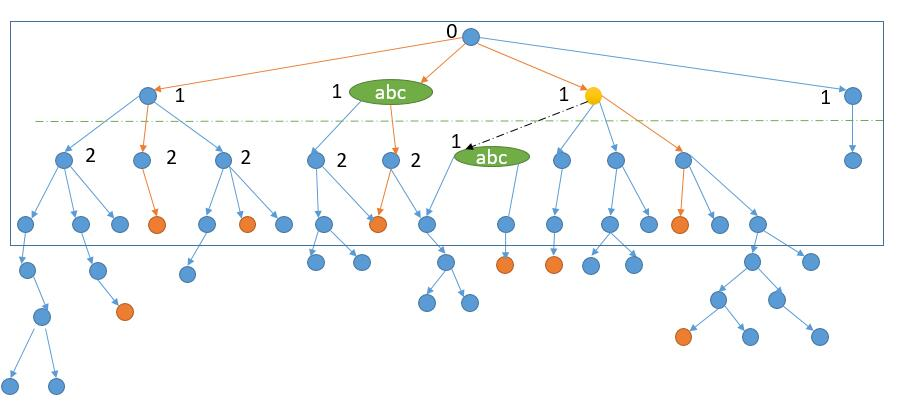

# 126. Word Ladder II
<https://leetcode.com/problems/word-ladder-ii/>
Hard


Given two words (beginWord and endWord), and a dictionary's word list, find all shortest transformation sequence(s) from beginWord to endWord, such that:

Only one letter can be changed at a time
Each transformed word must exist in the word list. Note that beginWord is not a transformed word.

**Note:**

    * Return an empty list if there is no such transformation sequence.
    * All words have the same length.
    * All words contain only lowercase alphabetic characters.
    * You may assume no duplicates in the word list.
    * You may assume beginWord and endWord are non-empty and are not the same.

**Example 1:**

    Input:
    beginWord = "hit",
    endWord = "cog",
    wordList = ["hot","dot","dog","lot","log","cog"]

    Output:
    [
        ["hit","hot","dot","dog","cog"],
        ["hit","hot","lot","log","cog"]
    ]

**Example 2:**

    Input:
    beginWord = "hit"
    endWord = "cog"
    wordList = ["hot","dot","dog","lot","log"]

    Output: []

    Explanation: The endWord "cog" is not in wordList, therefore no possible transformation.

Related Topics: Array; String; Backtracking; Breadth-first Search

Similar Questions: 
* Medium [Word Ladder](https://leetcode.com/problems/word-ladder/)

https://leetcode.wang/leetCode-126-Word-LadderII.html

### Question Explanation:
如果我们从开始的单词，把与之能够转换的单词连起来，它就会长成下边的样子。

橙色表示结束单词，上图橙色的路线就是我们要找的最短路径。所以我们要做的其实就是遍历上边的树，然后判断当前节点是不是结束单词，找到结束单词后，还要判断当前是不是最短的路径。说到遍历当然就是两种思路了，DFS 或者 BFS。


### DFS Solution: 
要找到最短路径，首先要解决的问题是怎么找到节点的所有孩子节点: 将要找的节点单词的每个位置换一个字符，然后看更改后的单词在不在 wordList 中。然后解决找到的是最短的路径，需要一个全局变量来保存当前找到的路径的长度。如果找到的新的路径的长度比之前的路径短，就把之前的结果清空，重新找，如果是最小的长度，就加入到结果中。

这要会TLE，需要优化：
- DFS 的过程的话，结合上图，就是先考虑了最左边的路径，然后再回溯一下，继续到达底部。然后回溯回溯，终于到了一条含有结束单词的路径，然而事实上这条并不是最短路径。综上，我们会多判断很多无用的路径。如果我们事先知道了最短路径长度是 4，那么我们只需要考虑前 4 层就足够了。怎么知道结束单词在哪一层呢？只能一层层的找了，也就是 BFS。此外，因为上图需要搜索的树提前是没有的，我们需要边找边更新这个树。而在 DFS 中，我们也需要这个树，其实就是需要每个节点的所有相邻节点。所以我们在 BFS 中，就把每个节点的所有相邻节点保存到 HashMap 中，就省去了 DFS 再去找相邻节点的时间。此外，BFS 的过程中，把最短路径的高度用 min 也记录下来，在 DFS 的时候到达高度后就可以提前结束。
- 
  假如我们在考虑上图中黄色节点的相邻节点，发现第三层的 abc 在第二层已经考虑过了。所以第三层的 abc 其实不用再考虑了，第三层的 abc 后边的结构一定和第二层后边的结构一样，因为我们要找最短的路径，所以如果产生了最短路径，一定是第二层的 abc 首先达到结束单词。所以其实我们在考虑第 k 层的某一个单词，如果这个单词在第 1 到 k-1 层已经出现过，我们其实就不过继续向下探索了。
  在之前的代码中，我们其实已经考虑了部分这个问题。
  ```java
    if (temp.contains(neighbor)) {
        continue;
    }
  ```
  但我们只考虑了当前路径是否含有该单词，而就像上图表示的，其他路径之前已经考虑过了当前单词，我们也是可以跳过的。根据这个优化思路，有两种解决方案:
  - 第一种，再利用一个 HashMap，记为 distance 变量。在 BFS 的过程中，把第一次遇到的单词当前的层数存起来。之后遇到也不进行更新。
    
    这样我们就可以在 DFS 的时候来判断当前黄色的节点的 distance 是不是比邻接节点的小 1。上图中 distance 都是 1 ，所以不符合，就可以跳过。
  - 在 DFS 中，因为我们每次都根据节点的层数来进行深搜，所以之前保存最短路径的全局变量 min 在这里也就不需要了。

```java
class Solution {
    public List<List<String>> findLadders(String beginWord, String endWord, List<String> wordList) {
        List<List<String>> ans = new ArrayList<>();
        if (!wordList.contains(endWord)) {
            return ans;
        }
        // 利用 BFS 得到所有的邻居节点
        HashMap<String, ArrayList<String>> map = new HashMap<>();
        bfs(beginWord, endWord, wordList, map);
        ArrayList<String> temp = new ArrayList<String>();
        // temp 用来保存当前的路径
        temp.add(beginWord);
        dfs(beginWord, endWord, map, temp, ans);
        return ans;
    }

    private void dfs(String beginWord, String endWord, HashMap<String, ArrayList<String>> map,
                                   ArrayList<String> temp, List<List<String>> ans) {
        if (beginWord.equals(endWord)) {
            ans.add(new ArrayList<String>(temp));
            return;
        }
        // 得到所有的下一个的节点
        ArrayList<String> neighbors = map.getOrDefault(beginWord, new ArrayList<String>());
        for (String neighbor : neighbors) {
            temp.add(neighbor);
            dfs(neighbor, endWord, map, temp, ans);
            temp.remove(temp.size() - 1);

        }
    }

    public void bfs(String beginWord, String endWord, List<String> wordList, HashMap<String, ArrayList<String>> map) {
        Queue<String> queue = new LinkedList<>();
        queue.offer(beginWord);
        boolean isFound = false;
        int depth = 0;
        Set<String> dict = new HashSet<>(wordList);
        Set<String> visited = new HashSet<>();
        visited.add(beginWord);
        while (!queue.isEmpty()) {
            int size = queue.size();
            depth++;
            Set<String> subVisited = new HashSet<>();
            for (int j = 0; j < size; j++) {
                String temp = queue.poll();
                // 一次性得到所有的下一个的节点
                ArrayList<String> neighbors = getNeighbors(temp, dict); 
                Iterator<String> it = neighbors.iterator();//把元素导入迭代器
                while (it.hasNext()) {
                    String neighbor = it.next();
                    if (!visited.contains(neighbor)) {
                        if (neighbor.equals(endWord)) {
                            isFound = true;
                        }
                        queue.offer(neighbor);
                        subVisited.add(neighbor);
                    }else{
                        it.remove();
                    } 
                }
                map.put(temp, neighbors);
            }
            visited.addAll(subVisited);
            if (isFound) {
                break;
            }
        }
    }

    private ArrayList<String> getNeighbors(String node, Set<String> dict) {
        ArrayList<String> res = new ArrayList<String>();
        char chs[] = node.toCharArray();

        for (char ch = 'a'; ch <= 'z'; ch++) {
            for (int i = 0; i < chs.length; i++) {
                if (chs[i] == ch)
                    continue;
                char old_ch = chs[i];
                chs[i] = ch;
                if (dict.contains(String.valueOf(chs))) {
                    res.add(String.valueOf(chs));
                }
                chs[i] = old_ch;
            }

        }
        return res;
    }
}
```

### BFS Solution: 