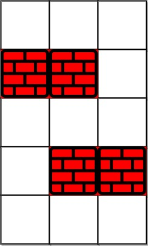

# 1293. Shortest Path in a Grid with Obstacles Elimination
<https://leetcode.com/problems/shortest-path-in-a-grid-with-obstacles-elimination/>
Hard

You are given an m x n integer matrix grid where each cell is either 0 (empty) or 1 (obstacle). You can move up, down, left, or right from and to an empty cell in one step.

Return the minimum number of steps to walk from the upper left corner (0, 0) to the lower right corner (m - 1, n - 1) given that you can eliminate at most k obstacles. If it is not possible to find such walk return -1.

**Example 1:**



    Input: grid = [[0,0,0],[1,1,0],[0,0,0],[0,1,1],[0,0,0]], k = 1
    Output: 6
    Explanation: 
    The shortest path without eliminating any obstacle is 10.
    The shortest path with one obstacle elimination at position (3,2) is 6. Such path is (0,0) -> (0,1) -> (0,2) -> (1,2) -> (2,2) -> (3,2) -> (4,2).


**Example 2:**


    Input: grid = [[0,1,1],[1,1,1],[1,0,0]], k = 1
    Output: -1
    Explanation: We need to eliminate at least two obstacles to find such a walk.

**Constraints:**
    * m == grid.length
    * n == grid[i].length
    * 1 <= m, n <= 40
    * 1 <= k <= m * n
    * grid[i][j] is either 0 or 1.
    * grid[0][0] == grid[m - 1][n - 1] == 0

Related Topics: Array; Breadth-First Search; Matrix

Similar Questions:
Medium [Shortest Path to Get Food](https://leetcode.com/problems/shortest-path-in-a-grid-with-obstacles-elimination/)

## Explanation: 
要求找到从左上角到右下角的最短路径长度。矩阵中有障碍物，而我们可以消除最多k个障碍。

## BFS Solution:
因为是求最短距离，所以先想到 BFS。需要用到一个 queue 来 BFS 和 矩阵 visited 来记录已经走过的位置。还要用 res 来记录当前层数。同时因为还需要破除障碍，所以需要记录到当前位置已经破除了几次障碍。queue 中保持坐标和其破除障碍的次数。把初始值 {0,0,0} 放入 queue 中，然后遍历：
1. 先查看是否当前坐标是右下角，是的话输出结果 res。
2. 遍历下一步。如果在矩阵内，如果是障碍，那么消除障碍数 +1。
3. 如果消除障碍数 <= k，并且 对应visited[nextR][nextC][nextK]的为 false，代表没有走过这个坐标。则更新visited并加入queue。
4. 遍历完所有下一步，层数+1。循环结束

Time: O(MNK)
Space: O(MNK)

```java
class Solution {
    private final int[][] dirs = new int[][]{{0,1}, {0,-1}, {1,0}, {-1,0}};
    public int shortestPath(int[][] grid, int k) {
        int m = grid.length, n = grid[0].length;
        Queue<int[]> q = new LinkedList<>(); // store the coordinate and its amount of obstacles elimination
        boolean[][][] visited = new boolean[m][n][k+1]; //store the visited coordinates, need to include current k as well. Because there might be quicker approaches reach (m,n) using same k.
        visited[0][0][0] = true;
        q.offer(new int[]{0,0,0});
        int res = 0;
        while(!q.isEmpty()){
            int size  = q.size();
            for(int i = 0; i<size; i++){
                int[] info = q.poll();
                int r = info[0], c = info[1], curK = info[2];
                if(r==m-1 && c==n-1){ // check if reach destination
                    return res;
                }
                for(int[] dir : dirs){
                    int nextR = dir[0] + r;
                    int nextC = dir[1] + c;
                    int nextK = curK;
                    if(nextR>=0 && nextR<m && nextC>=0 && nextC<n){
                        if(grid[nextR][nextC] == 1){ // reach obstacle
                            nextK++;
                        }
                        if(nextK<=k && !visited[nextR][nextC][nextK]){
                            visited[nextR][nextC][nextK] = true; // update visisted and put next steps into queue for next.
                            q.offer(new int[]{nextR, nextC, nextK});
                        }
                    }
                }
            }
            res++;
        }
        return -1;
    }
}
```