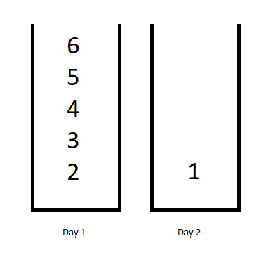

# 1335. Minimum Difficulty of a Job Schedule
<https://leetcode.com/problems/minimum-difficulty-of-a-job-schedule/>
Hard

You want to schedule a list of jobs in d days. Jobs are dependent (i.e To work on the i-th job, you have to finish all the jobs j where 0 <= j < i).

You have to finish at least one task every day. The difficulty of a job schedule is the sum of difficulties of each day of the d days. The difficulty of a day is the maximum difficulty of a job done in that day.

Given an array of integers jobDifficulty and an integer d. The difficulty of the i-th job is jobDifficulty[i].

Return the minimum difficulty of a job schedule. If you cannot find a schedule for the jobs return -1.

**Example 1:**


Input: jobDifficulty = [6,5,4,3,2,1], d = 2
Output: 7
Explanation: First day you can finish the first 5 jobs, total difficulty = 6.
Second day you can finish the last job, total difficulty = 1.
The difficulty of the schedule = 6 + 1 = 7 

**Example 2:**
Input: jobDifficulty = [9,9,9], d = 4
Output: -1
Explanation: If you finish a job per day you will still have a free day. you cannot find a schedule for the given jobs.

**Example 3:**
Input: jobDifficulty = [1,1,1], d = 3
Output: 3
Explanation: The schedule is one job per day. total difficulty will be 3.

**Example 4:**
Input: jobDifficulty = [7,1,7,1,7,1], d = 3
Output: 15

**Example 5:**
Input: jobDifficulty = [11,111,22,222,33,333,44,444], d = 6
Output: 843

**Constraints:**

* 1 <= jobDifficulty.length <= 300
* 0 <= jobDifficulty[i] <= 1000
* 1 <= d <= 10

Related Topics: Dynamic Programming

## Explanation: 
题目给出一组数组 jobDifficulty 和 指定天数 d。 jobDifficulty 中的值表示难度。一天中的难度是当天最高难度。不限制一天完成任务的数量，但是每天都必须分配任务。求最后累积难度的最小值。

## Top Down DP with cache Solution:
用一个二维DP数组 memo 来记录剩d天完成N个任务可能的最小值。用 dfs()函数来计算最小值。参数 d 是剩下的天数， start 是下个任务的index。如果 d == 0，最后一天结束，如果任务全部完成，返回0。如果 d == 0 || len == jobDifficulty.length，代表任务提前完成或者不能完成，返回 Integer.MAX_VALUE。查看 memo 是否有对应值。否则需要计算，用 curMax 记录当前天的最大难度， min记录总最小难度。从 start 开始依次尝试当天完成的个数，然后继续对剩余天数 d-1 和 任务 schedule+1 调用 dfs函数。用返回值 temp + CurMax 来更新 min。最后返回 memo[start][d] 。

Time：O(nnd)
Space: O(nd)

```java
class Solution {
    public int minDifficulty(int[] jobDifficulty, int d) {
        final int N = jobDifficulty.length;
        if(N<d) return -1;
        int[][] memo = new int[N][d+1];
        for(int[] row : memo) Arrays.fill(row, -1);
        return dfs(d, 0, jobDifficulty, memo);
    }
    
    private int dfs(int d, int start, int[] jobDifficulty, int[][] memo){
        if(d == 0 && start == jobDifficulty.length) return 0; // All jobs are finished on last day
        if(d == 0 || start == jobDifficulty.length) return Integer.MAX_VALUE; // All days are ran out or All jobs are finished.
        if(memo[start][d] != -1) return memo[start][d];

        int curMax = jobDifficulty[start];
        int min = Integer.MAX_VALUE;
        for(int schedule = start; schedule < jobDifficulty.length; ++schedule){
            curMax = Math.max(curMax, jobDifficulty[schedule]);
            int temp = dfs(d - 1, schedule + 1, jobDifficulty, memo);
            if(temp != Integer.MAX_VALUE)
                min = Math.min(min, temp + curMax);
        }

        return memo[start][d] = min;
    }
}
```