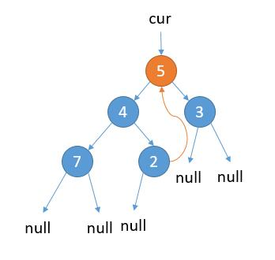

# 145. Binary Tree Postorder Traversal
<https://leetcode.com/problems/binary-tree-postorder-traversal/>
Hard

Given a binary tree, return the postorder traversal of its nodes' values.

**Example:**

    Input: [1,null,2,3]
    1
        \
        2
        /
    3

    Output: [3,2,1]


**Follow up:** Recursive solution is trivial, could you do it iteratively?

Related Topics: Stack; Tree

Similar Questions: 
* Medium [Binary Tree Inorder Traversal](https://leetcode.com/problems/binary-tree-inorder-traversal/)
* Easy [N-ary Tree Postorder Traversal](https://leetcode.com/problems/n-ary-tree-postorder-traversal/)


### Stack Solution: 
当遍历完某个根节点的左子树，回到根节点的时候，对于中序遍历和先序遍历可以把当前根节点从栈里弹出，然后转到右子树。举个例子，

         1
        / \
       2   3
      / \
     4   5

当遍历完 2,4,5 的时候，回到 1 之后我们就可以把 1 弹出，然后通过 1 到达右子树继续遍历。而对于后序遍历，当我们到达 1 的时候并不能立刻把 1 弹出，因为遍历完右子树，我们还需要将这个根节点加入到 list 中。所以我们就需要判断是从左子树到的根节点，还是右子树到的根节点。如果是从左子树到的根节点，此时应该转到右子树。如果是从右子树到的根节点，那么就可以把当前节点弹出，并且加入到 list 中。当然，如果是从左子树到的根节点，此时如果根节点的右子树为 null， 此时也可以把当前节点弹出，并且加入到 list 中。

开始的话，也是不停的往左子树走，然后直到为 null 。不同之处是，之前直接把节点 pop 并且加入到 list 中，然后直接转到右子树。这里的话，我们应该把节点 peek 出来，然后判断一下当前根节点的右子树是否为空或者是否是从右子树回到的根节点。判断是否是从右子树回到的根节点，这里我用了一个 last 记录上一次遍历的节点。如果当前节点的右节点和上一次遍历的节点相同，那就表明当前是从右节点过来的了。

```java
/**
 * Definition for a binary tree node.
 * public class TreeNode {
 *     int val;
 *     TreeNode left;
 *     TreeNode right;
 *     TreeNode(int x) { val = x; }
 * }
 */
class Solution {
    public List<Integer> postorderTraversal(TreeNode root) {
        List<Integer> list = new ArrayList<>();
        Stack<TreeNode> stack = new Stack<>();
        TreeNode cur = root;
        TreeNode last = null;
        while (cur != null || !stack.isEmpty()) {
            if (cur != null) {
                stack.push(cur);
                cur = cur.left;
            } else {
                TreeNode temp = stack.peek();
                //是否变到右子树
                if (temp.right != null && temp.right != last) {
                    cur = temp.right;
                } else {
                    list.add(temp.val);
                    last = temp;
                    stack.pop();
                }
            }
        }
        return list;
    }
}
```

### Stack Push Twice Solution: 
后序遍历遇到的问题就是到根节点的时候不能直接 pop ，因为后边还需要回来。只需要把每个节点 push 两次，然后判断当前 pop 节点和栈顶节点是否相同。相同的话，就意味着是从左子树到的根节点。不同的话，就意味着是从右子树到的根节点，此时就可以把节点加入到 list 中。

```java
/**
 * Definition for a binary tree node.
 * public class TreeNode {
 *     int val;
 *     TreeNode left;
 *     TreeNode right;
 *     TreeNode(int x) { val = x; }
 * }
 */
class Solution {
    public List<Integer> postorderTraversal(TreeNode root) {
        List<Integer> list = new ArrayList<>();
        if (root == null) {
            return list;
        }
        Stack<TreeNode> stack = new Stack<>();
        stack.push(root);
        stack.push(root);
        while (!stack.isEmpty()) {
            TreeNode cur = stack.pop();
            if (cur == null) {
                continue;
            }
            if (!stack.isEmpty() && cur == stack.peek()) {
                stack.push(cur.right);
                stack.push(cur.right);
                stack.push(cur.left);
                stack.push(cur.left);
            } else {
                list.add(cur.val);
            }
        }
        return list;
    }
}
```

### Direct Convert Solution: 
后序遍历的顺序是 左 -> 右 -> 根。前序遍历的顺序是 根 -> 左 -> 右，左右其实是等价的，所以我们也可以轻松的写出 根 -> 右 -> 左 的代码。然后把 根 -> 右 -> 左 逆序，就是 左 -> 右 -> 根，也就是后序遍历了。

```java
/**
 * Definition for a binary tree node.
 * public class TreeNode {
 *     int val;
 *     TreeNode left;
 *     TreeNode right;
 *     TreeNode(int x) { val = x; }
 * }
 */
class Solution {
    public List<Integer> postorderTraversal(TreeNode root) {
        List<Integer> list = new ArrayList<>();
        Stack<TreeNode> stack = new Stack<>();
        TreeNode cur = root;
        while (cur != null || !stack.isEmpty()) {
            if (cur != null) {
                list.add(cur.val);
                stack.push(cur);
                cur = cur.right; // 考虑左子树
            } else {
                // 节点为空，就出栈
                cur = stack.pop();
                // 考虑右子树
                cur = cur.left;
            }
        }
        Collections.reverse(list);
        return list;
    }
}
```

### Morris Traversal Solution: 
我们知道，左子树最后遍历的节点一定是一个叶子节点，它的左右孩子都是 null，我们把它右孩子指向当前根节点，这样的话我们就不需要额外空间了。这样做，遍历完当前左子树，就可以回到根节点了。当然如果当前根节点左子树为空，那么我们只需要保存根节点的值，然后考虑右子树即可。
所以总体思想就是：记当前遍历的节点为 cur。
1. cur.left 为 null，保存 cur 的值，更新 cur = cur.right
2. cur.left 不为 null，找到 cur.left 这颗子树最右边的节点记做 last
    1. last.right 为 null，那么将 last.right = cur，更新 cur = cur.left
    2. last.right 不为 null，说明之前已经访问过，第二次来到这里，表明当前子树遍历完成，保存 cur 的值，更新 cur = cur.right
结合图示：

如上图，cur 指向根节点。 当前属于 2.1 的情况，cur.left 不为 null，cur 的左子树最右边的节点的右孩子为 null，那么我们把最右边的节点的右孩子指向 cur。

接着，更新 cur = cur.left。

如上图，当前属于 2.1 的情况，cur.left 不为 null，cur 的左子树最右边的节点的右孩子为 null，那么我们把最右边的节点的右孩子指向 cur。

更新 cur = cur.left。

如上图，当前属于情况 1，cur.left 为 null，保存 cur 的值，更新 cur = cur.right。

如上图，当前属于 2.2 的情况，cur.left 不为 null，cur 的左子树最右边的节点的右孩子已经指向 cur，保存 cur 的值，更新 cur = cur.right

如上图，当前属于情况 1，cur.left 为 null，保存 cur 的值，更新 cur = cur.right。

如上图，当前属于 2.2 的情况，cur.left 不为 null，cur 的左子树最右边的节点的右孩子已经指向 cur，保存 cur 的值，更新 cur = cur.right。

当前属于情况 1，cur.left 为 null，保存 cur 的值，更新 cur = cur.right。

cur 指向 null，结束遍历。
根据上边的关系，我们会发现除了叶子节点只访问一次，其他节点都会访问两次，结合下图。

当第二次访问某个节点的时候，我们只需要将它的左节点，以及左节点的右节点，左节点的右节点的右节点... 逆序添加到 list 中即可。比如上边的例子。
上边的遍历顺序其实就是按照深度优先的方式。
```
    先访问 15, 7, 3, 1 然后往回走
    3 第二次访问，将它的左节点逆序加入到 list 中
    list = [1]

    继续访问 2, 然后往回走
    7 第二次访问，将它的左节点，左节点的右节点逆序加入到 list 中
    list = [1 2 3]

    继续访问 6 4, 然后往回走
    6 第二次访问, 将它的左节点逆序加入到 list 中
    list = [1 2 3 4]

    继续访问 5, 然后往回走
    15 第二次访问, 将它的左节点, 左节点的右节点, 左节点的右节点的右节点逆序加入到 list 中
    list = [1 2 3 4 5 6 7]

    然后访问 14 10 8, 然后往回走
    10 第二次访问，将它的左节点逆序加入到 list 中
    list = [1 2 3 4 5 6 7 8]

    继续访问 9, 然后往回走
    14 第二次访问，将它的左节点，左节点的右节点逆序加入到 list 中
    list = [1 2 3 4 5 6 7 8 9 10]

    继续访问 13 11, 然后往回走
    13 第二次访问, 将它的左节点逆序加入到 list 中
    list = [1 2 3 4 5 6 7 8 9 10 11]

    继续遍历 12，结束遍历

    然后单独把根节点，以及根节点的右节点，右节点的右节点，右节点的右节点的右节点逆序加入到 list 中
    list = [1 2 3 4 5 6 7 8 9 10 11 12 13 14 15]

    得到 list 就刚好是后序遍历
```
如下图，问题就转换成了 9 组单链表的逆序问题。

当遇到第二次访问的节点，我们将单链表逆序，然后加入到 list 并且还原即可。单链表逆序已经在 第 2 题 讨论过了，直接拿过来用，只需要把 node.next 改为 node.right 。

```java
/**
 * Definition for a binary tree node.
 * public class TreeNode {
 *     int val;
 *     TreeNode left;
 *     TreeNode right;
 *     TreeNode(int x) { val = x; }
 * }
 */
class Solution {
    public List<Integer> postorderTraversal(TreeNode root) {
        List<Integer> list = new ArrayList<>();
        TreeNode cur = root;
        while (cur != null) {
            // 情况 1
            if (cur.left == null) {
                cur = cur.right;
            } else {
                // 找左子树最右边的节点
                TreeNode pre = cur.left;
                while (pre.right != null && pre.right != cur) {
                    pre = pre.right;
                }
                // 情况 2.1
                if (pre.right == null) {
                    pre.right = cur;
                    cur = cur.left;
                }
                // 情况 2.2,第二次遍历节点
                if (pre.right == cur) {
                    pre.right = null; // 这里可以恢复为 null
                    //逆序
                    TreeNode head = reversList(cur.left);
                    //加入到 list 中，并且把逆序还原
                    reversList(head, list);
                    cur = cur.right;
                }
            }
        }
        TreeNode head = reversList(root);
        reversList(head, list);
        return list;
    }

    private TreeNode reversList(TreeNode head) {
        if (head == null) {
            return null;
        }
        TreeNode tail = head;
        head = head.right;

        tail.right = null;

        while (head != null) {
            TreeNode temp = head.right;
            head.right = tail;
            tail = head;
            head = temp;
        }

        return tail;
    }

    private TreeNode reversList(TreeNode head, List<Integer> list) {
        if (head == null) {
            return null;
        }
        TreeNode tail = head;
        head = head.right;
        list.add(tail.val);
        tail.right = null;

        while (head != null) {
            TreeNode temp = head.right;
            head.right = tail;
            tail = head;
            list.add(tail.val);
            head = temp;
        }
        return tail;
    }
}
```