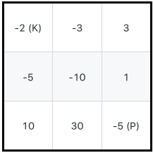

# 174. Dungeon Game
<https://leetcode.com/problems/dungeon-game/>
Hard

The demons had captured the princess (P) and imprisoned her in the bottom-right corner of a dungeon. The dungeon consists of M x N rooms laid out in a 2D grid. Our valiant knight (K) was initially positioned in the top-left room and must fight his way through the dungeon to rescue the princess.

The knight has an initial health point represented by a positive integer. If at any point his health point drops to 0 or below, he dies immediately.

Some of the rooms are guarded by demons, so the knight loses health (negative integers) upon entering these rooms; other rooms are either empty (0's) or contain magic orbs that increase the knight's health (positive integers).

In order to reach the princess as quickly as possible, the knight decides to move only rightward or downward in each step.

 

Write a function to determine the knight's minimum initial health so that he is able to rescue the princess.

For example, given the dungeon below, the initial health of the knight must be at least 7 if he follows the optimal path RIGHT-> RIGHT -> DOWN -> DOWN.


 

Note:

The knight's health has no upper bound.
Any room can contain threats or power-ups, even the first room the knight enters and the bottom-right room where the princess is imprisoned.

Related Topics: Binary Search; Dynamic Programming
Similar Questions: 
* Medium [Unique Paths](https://leetcode.com/problems/unique-paths/)
* Medium [Minimum Path Sum](https://leetcode.com/problems/minimum-path-sum/)
* Hard [Cherry Pickup](https://leetcode.com/problems/cherry-pickup/)

### Backtracking Solution: 
考虑从当前位置，应该是向右走还是向下走，这样我们是可以确定的。如果我们知道右边的位置到终点的需要的最小生命值是 x，下边位置到终点需要的最小生命值是 y。很明显我们应该选择所需生命值较小的方向。如果 x < y，我们就向右走。如果 x > y，我们就向下走。知道方向以后，当前位置到终点的最小生命值 need 就等于 x 和 y 中较小的值减去当前位置上边的值。如果算出来 need 大于 0，那就说明我们需要 need 的生命值到达终点。如果算出来 need 小于等于 0，那就说明当前位置增加的生命值很大，所以当前位置我们只需要给一个最小值 1，就足以走到终点。

举个具体的例子就明白了。如果右边的位置到终点的需要的最小生命值是 5，下边位置到终点需要的最小生命值是 8。所以我们选择向右走。如果当前位置的值是 2，然后 need = 5 - 2 = 3，所以当前位置的初始值应该是 3。如果当前位置的值是 -3，然后 need = 5 - (-3) = 8，所以当前位置的初始值应该是 8。如果当前位置的值是 10，说明增加的生命值很多，need = 5 - 10 = -5，此时我们只需要将当前位置的生命值初始为 1 即可。然后每个位置都这样考虑，递归也就出来了。递归出口也很好考虑， 那就是最后求终点到终点需要的最小生命值。如果终点位置的值是正的，那么所需要的最小生命值就是 1。如果终点位置的值是负的，那么所需要的最小生命值就是负值的绝对值加 1。

为了提高效率，用 map 来保存已经处理过的坐标。key 是坐标 i,j，value 的话就存当最后求出来的当前位置到终点所需的最小生命值，也就是 return 前同时存进 map 中。

```java
class Solution {
    public int calculateMinimumHP(int[][] dungeon) {
        return calculateMinimumHPHelper(0, 0, dungeon, new HashMap<String, Integer>());
    }

    private int calculateMinimumHPHelper(int i, int j, int[][] dungeon, HashMap<String, Integer> map) {
        if (i == dungeon.length - 1 && j == dungeon[0].length - 1) {
            if (dungeon[i][j] > 0) {
                return 1;
            } else {
                return -dungeon[i][j] + 1;
            }
        }
        String key = i + "@" + j;
        if (map.containsKey(key)) {
            return map.get(key);
        }
        int right = j < dungeon[0].length - 1 ? calculateMinimumHPHelper(i, j + 1, dungeon, map) : Integer.MAX_VALUE;
        int down = i < dungeon.length - 1 ? calculateMinimumHPHelper(i + 1, j, dungeon, map) : Integer.MAX_VALUE;
        int need = right < down ? right - dungeon[i][j] : down - dungeon[i][j];
        if (need <= 0) {
            map.put(key, 1);
            return 1;
        } else {
            map.put(key, need);
            return need;
        }
    }
}
```

### DP Solution: 
用动态规划可以节省递归压栈的时间，直接从底部往上走。我们的状态就定义成解法二递归中返回的值，用 dp[i][j] 表示从 (i, j) 到达终点所需要的最小生命值。状态转移方程的话和递归也一模一样，只需要把函数调用改成取直接取数组的值。因为对于边界的情况，我们需要赋值为最大值，所以数组的话我们也扩充一行一列将其初始化为最大值，比如

奖惩数组：
    1   -3   3
    0   -2   0
    -3  -3   -3

dp 数组：
终点位置就是递归出口时候返回的值，边界扩展一下用 M 表示 Integer.MAXVALUE
    0 0 0 M
    0 0 0 M
    0 0 4 M
    M M M M

然后就可以一行一行或者一列一列的去更新 dp 数组，当然要倒着更新。因为更新 dp[i][j] 的时候我们需要 dp[i+1][j] 和 dp[i][j+1] 的值。因为我们的 dp 数组在更新第 i 行的时候，我们只需要第 i+1 行的信息，而 i+2，i+3 行的信息我们就不再需要了，我们我们其实不需要二维数组，只需要一个一维数组就足够了。

```java
class Solution {
    public int calculateMinimumHP(int[][] dungeon) {
        int row = dungeon.length;
        int col = dungeon[0].length;
        int[] dp = new int[col + 1];

        for (int i = 0; i <= col; i++) {
            dp[i] = Integer.MAX_VALUE;
        }
        dp[col - 1] = dungeon[row - 1][col - 1] > 0 ? 1 : -dungeon[row - 1][col - 1] + 1;
        for (int i = row - 1; i >= 0; i--) {
            for (int j = col - 1; j >= 0; j--) {
                if (i == row - 1 && j == col - 1) {
                    continue;
                }
                dp[j] = Math.min(dp[j], dp[j + 1]) - dungeon[i][j];
                if (dp[j] <= 0) {
                    dp[j] = 1;
                }
            }
        }
        return dp[0];
    }
}
```
