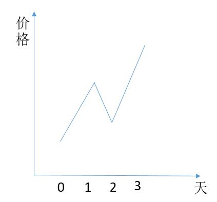
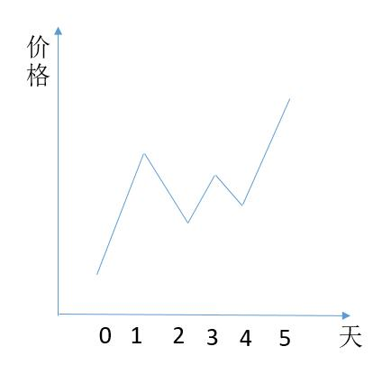
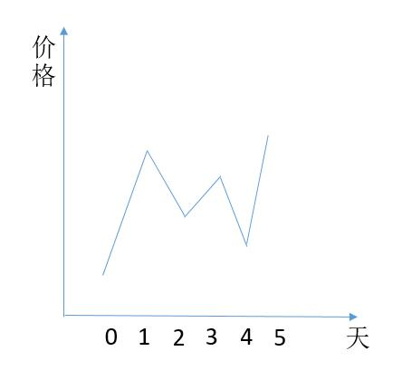
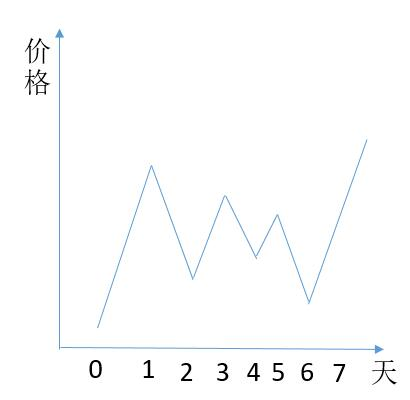

# 188. Best Time to Buy and Sell Stock IV
<https://leetcode.com/problems/best-time-to-buy-and-sell-stock-iv/>
Hard

Say you have an array for which the i-th element is the price of a given stock on day i.

Design an algorithm to find the maximum profit. You may complete at most k transactions.

**Note:**
You may not engage in multiple transactions at the same time (ie, you must sell the stock before you buy again).

**Example 1:**

    Input: [2,4,1], k = 2
    Output: 2
    Explanation: Buy on day 1 (price = 2) and sell on day 2 (price = 4), profit = 4-2 = 2.

**Example 2:**

    Input: [3,2,6,5,0,3], k = 2
    Output: 7
    Explanation: Buy on day 2 (price = 2) and sell on day 3 (price = 6), profit = 6-2 = 4.
                Then buy on day 5 (price = 0) and sell on day 6 (price = 3), profit = 3-0 = 3.

Related Topics: Dynamic Programming

Similar Questions: 
* Easy [Best Time to Buy and Sell Stock](https://leetcode.com/problems/best-time-to-buy-and-sell-stock/)
* Easy [Best Time to Buy and Sell Stock II](https://leetcode.com/problems/best-time-to-buy-and-sell-stock-ii/)
* Hard [Best Time to Buy and Sell Stock III](https://leetcode.com/problems/best-time-to-buy-and-sell-stock-iii/)

### DP Solution: 
这里我们需要两个递推公式来分别更新两个变量local和global，其实可以求至少k次交易的最大利润。我们定义local[i][j]为在到达第i天时最多可进行j次交易并且最后一次交易在最后一天卖出的最大利润，此为局部最优。然后我们定义global[i][j]为在到达第i天时最多可进行j次交易的最大利润，此为全局最优。它们的递推式为：
    local[i][j] = max(global[i - 1][j - 1] + max(diff, 0), local[i - 1][j] + diff)
    global[i][j] = max(local[i][j], global[i - 1][j])，

其中局部最优值是比较前一天并少交易一次的全局最优加上大于0的差值，和前一天的局部最优加上差值后相比，两者之中取较大值，而全局最优比较局部最优和前一天的全局最优。

但这道题还有个坑，就是如果k的值远大于prices的天数，比如k是好几百万，而prices的天数就为若干天的话，上面的DP解法就非常的没有效率，应该直接用Best Time to Buy and Sell Stock II 买股票的最佳时间之二的方法来求解，所以实际上这道题是之前的二和三的综合体。

Time: O(nk)
Space: O(k)

```java
class Solution {
    public int maxProfit(int k, int[] prices) {
        if(prices.length == 0) return 0;
        //K 看做任意次，转到 122 题
        if (k >= prices.length / 2) {
            return maxProfit(prices);
        }
        int[] local = new int[k+1];
        int[] global = new int[k+1];
        for (int i = 1; i < prices.length; i++) {
            int diff = prices[i] - prices[i-1];
            for (int j = k; j >= 1; j--) {
                local[j] = Math.max(global[j-1] + Math.max(diff, 0), local[j] + diff);
                global[j] = Math.max(local[j], global[j]);
            }
        }
        return global[k];
    }
    //122 题代码
    public int maxProfit(int[] prices) {
        int profit = 0;
        for (int i = 1; i < prices.length; i++) {
            int sub = prices[i] - prices[i - 1];
            if (sub > 0) {
                profit += sub;
            }
        }
        return profit;
    }
}
```


### Max Heap and Stack Solution: 
为了得到最高的收益，我们肯定会选择在波谷买入，然后在波峰卖出。第 v 天买入，第 p 天卖出，我们记做 (v,p)。所以我们所有可能的交易就是选取波谷、波峰，然后我们把这些交易所得的收益 prices[p] - prices[v] 依次放入数组中。把收益降序排序，选取前 k 个加起来，就是题目让我们所求的了，即最多进行 k 次交易时的最大收入。当然事情并不会这么简单，上边的情况是最理想的，在每次的波谷买入、波峰卖出，但对于下边的情况就会有些特殊了。

如果按照上边的算法，我们会将 (0,1) 和 (2,3) 存入。如果进行两次交易，当然也是没有问题的，刚好就是这两次的收益相加。但如果进行一次交易呢？很明显我们应该在第 0 天买入，在第 3 天卖出，所以我们应该将 (0,3) 存入。也就是当有新的交易 (2,3) 来的时候我们要和栈顶的交易 (0,1) 的波峰波谷进行比较，如果波谷大于之前的波谷，并且波峰也大于之前的波峰，两次交易就需要合并为 (0,3)。接下来的问题就是我们栈中只存了 (0,3) 这一次交易，那么算收益的时候，如果可以进行两次交易，那该怎么办呢？这也是这个解法最巧妙的地方了。假如两次交易的时间分别是 (v1,p1) 和 (v2,p2) ，那么如果最多进行一次交易，那么最大收益就是 prices[p2] - prices[v1]。如果最多进行两次交易，那么最大收益就是 prices[p1] - prices[v1] + prices[p2] - prices[v2]，进行一下变换 (prices[p2] - prices[v1]) + (prices[p1] - prices[v2])，第一个括号括起来的就是进行一次交易的最大收益，所以相对于只进行一次交易，我们的收益增加了第二个括号括起来的 prices[p1] - prices[v2]，所以我们只需要在合并两次交易的时候，把 prices[p1] - prices[v2] 存到 profit 数组中即可。

举个具体的例子，假如股票价格数组是 1,4,2,6，然后我们有一个 stack 去存每次的交易，profit 去存每次交易的收入。我们会把 6 - 1 = 5 和 4 - 2 = 2存入profit 中。这样如果最多进行一次交易，从 profit 中选取最大的收益，我们刚好得到就是 5。如果最多进行两次交易，从 profit 中选取前二名的收益，我们就得到 5 + 2 = 7，刚好等价于 (4 - 1) + (6 - 2) = 7。
```java
while (!stack.isEmpty() && prices[p] >= prices[stack.peek().peek && prices[v] >= prices[stack.peek().valley]) {
    Transaction pop = stack.pop();
    //加入 prices[p1] - prices[v2] 的收益
    profit.add(prices[pop.peek] - prices[v]);
    //买入点更新为前一次的买入点
    v = pop.valley;
}
```
至于为什么要用 while 循环，因为和之前的合并之后，完全可能继续合并，比如下边的例子。

一开始 (2,3) 不能和 (0,1) 合并，但当 (4,5) 来时候，先和 (2,3) 合并为 (2,5)，再和 (0,1)合并为 (0,5)。还有一种情况，如果新加入的交易的买入点低于栈顶交易的买入点，我们要把栈顶元素出栈。比如下图的例子。

首先是 (0,1) 入栈，然后是 (2,3) 入栈。接着 (4,5) 入栈，此时我们应该将 (2,3) 出栈，原因有两点。第一，因为新来的交易买入点更低，未来如果有交易可以和 (2,3) 合并，那么一定可以和 (4,5) 合并。并且和 (4,5)合并后的收益会更大。第二，因为栈顶的元素是已经不能合并的交易，而每次我们是和栈顶进行合并，所以新来的交易完全可能会和栈顶之前的元素进行合并交易，因此我们要把旧的栈顶元素出栈。就比如上图的中例子，把 (2,3) 出栈以后，我们可以把 (4,5)和 (0,1) 进行合并。在求前 k 笔最大的交易，我们可以用大小为 k 的优先队列存储。

Time: O(n + klgn)

```java
//当前的买入点比栈顶的低
while (!stack.isEmpty() && prices[v] <= prices[stack.peek().valley]) {
    Transaction pop = stack.pop();
    profit.add(prices[pop.peek] - prices[pop.valley]);
}
```
至于为什么要用 while 循环，因为有可能需要连续出栈，比如下图的例子。

(6,7)来的时候，要把 (4,5)、(2,3) 依次出栈。
综上所述，我们要把新的交易的买入点和栈顶的买入点比较，如果当前的买入点更低，要把栈顶的元素出栈。然后再判断，卖出点是否高于栈顶元素的卖出点，如果更高的话，要把当前交易和栈顶的交易合并。


```java
class Solution {
    class Transaction {
        int valley;
        int peek;

        Transaction(int v, int p) {
            valley = v;
            peek = p;
        }
    }

    public int maxProfit(int k, int[] prices) {
        if(k == 0){
            return 0;
        }
        Stack<Transaction> stack = new Stack<>();
        List<Integer> profit = new ArrayList<>();
        int v;
        int p = -1;
        int n = prices.length;
        while (true) {
            v = p + 1;
            while (v + 1 < n && prices[v] > prices[v + 1]) {
                v++;
            }
            p = v;
            while (p + 1 < n && prices[p] <= prices[p + 1]) {
                p++;
            }

            if (p == v) {
                break;
            }

            //新的交易的买入点更低，要把栈顶的元素出栈
            while (!stack.isEmpty() && prices[v] <= prices[stack.peek().valley]) {
                Transaction pop = stack.pop();
                profit.add(prices[pop.peek] - prices[pop.valley]);
            }

            //当前交易和栈顶交易是否能合并
            while (!stack.isEmpty() && prices[p] >= prices[stack.peek().peek]) {
                Transaction pop = stack.pop();
                profit.add(prices[pop.peek] - prices[v]);
                v = pop.valley;
            }

            stack.push(new Transaction(v, p));
        }

        while (!stack.isEmpty()) {
            Transaction pop = stack.pop();
            profit.add(prices[pop.peek] - prices[pop.valley]);
        }
        int ret = 0;
        //相当于最小堆，队列头始终队列中是最小的元素
        PriorityQueue<Integer> queue = new PriorityQueue<Integer>();

        for (int i = 0; i < profit.size(); i++) {
            if (i < k) {
                queue.add(profit.get(i));
            } else {
                int peek = queue.peek();
                //当前收益大于栈顶元素，将栈顶元素弹出，然后将当前元素加入队列
                if (profit.get(i) > peek) {
                    queue.poll();
                    queue.add(profit.get(i));
                }
            }

        }

        while (!queue.isEmpty()) {
            ret += queue.poll();
        }
        return ret;
    }
}
```