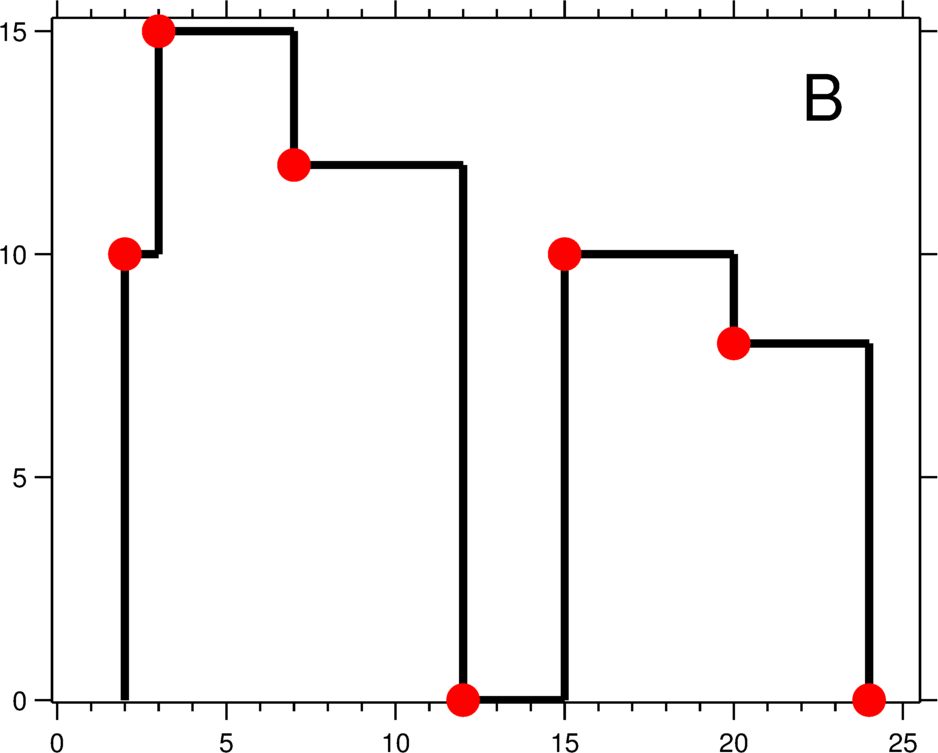

# 218. The Skyline Problem
<https://leetcode.com/problems/the-skyline-problem/>
Hard

A city's skyline is the outer contour of the silhouette formed by all the buildings in that city when viewed from a distance. Now suppose you are given the locations and height of all the buildings as shown on a cityscape photo (Figure A), write a program to output the skyline formed by these buildings collectively (Figure B).
 

The geometric information of each building is represented by a triplet of integers [Li, Ri, Hi], where Li and Ri are the x coordinates of the left and right edge of the ith building, respectively, and Hi is its height. It is guaranteed that 0 ≤ Li, Ri ≤ INT_MAX, 0 < Hi ≤ INT_MAX, and Ri - Li > 0. You may assume all buildings are perfect rectangles grounded on an absolutely flat surface at height 0.

For instance, the dimensions of all buildings in Figure A are recorded as: [ [2 9 10], [3 7 15], [5 12 12], [15 20 10], [19 24 8] ] .

The output is a list of "key points" (red dots in Figure B) in the format of [ [x1,y1], [x2, y2], [x3, y3], ... ] that uniquely defines a skyline. A key point is the left endpoint of a horizontal line segment. Note that the last key point, where the rightmost building ends, is merely used to mark the termination of the skyline, and always has zero height. Also, the ground in between any two adjacent buildings should be considered part of the skyline contour.

For instance, the skyline in Figure B should be represented as:[ [2 10], [3 15], [7 12], [12 0], [15 10], [20 8], [24, 0] ].

**Notes:**

    * The number of buildings in any input list is guaranteed to be in the range [0, 10000].
    * The input list is already sorted in ascending order by the left x position Li.
    * The output list must be sorted by the x position.
    * There must be no consecutive horizontal lines of equal height in the output skyline. For instance, [...[2 3], [4 5], [7 5], [11 5], [12 7]...] is not acceptable; the three lines of height 5 should be merged into one in the final output as such: [...[2 3], [4 5], [12 7], ...]

Related Topics: Divide and Conquer; Heap; Binary Indexed Tree; Segement Tree; Line Sweep

Similar Questions:  
* Hard [Falling Squares](https://leetcode.com/problems/falling-squares/)

## Critical Points TreeMap Solution:  

思路是只考虑每个 building 的左上角和右上角坐标，将所有点按 x 坐标排序，然后开始遍历。需要一个优先队列来存储遍历坐标的高度，也就是 y 轴坐标。对于左上角坐标和右上角坐标有不同的处理方式。遇到左上角坐标，将其 y 坐标加入到优先队列中。遇到右上角坐标，将其 y 坐标从优先队列中删除，也就是删除了其对应的左上角坐标的 y 值。最后判断优先队列中的最高高度相对于之前是否更新，如果更新了的话，就将当前的 x 以及更新后的最高高度作为一个坐标加入到最终结果中。

 
以给的例子为例，buildings  [2 9 10], [3 7 15], [5 12 12], [15 20 10], [19 24 8]。根据 buildings 求出每个 building 的左上角和右上角坐标。将所有坐标按照 x 排序, 并标记当前坐标是左上角坐标还是右上角坐标 l(2,10) l(3,15) l(5,12) r(7,15) r(9,10) r(12,12) l(15,10) l(19,8) r(20,10) r(24,8)，PriorityQueue = {0}, preMax = 0。

* l(2,10) 将 10 加入优先队列。preMax = 0, PriorityQueue  = {0 10}。当前 PriorityQueue 的 max = 10, 相对于 preMax 更新了。将 (2,10) 加入到 res, res = {(2,10)}。更新 preMax = 10。
* l(3,15) 将 15 加入优先队列。preMax = 10, PriorityQueue  = {0 10 15}。当前 PriorityQueue 的 max = 15, 相对于 preMax 更新了。将 (3,15) 加入到 res, res = {(2,10) (3,15)}。更新 preMax = 15。    
* l(5,12) 将 12 加入优先队列。preMax = 15, PriorityQueue  = {0 10 15 12}。当前 PriorityQueue 的 max = 15, 相对于 preMax 没有更新。res 不变
* r(7,15) , 遇到右上角坐标, 将 15 从优先队列删除。preMax = 15, PriorityQueue  = {0 10 12}。当前 PriorityQueue 的 max = 12, 相对于 preMax 更新了。将 (7,max) 即 (7,12) 加入到 res, res = {(2,10) (3,15) (7,12)}。更新 preMax = 12
* r(9,10) , 遇到右上角坐标, 将 10 从优先队列删除。preMax = 12, PriorityQueue  = {0 12}。当前 PriorityQueue 的 max = 12, 相对于 preMax 没有更新。res 不变
* r(12,12) , 遇到右上角坐标, 将 12 从优先队列删除。preMax = 12, PriorityQueue  = {0}。当前 PriorityQueue 的 max = 0, 相对于 preMax 更新了。将 (12,max) 即 (7,0) 加入到 res, res = {(2,10) (3,15) (7,12) (12,0)}。更新 preMax = 0。

然后再考虑一些边界情况，开始给坐标排序的时候我们是根据 x 坐标大小，当 x 坐标相等的时候怎么办呢？考虑两个坐标比较的时候，x 坐标相等会有三种情况

* 当两个坐标都是左上角坐标，我们要将高度高的排在前边  
* 当两个坐标都是右上角坐标，我们要将高度低的排在前边
* 当两个坐标一个是左上角坐标，一个是右上角坐标，我们需要将左上角坐标排在前边

上边的三条规则也是根据三种情况归纳总结出来的，大家可以举例子来判断。有了这三个规则，然后写代码的话就会很繁琐，这里有个技巧。存左上角坐标的时候， 将高度（y）存为负数。存右上角坐标的时候，将高度（y）存为正数。这么做有两个作用。一个作用就是可以根据高度的正负数区分当前是左上角坐标还是右上角坐标。另一个作用就是可以通过一个比较器，就实现上边的三条比较规则。

代码的话还能优化一下，上边代码中最常出现的三种操作。添加高度，时间复杂度 O(log(n))。删除高度，时间复杂度 O(n)。查看最大高度，时间复杂度 O(1)。有一个操作是 O(n)，加上外层的遍历，所以会使得最终的时间复杂度成为 O(n²) 。之所以是上边的时间复杂度，因为我们使用的是优先队列。我们还可以使用 TreeMap，这样上边的三种操作时间复杂度就都是 O(log(n)) 了，最终的时间复杂度就变为 O(nlog(n))TreeMap 的话 key 当然就是存高度了，因为可能添加重复的高度，所有value 的话存高度出现的次数即可。代码的话，整体思想不需要改变，只需要改变添加高度、删除高度、查看最大高度的部分。

```java
class Solution {
    public List<List<Integer>> getSkyline(int[][] buildings) {
        List<List<Integer>> points = new ArrayList<>();
        List<List<Integer>> results = new ArrayList<>();
        int n = buildings.length;
        //求出将左上角和右上角坐标, 左上角坐标的 y 存负数
        for (int[] b : buildings) {
            List<Integer> p1 = new ArrayList<>();
            p1.add(b[0]);
            p1.add(-b[2]);
            points.add(p1);

            List<Integer> p2 = new ArrayList<>();
            p2.add(b[1]);
            p2.add(b[2]);
            points.add(p2);
        }
        //将所有坐标排序
        Collections.sort(points, new Comparator<List<Integer>>() {
            @Override
            public int compare(List<Integer> p1, List<Integer> p2) {
                int x1 = p1.get(0);
                int y1 = p1.get(1);
                int x2 = p2.get(0);
                int y2 = p2.get(1);
                if (x1 != x2) {
                    return x1 - x2;
                } else {
                    return y1 - y2;
                }
            }

        });
        TreeMap<Integer, Integer> treeMap = new TreeMap<>(new Comparator<Integer>() {
            @Override
            public int compare(Integer i1, Integer i2) {
                return i2 - i1;
            }
        });
        treeMap.put(0, 1);
        int preMax = 0;

        for (List<Integer> p : points) {
            int x = p.get(0);
            int y = p.get(1);
            if (y < 0) {
                Integer v = treeMap.get(-y);
                if (v == null) {
                    treeMap.put(-y, 1);
                } else {
                    treeMap.put(-y, v + 1);
                }
            } else {
                Integer v = treeMap.get(y);
                if (v == 1) {
                    treeMap.remove(y);
                } else {
                    treeMap.put(y, v - 1);
                }
            }
            int curMax = treeMap.firstKey();
            if (curMax != preMax) {
                List<Integer> temp = new ArrayList<>();
                temp.add(x);
                temp.add(curMax);
                results.add(temp);
                preMax = curMax;
            }
        }
        return results;
    }
}
```

## Divide and Conquer Solution: 
首先考虑，如果只给一个建筑 [x, y, h]，那么答案是多少？很明显输出的解将会是 [[x, h], [y, 0]]，也就是左上角和右下角坐标。接下来考虑，如果有建筑 A B C D E，我们知道了建筑 A B C 输出的解和 D E 输出的解，那么怎么把这两组解合并，得到 A B C D E 输出的解。合并方法采用归并排序中双指针的方法，将两个指针分别指向两组解的开头，然后进行比对。具体的，看下边的例子。每次选取 x 坐标较小的点，然后再根据一定规则算出高度，具体的看下边的过程。
Skyline1 = {(1, 11),  (3, 13),  (9, 0),  (12, 7),  (16, 0)}
Skyline2 = {(14, 3),  (19, 18), (22, 3), (23, 13),  (29, 0)}

Skyline1 存储第一组的解。Skyline2 存储第二组的解。Result 存储合并后的解, Result = {}。h1 表示将 Skyline1 中的某个关键点加入 Result 中时, 当前关键点的高度h2 表示将 Skyline2 中的某个关键点加入 Result 中时, 当前关键点的高度。h1 = 0, h2 = 0。i = 0, j = 0

```
(1, 11),  (3, 13),  (9, 0),  (12, 7),  (16, 0)
   ^
   i
(14, 3),  (19, 18), (22, 3), (23, 13),  (29, 0)    
   ^
   j   
```

比较 (1, 11) 和 (14, 3)：比较 x 坐标, 1 < 14, 所以考虑 (1, 11)，x 取 1, 接下来更新 height。h1 = 11, height = max(h1, h2) = max(11, 0) = 11。将 (1, 11) 加入到 Result 中。Result = {(1, 11)}。i 后移, i = i + 1 = 2

```
(1, 11),  (3, 13),  (9, 0),  (12, 7),  (16, 0)
             ^
             i
(14, 3),  (19, 18), (22, 3), (23, 13),  (29, 0)    
   ^
   j
```

比较 (3, 13) 和 (14, 3)：比较 x 坐标, 3 < 14, 所以考虑 (3, 13)。x 取 3, 接下来更新 height。h1 = 13, height = max(h1, h2) = max(13, 0) = 13。将 (3, 13) 加入到 Result 中。Result = {(1, 11), (3, 13)}。i 后移, i = i + 1 = 3，(9, 0) 和 (12, 7) 同理。此时 h1 = 7。Result 为 {(1, 11), (3, 13), (9, 0), (12, 7)}。i = 4

```
(1, 11),  (3, 13),  (9, 0),  (12, 7),  (16, 0)
                                          ^
                                          i
(14, 3),  (19, 18), (22, 3), (23, 13),  (29, 0)    
   ^
   j
```

比较 (16, 0) 和 (14, 3), 比较 x 坐标, 14 < 16, 所以考虑 (14, 3)。x 取 14, 接下来更新 height。h2 = 3, height = max(h1, h2) = max(7, 3) = 7。将 (14, 7) 加入到 Result 中。Result = {(1, 11), (3, 13), (9, 0), (12, 7), (14, 7)}。j 后移, j = j + 1 = 2

```
(1, 11),  (3, 13),  (9, 0),  (12, 7),  (16, 0)
                                          ^
                                          i
(14, 3),  (19, 18), (22, 3), (23, 13),  (29, 0)    
             ^
             j
```

比较 (16, 0) 和 (19, 18)。比较 x 坐标, 16 < 19, 所以考虑 (16, 0)。x 取 16, 接下来更新 height。h1 = 0, height = max(h1, h2) = max(0, 3) = 3。将 (16, 3) 加入到 Result 中。Result = {(1, 11), (3, 13), (9, 0), (12, 7), (14, 7), (16, 3)}。i 后移, i = i + 1 = 5

因为 Skyline1 没有更多的解了，所以只需要将 Skyline2 剩下的解按照上边 height 的更新方式继续加入到 Result 中即可
Result = {(1, 11), (3, 13), (9, 0), (12, 7), (14, 7), (16, 3), 
              (19, 18), (22, 3), (23, 13), (29, 0)}

我们会发现上边多了一些解, (14, 7) 并不是我们需要的, 因为之前已经有了 (12, 7), 所以我们需要将其去掉。
Result = {(1, 11), (3, 13), (9, 0), (12, 7), (16, 3), (19, 18), 
              (22, 3), (23, 13), (29, 0)}

```java
class Solution {
    public List<List<Integer>> getSkyline(int[][] buildings) {
        if(buildings.length == 0){
            return  new ArrayList<>();
        }
        return merge(buildings, 0, buildings.length - 1);
    }

    private List<List<Integer>> merge(int[][] buildings, int start, int end) {

        List<List<Integer>> res = new ArrayList<>();
        //只有一个建筑, 将 [x, h], [y, 0] 加入结果
        if (start == end) {
            List<Integer> temp = new ArrayList<>();
            temp.add(buildings[start][0]);
            temp.add(buildings[start][2]);
            res.add(temp);

            temp = new ArrayList<>();
            temp.add(buildings[start][1]);
            temp.add(00);
            res.add(temp);
            return res;
        }
        int mid = (start + end) >>> 1;
        //第一组解
        List<List<Integer>> Skyline1  = merge(buildings, start, mid);
        //第二组解
        List<List<Integer>> Skyline2  = merge(buildings, mid + 1, end);
        //下边将两组解合并
        int h1 = 0;
        int h2 = 0;
        int i = 0;
        int j = 0;
        while (i < Skyline1 .size() || j < Skyline2 .size()) {
            long x1 = i < Skyline1 .size() ? Skyline1 .get(i).get(0) : Long.MAX_VALUE;
            long x2 = j < Skyline2 .size() ? Skyline2 .get(j).get(0) : Long.MAX_VALUE;
            long x = 0;
            //比较两个坐标
            if (x1 < x2) {
                h1 = Skyline1 .get(i).get(1);
                x = x1;
                i++;
            } else if (x1 > x2) {
                h2 = Skyline2 .get(j).get(1);
                x = x2;
                j++;
            } else {
                h1 = Skyline1 .get(i).get(1);
                h2 = Skyline2 .get(j).get(1);
                x = x1;
                i++;
                j++;
            }
            //更新 height
            int height = Math.max(h1, h2);
            //重复的解不要加入
            if (res.isEmpty() || height != res.get(res.size() - 1).get(1)) {
                List<Integer> temp = new ArrayList<>();
                temp.add((int) x);
                temp.add(height);
                res.add(temp);
            }
        }
        return res;
    }
}
```