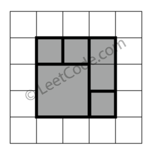
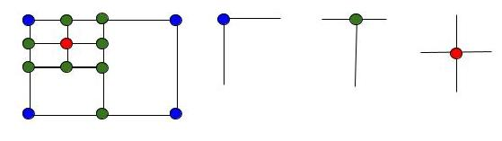

# 391. Perfect Rectangle
<https://leetcode.com/problems/perfect-rectangle/>
Hard

Given N axis-aligned rectangles where N > 0, determine if they all together form an exact cover of a rectangular region.

Each rectangle is represented as a bottom-left point and a top-right point. For example, a unit square is represented as [1,1,2,2]. (coordinate of bottom-left point is (1, 1) and top-right point is (2, 2)).


**Example 1:**


    rectangles = [
        [1,1,3,3],
        [3,1,4,2],
        [3,2,4,4],
        [1,3,2,4],
        [2,3,3,4]
    ]

    Return true. All 5 rectangles together form an exact cover of a rectangular region.
 

**Example 2:**


    rectangles = [
        [1,1,2,3],
        [1,3,2,4],
        [3,1,4,2],
        [3,2,4,4]
    ]

    Return false. Because there is a gap between the two rectangular regions.
 

**Example 3:**


    rectangles = [
        [1,1,3,3],
        [3,1,4,2],
        [1,3,2,4],
        [3,2,4,4]
    ]

    Return false. Because there is a gap in the top center.
 

**Example 4:**


    rectangles = [
        [1,1,3,3],
        [3,1,4,2],
        [1,3,2,4],
        [2,2,4,4]
    ]

    Return false. Because two of the rectangles overlap with each other.
 

Related Topics: Line Sweep

## Counting Corners Solution:
[leetcode 大神解法](https://leetcode.com/problems/perfect-rectangle/discuss/87180/O(n)-solution-by-counting-corners-with-detailed-explaination): 

所有的矩形的四个顶点只会有下面蓝，绿，红三种情况，其中蓝表示该顶点周围没有其他矩形，T型的绿点表示两个矩形并排相邻，红点表示四个矩形相邻，那么在一个完美矩形中，蓝色的点只能有四个，这是个很重要的判断条件。我们再来看矩形的四个顶点，我们按照左下，左上，右上，右下的顺序来给顶点标号为1，2，4，8，为啥不是1，2，3，4呢，我们注意它们的二进制1(0001)，2(0010)，4(0100)，8(1000)，这样便于我们与和或的操作，我们还需要知道的一个判定条件是，当一个点是某一个矩形的左下顶点时，这个点就不能是其他矩形的左下顶点了，这个条件对于这四种顶点都要成立，那么对于每一个点，如果它是某个矩形的四个顶点之一，我们记录下来，如果在别的矩形中它又是相同的顶点，那么直接返回false即可，这样就体现了我们标记为1，2，4，8的好处，我们可以按位检查1。如果每个点的属性没有冲突，那么我们来验证每个点的mask是否合理，通过上面的分析，我们知道每个点只能是蓝，绿，红三种情况的一种，其中蓝的情况是mask的四位中只有一个1，分别就是1(0001)，2(0010)，4(0100)，8(1000)，而且蓝点只能有四个；那么对于T型的绿点，mask的四位中有两个1，那么就有六种情况，分别是12(1100), 10(1010), 9(1001), 6(0110), 5(0101), 3(0011)；而对于红点，mask的四位都是1，只有一种情况15(1111)，那么我们可以通过直接找mask是1，2，4，8的个数，也可以间接通过找不是绿点和红点的个数，看是否是四个。最后一个判定条件是每个矩形面积累加和要等于最后的大矩形的面积，那么大矩形的面积我们通过计算最小左下点和最大右上点来计算出来即可。

```java
class Solution {
    public boolean isRectangleCover(int[][] rectangles) {
        int left = Integer.MAX_VALUE, down = Integer.MAX_VALUE;
        int right = Integer.MIN_VALUE, up = Integer.MIN_VALUE;
        
        Map<Integer, HashMap<Integer, Integer>> map = new HashMap<>();
        for (int i = 0; i < rectangles.length; i++) {
            left = Math.min(left, rectangles[i][0]);
            down = Math.min(down, rectangles[i][1]); 
            right = Math.max(right, rectangles[i][2]);
            up = Math.max(up, rectangles[i][3]);
            if (!helper(map, rectangles[i][0], rectangles[i][1], 1)) return false;
            if (!helper(map, rectangles[i][2], rectangles[i][1], 2)) return false;
            if (!helper(map, rectangles[i][2], rectangles[i][3], 4)) return false;
            if (!helper(map, rectangles[i][0], rectangles[i][3], 8)) return false;
        }
        
        for (Integer x : map.keySet()) {
            for (Integer y : map.get(x).keySet()) {
                Integer v = map.get(x).get(y);
                if ((x == left || x == right) && (y == up || y == down)) {
                    if (v != 1 && v != 2 && v != 4 && v != 8) return false;
                } else {
                    if (v != 3 && v != 6 && v != 9 && v != 12 && v != 15) return false;
                }
            }
        }

        return true;
    }
    private boolean helper(Map<Integer, HashMap<Integer, Integer>> map, int x, int y, int pos) {
        if (!map.containsKey(x)) map.put(x, new HashMap<>());
        if (!map.get(x).containsKey(y)) map.get(x).put(y, 0);
        if ((map.get(x).get(y) & pos) != 0) return false;
        map.get(x).put(y, map.get(x).get(y) | pos);
        
        return true;
    }
}
```

## Math Solution: 

每个绿点其实都是两个顶点的重合，每个红点都是四个顶点的重合，而每个蓝点只有一个顶点，有了这条神奇的性质就不用再去判断“每个点最多只能是一个矩形的左下，左上，右上，或右下顶点”这条性质了，我们直接用一个set，对于遍历到的任意一个顶点，如果set中已经存在了，则删去这个点，如果没有就加上，这样最后会把绿点和红点都滤去，剩下的都是蓝点，我们只要看蓝点的个数是否为四个，再加上检测每个矩形面积累加和要等于最后的大矩形的面积即可。

```java
class Solution {
    public boolean isRectangleCover(int[][] rectangles) {
        if (rectangles.length == 0 || rectangles[0].length == 0) return false;
        int x1 = Integer.MAX_VALUE;
        int x2 = Integer.MIN_VALUE;
        int y1 = Integer.MAX_VALUE;
        int y2 = Integer.MIN_VALUE;
        HashSet<String> set = new HashSet<String>();
        int area = 0;
        for (int[] rect : rectangles) {
            x1 = Math.min(rect[0], x1);
            y1 = Math.min(rect[1], y1);
            x2 = Math.max(rect[2], x2);
            y2 = Math.max(rect[3], y2);
            area += (rect[2] - rect[0]) * (rect[3] - rect[1]);
            String s1 = rect[0] + " " + rect[1];
            String s2 = rect[0] + " " + rect[3];
            String s3 = rect[2] + " " + rect[3];
            String s4 = rect[2] + " " + rect[1];
            if (!set.add(s1)) set.remove(s1);
            if (!set.add(s2)) set.remove(s2);
            if (!set.add(s3)) set.remove(s3);
            if (!set.add(s4)) set.remove(s4);
        }
        if (!set.contains(x1 + " " + y1) || !set.contains(x1 + " " + y2) || !set.contains(x2 + " " + y1) || !set.contains(x2 + " " + y2) || set.size() != 4) return false;
        return area == (x2-x1) * (y2-y1);
    }
}
```