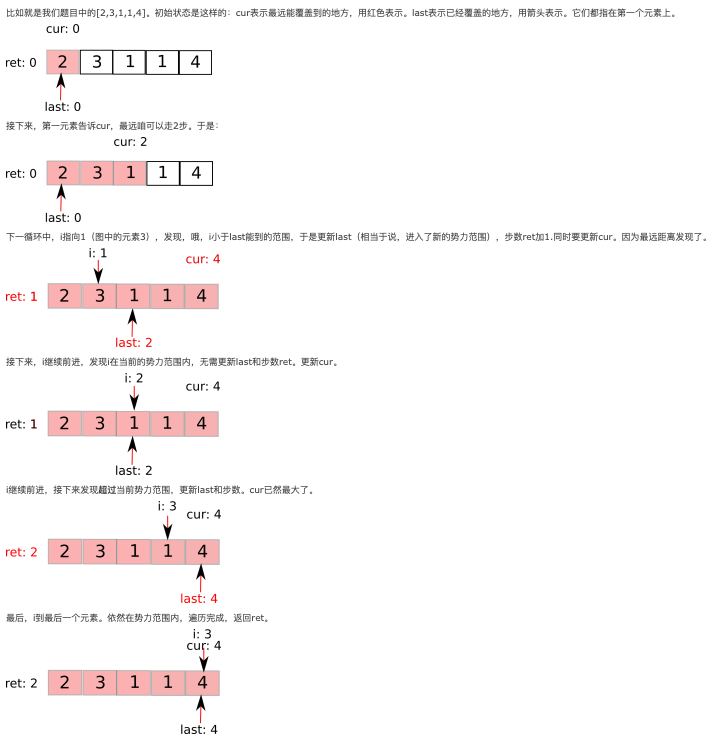

# 45. Jump Game II
<https://leetcode.com/problems/jump-game-ii/>
Hard

Given an array of non-negative integers, you are initially positioned at the first index of the array.

Each element in the array represents your maximum jump length at that position.

Your goal is to reach the last index in the minimum number of jumps.

**Example:**

    Input: [2,3,1,1,4]
    Output: 2
    Explanation: The minimum number of jumps to reach the last index is 2.
        Jump 1 step from index 0 to 1, then 3 steps to the last index.

**Note:**

You can assume that you can always reach the last index.

Related Topics: Array; Greedy

Similar Questions: 
* Medium [Jump Game](https://leetcode.com/problems/jump-game-ii/)
* Medium [Jump Game III](https://leetcode.com/problems/jump-game-iii/)


### BFS Solution: 
利用 BFS 的思想来解，遍历当前跳跃能到的所有位置，然后根据该位置上的跳力来预测下一步能跳到的最远距离，得出一个最远的范围，一旦当这个范围到达末尾时，当前所用的步数一定是最小步数。需要两个变量 cur 和 pre 分别来保存当前的能到达的最远位置和之前能到达的最远位置，只要 cur 未达到最后一个位置则循环继续，pre 先赋值为 cur 的值，表示上一次循环后能到达的最远位置，如果当前位置i小于等于 pre，说明还是在上一跳能到达的范围内，根据当前位置加跳力来更新 cur，更新 cur 的方法是比较当前的 cur 和 i + nums[i] 之中的较大值，如果题目中未说明是否能到达末尾，还可以判断此时 pre 和 cur 是否相等，如果相等说明 cur 没有更新，即无法到达末尾位置，返回 -1。

Time: O(N)
```java
class Solution {
    public int jump(int[] nums) {
        int res = 0, i = 0, cur = 0;
        while(cur < nums.length-1){
            res++;
            int pre = cur;
            for(; i<= pre; ++i){
                cur = Math.max(cur, i+nums[i]);
            }
            if(pre == cur) return -1;
        }
        return res;
    }
}
```

### Greedy Solution: 
cur 是当前能到达的最远位置，last 是上一步能到达的最远位置，遍历数组，首先用 i + nums[i] 更新 cur，这个在上面解法中讲过了，然后判断如果当前位置到达了 last，即上一步能到达的最远位置，说明需要再跳一次了，将 last 赋值为 cur，并且步数 res 自增1，这里小优化一下，判断如果 cur 到达末尾了，直接 break 掉即可。

比如就是我们题目中的[2,3,1,1,4]。初始状态是这样的：cur表示最远能覆盖到的地方，用红色表示。last表示已经覆盖的地方，用箭头表示。它们都指在第一个元素上。


```java
class Solution {
    public int jump(int[] nums) {
        int jump = 0, curEnd = 0, curFarthest = 0;
        for(int i = 0; i < nums.length - 1; i++){
            curFarthest = Math.max(curFarthest, i+nums[i]);
            if(i == curEnd){
                jump++;
                curEnd = curFarthest;
            }
        }
        return jump;
    }
}
```