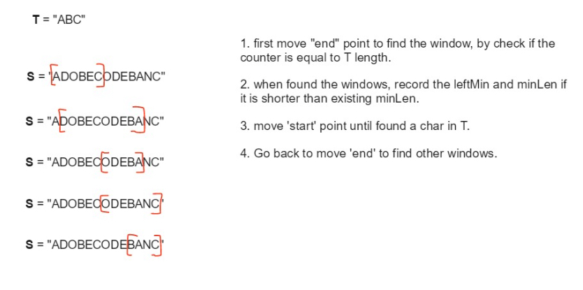

# 76. Minimum Window Substring
<https://leetcode.com/problems/minimum-window-substring/>
Hard

Given a string S and a string T, find the minimum window in S which will contain all the characters in T in complexity O(n).

**Example 1:**

    Input: s = "ADOBECODEBANC", t = "ABC"
    Output: "BANC"
    Explanation: The minimum window substring "BANC" includes 'A', 'B', and 'C' from string t.

**Example 2:**

    Input: s = "a", t = "a"
    Output: "a"
    Explanation: The entire string s is the minimum window.

**Example 3:**

    Input: s = "a", t = "aa"
    Output: ""
    Explanation: Both 'a's from t must be included in the window.
    Since the largest window of s only has one 'a', return empty string.

**Note:**

    * If there is no such window in S that covers all characters in T, return the empty string "".
    * If there is such window, you are guaranteed that there will always be only one unique minimum window in S.

**Constraints:**
    * m == s.length
    * n == t.length
    * 1 <= m, n <= 105
    * s and t consist of uppercase and lowercase English letters.

Related Topics: Hash Table; Two Pointers; String; Sliding Window

Similar Questions:  
* Hard [Substring with Concatenation of All Words](https://leetcode.com/problems/substring-with-concatenation-of-all-words/)
* Medium [Minimum Size Subarray Sum](https://leetcode.com/problems/minimum-size-subarray-sum/)
* Hard [Sliding Window Maximum](https://leetcode.com/problems/sliding-window-maximum/)
* Medium [Permutation in String](https://leetcode.com/problems/permutation-in-string/)
* Hard [Smallest Range Covering Elements from K Lists](https://leetcode.com/problems/smallest-range-covering-elements-from-k-lists/)
* Hard [Minimum Window Subsequence](https://leetcode.com/problems/minimum-window-subsequence/)


## Explanation: 
这道题给了我们一个原字符串S，还有一个目标字符串T，让在S中找到一个最短的子串，使得其包含了T中的所有的字母，并且限制了时间复杂度为 O(n)。这道题的要求是要在 O(n) 的时间度里实现找到这个最小窗口字串，暴力搜索 Brute Force 肯定是不能用的，因为遍历所有的子串的时间复杂度是平方级的。

## Map and Sliding Window Solution: 


根据上图中的例子，可以发现基本顺序是先扩大右边界，然后再收缩左边界，然后对比长度，最后移动右边界再次进行检查。这就是Sliding Window。
先用 map 来记录t中字母出现的次数。这里用一个 int[256] 数组。left 来记录当前窗口的左边界，count 来记录当前窗口包含了多少t中的字母。minLen用来记录出现过的包含T串所有字母的最短的子串的长度，minLeft最短子串的左边界。开始遍历S串，对于S中的每个遍历到的字母，都在 map 中的映射值减1，如果减1后的映射值仍大于等于0，说明当前遍历到的字母是T串中的字母，count++。当 count 和 t 串字母个数相等时，说明此时的窗口已经包含了t串中的所有字母，此时更新 minLen 和 minLeft。结果 res 就是以 minLeft 开始， 长度为 minLen 的子串。然后开始收缩左边界，由于遍历的时候，对映射值减了1，所以此时去除字母的时候，就要把减去的1加回来，此时如果加1后的值大于0了。因为只有t中有的字母才可能为0，其他窗口中出现的字符都是负的，说明此时少了一个t中的字母，那么 count 值就要减1了。然后移动左边界left。具体的步骤：

- 先扫描一遍t，把对应的字符及其出现的次数存到 map 中。
- 移动右边界，就把遍历到的字母对应的 map 中的值减一，如果减1后仍大于等于0，cnt 自增1。
- 移动左边界，去夹逼最小的substring。如果 count 等于 t 串长度时，开始循环，纪录一个字串并更新最小字串值。
- 将子窗口的左边界向右移，如果某个移除掉的字母是T串中不可缺少的字母，那么 cnt 自减1，表示此时T串并没有完全匹配。
- 重复第二步。

Time: O(S+T), S - length of S; T - length of T
Space: O(1)

```java
class Solution {
    public String minWindow(String s, String t) {
        int[] map = new int[256];
        for(char c : t.toCharArray()){
            map[c-'A']++;
        }
        int left = 0, count = 0, minLeft = -1, minLen = Integer.MAX_VALUE;
        for(int i = 0; i<s.length(); i++){
            if(map[s.charAt(i)-'A']-- > 0) count++; // 当前窗口中有当前字符，从map中减去。如果map中对应的个数>0, 表示是t中字母，count++。
            while(count == t.length()){ //找到 t 中所有字母，开始收缩左边
                if(minLen > i - left + 1){ // 找到更短的字符串，更新 minLen 和 minLeft
                    minLen = i - left +1;
                    minLeft = left;
                }
                if(++map[s.charAt(left) - 'A'] > 0) count--; // 从窗口左边剔除的字符在 t 中，需要在map中加回，表示窗口中没有了。如果map中对应的个数>0, 是t中字母，count--。
                left++;
            }
        }
        return minLeft == -1? "" : s.substring(minLeft, minLeft+minLen);
    }
}
```

(a(b)c(d)e), 1 -> a,b,c,d,e


```java
class Solution {
    public List<Character> getGroupCharacter(String s, int group){
        TreeMap<Integer, List<Character>> groupMap = new TreeMap();
        int curGroup = 0;
        for(Character c : s.toCharArray()){
            if(c == '('){
                curGroup = groupMap.size() == 0 ? 1 : groupMap.lastKey()+1;
                groupMap.put(curGroup, new ArrayList<>());
            }else(c == ')'){
                if(curGroup == group) return groupMap.get(curGroup);
                groupMap.remove(curGroup);
                curGroup = groupMap.floorKey(curGroup);
            }else{
                for(int i = 1; i<curGroup; i++){
                    if(group.containsKey(i)){
                        groupMap.put(i, groupMap.get(i).add(c));
                    }
                }
            }
        }
        return Collections.EMPTY_LIST;
    }
}
```
