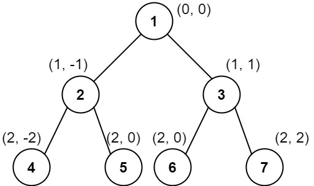

# 987. Vertical Order Traversal of a Binary Tree
<https://leetcode.com/problems/vertical-order-traversal-of-a-binary-tree/>
Hard

Given the root of a binary tree, calculate the vertical order traversal of the binary tree.

For each node at position (row, col), its left and right children will be at positions (row + 1, col - 1) and (row + 1, col + 1) respectively. The root of the tree is at (0, 0).

The vertical order traversal of a binary tree is a list of top-to-bottom orderings for each column index starting from the leftmost column and ending on the rightmost column. There may be multiple nodes in the same row and same column. In such a case, sort these nodes by their values.

Return the vertical order traversal of the binary tree.

 

**Example 1:**


Input: root = [3,9,20,null,null,15,7]
Output: [[9],[3,15],[20],[7]]
Explanation:
Column -1: Only node 9 is in this column.
Column 0: Nodes 3 and 15 are in this column in that order from top to bottom.
Column 1: Only node 20 is in this column.
Column 2: Only node 7 is in this column.

**Example 2:**



Input: root = [1,2,3,4,5,6,7]
Output: [[4],[2],[1,5,6],[3],[7]]
Explanation:
Column -2: Only node 4 is in this column.
Column -1: Only node 2 is in this column.
Column 0: Nodes 1, 5, and 6 are in this column.
          1 is at the top, so it comes first.
          5 and 6 are at the same position (2, 0), so we order them by their value, 5 before 6.
Column 1: Only node 3 is in this column.
Column 2: Only node 7 is in this column.

**Example 3:**


Input: root = [1,2,3,4,6,5,7]
Output: [[4],[2],[1,5,6],[3],[7]]
Explanation:
This case is the exact same as example 2, but with nodes 5 and 6 swapped.
Note that the solution remains the same since 5 and 6 are in the same location and should be ordered by their values.
 

**Constraints:**

* The number of nodes in the tree is in the range [1, 1000].
* 0 <= Node.val <= 1000

Related Topics: Hash Table; Tree; Depth-first Search; Breadth-first Search

## Explanation: 
这道题是让给二叉树进行竖直遍历。和 Binary Tree Vertical Order Traversal 有些一样。不同之处是在于这道题对于同一列中的结点值的顺序还有要求。就是说默认是按y值从大到小排列的，但如果y值相同，则按结点值从小到大排。所以需要根据列的值，行的值，节点值依次排序。

## BFS/DFS with Global SortingS Solution:
需要用一个列表，并按照题目要求排序其中的值。因为要保存节点坐标，所以可以用 BFS 或者 DFS 来遍历树。
1. 用 BFS 或者 DFS 遍历数。为了保存列，行，节点值，新建一个类 Triplet。注意遍历时，复用 Triplet 来保存下个处理的节点，当前的行，列。然后存入 nodeList 时，用 Triplet 保存列，行和节点值。
2. 对 nodeList 根据题目要求排序。
3. 从排序后的 nodeList 中，根据列的值来分组。

Time: O(NlogN)
Space: O(N)

### BFS
```java
/**
 * Definition for a binary tree node.
 * public class TreeNode {
 *     int val;
 *     TreeNode left;
 *     TreeNode right;
 *     TreeNode() {}
 *     TreeNode(int val) { this.val = val; }
 *     TreeNode(int val, TreeNode left, TreeNode right) {
 *         this.val = val;
 *         this.left = left;
 *         this.right = right;
 *     }
 * }
 */
class Solution {
    class Triplet<F, S, T> {
        public final F first;
        public final S second;
        public final T third;

        //<column, row, value>
        public Triplet(F first, S second, T third) {
            this.first = first;
            this.second = second;
            this.third = third;
        }
    }
    
    List<Triplet<Integer, Integer, Integer>> nodeList = new ArrayList<>();
    public List<List<Integer>> verticalTraversal(TreeNode root) {
        List<List<Integer>> output = new ArrayList();
        if (root == null) {
            return output;
        }

        // step 1). BFS traversal
        BFS(root);

        // step 2). sort the global list by <column, row, value>
        Collections.sort(this.nodeList, new Comparator<Triplet<Integer, Integer, Integer>>() {
            @Override
            public int compare(Triplet<Integer, Integer, Integer> t1,
                    Triplet<Integer, Integer, Integer> t2) {
                if (t1.first.equals(t2.first))
                    if (t1.second.equals(t2.second))
                        return t1.third - t2.third;
                    else
                        return t1.second - t2.second;
                else
                    return t1.first - t2.first;
            }
        });

        // step 3). extract the values, partitioned by the column index.
        List<Integer> currColumn = new ArrayList();
        Integer currColumnIndex = this.nodeList.get(0).first;

        for (Triplet<Integer, Integer, Integer> triplet : this.nodeList) {
            Integer column = triplet.first, value = triplet.third;
            if (column == currColumnIndex) {
                currColumn.add(value);
            } else {
                output.add(currColumn);
                currColumnIndex = column;
                currColumn = new ArrayList();
                currColumn.add(value);
            }
        }
        output.add(currColumn);

        return output;
    }
    
    private void BFS(TreeNode root) {
        Queue<Triplet<TreeNode, Integer, Integer>> queue = new ArrayDeque();
        int row = 0, column = 0;
        queue.offer(new Triplet(root, row, column));

        while (!queue.isEmpty()) {
            Triplet<TreeNode, Integer, Integer> triplet = queue.poll();
            root = triplet.first;
            row = triplet.second;
            column = triplet.third;

            if (root != null) {
                this.nodeList.add(new Triplet(column, row, root.val));
                queue.offer(new Triplet(root.left, row + 1, column - 1));
                queue.offer(new Triplet(root.right, row + 1, column + 1));
            }
        }
    }
}
```

### DFS

```java
class Triplet<F, S, T> {
    public final F first;
    public final S second;
    public final T third;

    public Triplet(F first, S second, T third) {
        this.first = first;
        this.second = second;
        this.third = third;
    }
}

class Solution {
    List<Triplet<Integer, Integer, Integer>> nodeList = new ArrayList<>();

    private void DFS(TreeNode node, Integer row, Integer column) {
        if (node == null)
            return;
        nodeList.add(new Triplet(column, row, node.val));
        // preorder DFS traversal
        this.DFS(node.left, row + 1, column - 1);
        this.DFS(node.right, row + 1, column + 1);
    }

    public List<List<Integer>> verticalTraversal(TreeNode root) {
        List<List<Integer>> output = new ArrayList();
        if (root == null) {
            return output;
        }

        // step 1). DFS traversal
        DFS(root, 0, 0);

        // step 2). sort the list by <column, row, value>
        Collections.sort(this.nodeList, new Comparator<Triplet<Integer, Integer, Integer>>() {
            @Override
            public int compare(Triplet<Integer, Integer, Integer> t1,
                    Triplet<Integer, Integer, Integer> t2) {
                if (t1.first.equals(t2.first))
                    if (t1.second.equals(t2.second))
                        return t1.third - t2.third;
                    else
                        return t1.second - t2.second;
                else
                    return t1.first - t2.first;
            }
        });

        // step 3). extract the values, grouped by the column index.
        List<Integer> currColumn = new ArrayList();
        Integer currColumnIndex = this.nodeList.get(0).first;

        for (Triplet<Integer, Integer, Integer> triplet : this.nodeList) {
            Integer column = triplet.first, value = triplet.third;
            if (column == currColumnIndex) {
                currColumn.add(value);
            } else {
                output.add(currColumn);
                currColumnIndex = column;
                currColumn = new ArrayList();
                currColumn.add(value);
            }
        }
        output.add(currColumn);

        return output;
    }
}
```