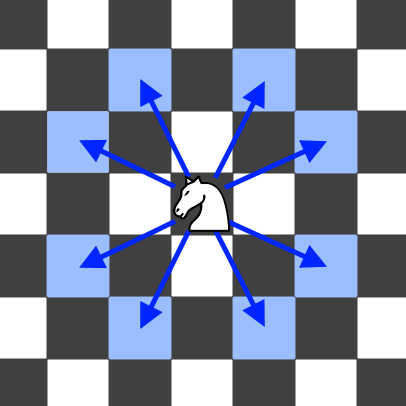

# 1197. Minimum Knight Moves
<https://leetcode.com/problems/minimum-knight-moves/>
Medium

In an infinite chess board with coordinates from -infinity to +infinity, you have a knight at square [0, 0].

A knight has 8 possible moves it can make, as illustrated below. Each move is two squares in a cardinal direction, then one square in an orthogonal direction.


Return the minimum number of steps needed to move the knight to the square [x, y].  It is guaranteed the answer exists.

 

**Example 1:**

Input: x = 2, y = 1
Output: 1
Explanation: [0, 0] → [2, 1]

**Example 2:**

Input: x = 5, y = 5
Output: 4
Explanation: [0, 0] → [2, 1] → [4, 2] → [3, 4] → [5, 5]
 

**Constraints:**
    * |x| + |y| <= 300

Related Topics: Breadth-first Search

## Explanation:  
题是求棋子从 (0,0) 到 (x,y) 的最少步数。棋子有8种走法。但是因为是对称的，所以只管正向区间的。这样可以少算其他三个区间。

## BFS Solution: 
看到求最少步数的题，优先想到 BFS ，用 queue 实现。先定义一个方向矩阵 DIRECTIONS。然后因为只考虑正向区间，所以对(x,y) 取绝对值。然后用一个 Set visited 来保存已经走过的路径。把起始点 add 到 queue 里。每次循环，取出当前层的大小 currSize，然后依次从 queue 中 remove 出当前坐标 curr。计算下个新坐标 nextLoc。注意因为只管正向区间，所以要剔除不在这个区间内的新坐标。把新坐标放入 queue 和 visited 中。每层遍历完 result 自增。
```java
class Solution {
    private final int[][] DIRECTIONS = new int[][] {{2, 1}, {1, 2}, {-1, 2}, {-2, 1}, {-2, -1}, {-1, -2}, {1, -2}, {2, -1}};
    public int minKnightMoves(int x, int y) {
        x = Math.abs(x);
        y = Math.abs(y);
        Queue<int[]> queue = new LinkedList<>();
        queue.add(new int[] {0, 0});
        Set<String> visited = new HashSet<>();
        visited.add("0,0");
        int result = 0;
        while (!queue.isEmpty()) {
            int currSize = queue.size();
            for(int i = 0; i<currSize; i++){
                int[] curr = queue.remove();
                if(curr[0] == x && curr[1] == y) return result;
                for(int[] d : DIRECTIONS){
                    int[] nextLoc = new int[]{curr[0]+d[0], curr[1]+d[1]};
                    if(!visited.contains(nextLoc[0]+","+nextLoc[1]) && nextLoc[0] >= -1 && nextLoc[1] >= -1){
                        queue.add(nextLoc);
                        visited.add(nextLoc[0]+","+nextLoc[1]);
                    }
                }
            }
            result++;
        }
        return -1;
    }
}
```

## DP Solution: 
从 (0,0) 到 (x,y) 也可以反过来找。同样对 (x,y) 取绝对值。然后用 Map<String, Integer> memo 来作为保存之前走过的位置的最小步数。然后从 (x,y) 开始调用递归函数。

递归函数 helper() 返回当前点到原点的最小值。先判断是否该位置走过。当 (x,y) == (0,0) (因为(x,y)在正向区间，所以可以写成 x+y == 0)，找到结果，递归结束。**注意**在 (0,2)，(2,0)，(1,1) 时，棋子需要两步才能回到原点，但是会走进负区间，所以还要加上 x+y == 2，return 2 的终止条件。因为只在乎正向区间，而且要返回 (0,0)， 所以只有(-1,-2) 和 (-2,-1) 两种走法，依次对其递归调用。取两者的最小值放入memo中，并返回最小值。


```java
class Solution {
    public int minKnightMoves(int x, int y) {
        x = Math.abs(x);
        y = Math.abs(y);
        Map<String, Integer> memo = new HashMap<>();
        return helper(x, y, memo);
    }
    
    private int helper(int x, int y, Map<String, Integer> memo){
        String key = x + ":" + y;
        if (memo.containsKey(key)) {
            return memo.get(key);
        }
        if (x + y == 0) {
            return 0;
        } else if (x + y == 2) {
            return 2;
        }
        int min = Math.min(helper(Math.abs(x - 1), Math.abs(y - 2), memo), 
                           helper(Math.abs(x - 2), Math.abs(y - 1), memo)) + 1;
        memo.put(key, min);
        return min;
    }
}
```