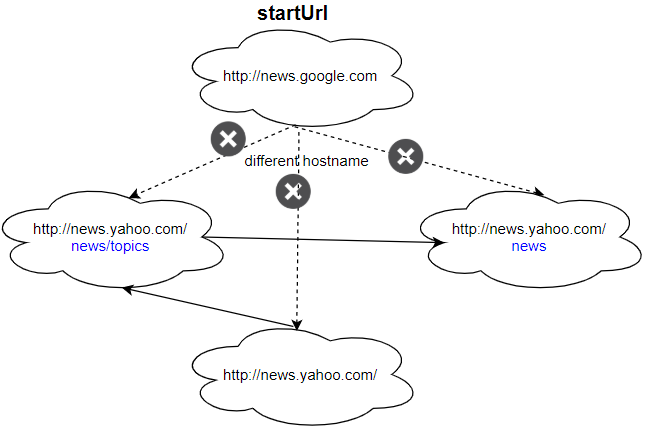

# 1242. Web Crawler Multithreaded
<https://leetcode.com/problems/web-crawler-multithreaded/>
Medium

Given a url startUrl and an interface HtmlParser, implement a Multi-threaded web crawler to crawl all links that are under the same hostname as startUrl. 

Return all urls obtained by your web crawler in any order.

Your crawler should:

Start from the page: startUrl
Call HtmlParser.getUrls(url) to get all urls from a webpage of given url.
Do not crawl the same link twice.
Explore only the links that are under the same hostname as startUrl.


As shown in the example url above, the hostname is example.org. For simplicity sake, you may assume all urls use http protocol without any port specified. For example, the urls http://leetcode.com/problems and http://leetcode.com/contest are under the same hostname, while urls http://example.org/test and http://example.com/abc are not under the same hostname.

The HtmlParser interface is defined as such: 

interface HtmlParser {
  // Return a list of all urls from a webpage of given url.
  // This is a blocking call, that means it will do HTTP request and return when this request is finished.
  public List<String> getUrls(String url);
}
Note that getUrls(String url) simulates performing a HTTP request. You can treat it as a blocking function call which waits for a HTTP request to finish. It is guaranteed that getUrls(String url) will return the urls within 15ms.  Single-threaded solutions will exceed the time limit so, can your multi-threaded web crawler do better?

Below are two examples explaining the functionality of the problem, for custom testing purposes you'll have three variables urls, edges and startUrl. Notice that you will only have access to startUrl in your code, while urls and edges are not directly accessible to you in code.

 

**Follow up:**

1. Assume we have 10,000 nodes and 1 billion URLs to crawl. We will deploy the same software onto each node. The software can know about all the nodes. We have to minimize communication between machines and make sure each node does equal amount of work. How would your web crawler design change?
2. What if one node fails or does not work?
3. How do you know when the crawler is done?
 

**Example 1:**


Input:
urls = [
  "http://news.yahoo.com",
  "http://news.yahoo.com/news",
  "http://news.yahoo.com/news/topics/",
  "http://news.google.com",
  "http://news.yahoo.com/us"
]
edges = [[2,0],[2,1],[3,2],[3,1],[0,4]]
startUrl = "http://news.yahoo.com/news/topics/"
Output: [
  "http://news.yahoo.com",
  "http://news.yahoo.com/news",
  "http://news.yahoo.com/news/topics/",
  "http://news.yahoo.com/us"
]

**Example 2:**


Input: 
urls = [
  "http://news.yahoo.com",
  "http://news.yahoo.com/news",
  "http://news.yahoo.com/news/topics/",
  "http://news.google.com"
]
edges = [[0,2],[2,1],[3,2],[3,1],[3,0]]
startUrl = "http://news.google.com"
Output: ["http://news.google.com"]
Explanation: The startUrl links to all other pages that do not share the same hostname.
 

**Constraints:**

* 1 <= urls.length <= 1000
* 1 <= urls[i].length <= 300
* startUrl is one of the urls.
* Hostname label must be from 1 to 63 characters long, including the dots, may contain only the ASCII letters from 'a' to 'z', digits from '0' to '9' and the hyphen-minus character ('-').
* The hostname may not start or end with the hyphen-minus character ('-'). 
* See:  https://en.wikipedia.org/wiki/Hostname#Restrictions_on_valid_hostnames
* You may assume there're no duplicates in url library.

Related Topics: Depth-first Search; Breadth-first Search

Similar Questions: 
* Medium [Web Crawler](https://leetcode.com/problems/web-crawler/)

## Explanation:
题目要求设计个爬虫来获取起始url关联的所有url。遍历用 DFS 或者 BFS。Follow up 给出会有很多url，所以需要用到多线程。

## BFS Mono Thread Solution (TLE):


```java
/**
 * // This is the HtmlParser's API interface.
 * // You should not implement it, or speculate about its implementation
 * interface HtmlParser {
 *     public List<String> getUrls(String url) {}
 * }
 */
class Solution {
    public List<String> crawl(String startUrl, HtmlParser htmlParser) {
        // find hostname
        int index = startUrl.indexOf('/', 7);
        String hostname = (index != -1) ? startUrl.substring(0, index) : startUrl;
        
        // bfs
        Set<String> result = new HashSet<>();
        Queue<String> queue = new LinkedList<>();
        queue.add(startUrl);
        while(!queue.isEmpty()){
            String tmp = queue.remove();
            if(tmp.startsWith(hostname) && !result.contains(tmp)){
                result.add(tmp);
                for(String s: htmlParser.getUrls(tmp)){
                    queue.add(s);
                }
            }
        }
        return new ArrayList<>(result);
    }
}
```

## Multi-Thread using volatile & synchronized:
新建一个class Crawler 实现 Runnable。用一个Set result 来保存结果，需要定义为 **volatile** 来保证在线程间共享。更新 result 的函数 addUrl 需要定义为 **synchronized** 来上锁。遍历返回的url，对于每个url，新建一个Thread，并存入列表 threads。然后遍历 threads 来保证所有线程都完成了。


```java
/**
 * // This is the HtmlParser's API interface.
 * // You should not implement it, or speculate about its implementation
 * interface HtmlParser {
 *     public List<String> getUrls(String url) {}
 * }
 */
class Solution {
    public List<String> crawl(String startUrl, HtmlParser htmlParser) {
        // find hostname
        int index = startUrl.indexOf('/', 7);
        String hostname = (index != -1) ? startUrl.substring(0, index) : startUrl;
        
        // bfs
        // multi-thread
        Crawler crawler = new Crawler(startUrl, hostname, htmlParser);
        crawler.result = new HashSet<>(); // reset result as static property belongs to class, it will go through all of the test cases
        Thread thread = new Thread(crawler);
        thread.start();
        
        crawler.joinThread(thread); // wait for thread to complete
        return new ArrayList<>(crawler.result);
    }
}

class Crawler implements Runnable {
    String startUrl;
    String hostname;
    HtmlParser htmlParser;
    public static volatile Set<String> result = new HashSet<>();

    public Crawler(String startUrl, String hostname, HtmlParser htmlParser){
        this.startUrl = startUrl;
        this.hostname = hostname;
        this.htmlParser = htmlParser;
    }
    @Override
    public void run(){
        if(this.startUrl.startsWith(hostname) && !this.result.contains(this.startUrl)){
            addUrl(this.result, this.startUrl);
            List<Thread> threads = new ArrayList<>();
            for(String s: htmlParser.getUrls(startUrl)){
			          if(result.contains(s)) continue;
                Crawler crawler = new Crawler(s, hostname, htmlParser);
                Thread thread = new Thread(crawler);
                thread.start();
                threads.add(thread);
            }
            for(Thread t: threads){
                joinThread(t); // wait for all threads to complete
            }
        }
    }
    public static synchronized void addUrl(Set<String> result, String url){
        result.add(url);
    }
    
    public static void joinThread(Thread thread){
        try{
            thread.join();
        } catch(InterruptedException e){
            e.printStackTrace();
        }
    }
}
```

## Mutli-Thread using ConcurrentHashMap Solution: 
对于保存结果的 result，用 ConcurrentHashMap。
    public static ConcurrentHashMap<String, String> map = new ConcurrentHashMap<>();
    public static Set<String> result = map.newKeySet();

```java
class Solution {
    public List<String> crawl(String startUrl, HtmlParser htmlParser) {

        // find hostname
        int index = startUrl.indexOf('/', 7);
        String hostname = (index != -1) ? startUrl.substring(0, index) : startUrl;

        // multi-thread
        Crawler crawler = new Crawler(startUrl, hostname, htmlParser);
        crawler.map = new ConcurrentHashMap<>(); // reset result as static property belongs to class, it will go through all of the test cases
        crawler.result = crawler.map.newKeySet();
        Thread thread = new Thread(crawler);
        thread.start();

        crawler.joinThread(thread); // wait for thread to complete
        return new ArrayList<>(crawler.result);
    }
}

class Crawler implements Runnable {
    String startUrl;
    String hostname;
    HtmlParser htmlParser;
    public static ConcurrentHashMap<String, String> map = new ConcurrentHashMap<>();
    public static Set<String> result = map.newKeySet();

    public Crawler(String startUrl, String hostname, HtmlParser htmlParser) {
        this.startUrl = startUrl;
        this.hostname = hostname;
        this.htmlParser = htmlParser;
    }

    @Override
    public void run() {
        if (this.startUrl.startsWith(hostname) && !this.result.contains(this.startUrl)) {
            this.result.add(this.startUrl);
            List<Thread> threads = new ArrayList<>();
            for (String s : htmlParser.getUrls(startUrl)) {
			    if(result.contains(s)) continue;
                Crawler crawler = new Crawler(s, hostname, htmlParser);
                Thread thread = new Thread(crawler);
                thread.start();
                threads.add(thread);
            }
            for (Thread t : threads) {
                joinThread(t); // wait for all threads to complete
            }
        }
    }

    public static void joinThread(Thread thread) {
        try {
            thread.join();
        } catch (InterruptedException e) {
            e.printStackTrace();
        }
    }
}
```