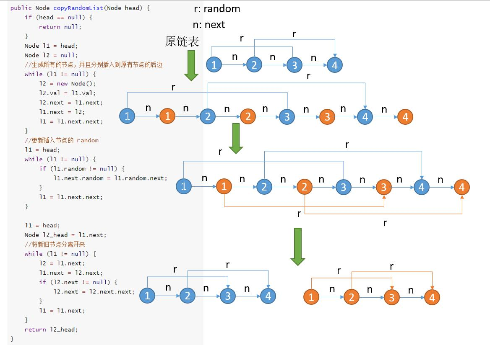

# 138. Copy List with Random Pointer
<https://leetcode.com/problems/copy-list-with-random-pointer/>
Medium

A linked list is given such that each node contains an additional random pointer which could point to any node in the list or null.

Return a deep copy of the list.

The Linked List is represented in the input/output as a list of n nodes. Each node is represented as a pair of [val, random_index] where:

    * val: an integer representing Node.val
    * random_index: the index of the node (range from 0 to n-1) where random pointer points to, or null if it does not point to any node.
 

**Example 1:**


    Input: head = [[7,null],[13,0],[11,4],[10,2],[1,0]]
    Output: [[7,null],[13,0],[11,4],[10,2],[1,0]]

**Example 2:**


    Input: head = [[1,1],[2,1]]
    Output: [[1,1],[2,1]]

**Example 3:**


    Input: head = [[3,null],[3,0],[3,null]]
    Output: [[3,null],[3,0],[3,null]]

**Example 4:**


    Input: head = []
    Output: []
    Explanation: Given linked list is empty (null pointer), so return null.
 

**Constraints:**

    * -10000 <= Node.val <= 10000
    * Node.random is null or pointing to a node in the linked list.
    * Number of Nodes will not exceed 1000.

Related Topics: Hash Table; Linked List

Similar Questions: 
* Medium [Clone Graph](https://leetcode.com/problems/clone-graph/)

## Explaination: 
这道题其实和 [133. Clone Graph](https://leetcode.com/problems/clone-graph/) 很类似，这里的话就是要解决的问题就是，当更新当前节点的 random 指针的时候，如果 random 指向的是很后边的节点，但此时后边的节点还没有生成，那么我们该如何处理。和 133 题 一样，我们可以利用 HashMap 将节点提前生成并且保存起来，第二次遍历到他的时候直接从 HashMap 里边拿即可。

## Recursive + Map Solution: 
用递归的解法，写起来相当的简洁，还是需要一个 HashMap 来建立原链表结点和拷贝链表结点之间的映射。在递归函数中，首先判空，若为空，则返回空指针。然后就是去 HashMap 中查找是否已经在拷贝链表中存在了该结点，是的话直接返回。否则新建一个拷贝结点 res，然后建立原结点和该拷贝结点之间的映射，然后就是要给拷贝结点的 next 和 random 指针赋值了，直接分别调用递归函数即可。

Time: O(n)
Space: O(n)

```java
/*
// Definition for a Node.
class Node {
    int val;
    Node next;
    Node random;

    public Node(int val) {
        this.val = val;
        this.next = null;
        this.random = null;
    }
}
*/

class Solution {
    public Node copyRandomList(Node head) {
        Map<Node, Node> map = new HashMap<>();
        return helper(head, map);
    }
    
    public Node helper(Node node, Map<Node, Node> map){
        if(node == null) return null;
        if(map.containsKey(node)) return map.get(node);
        Node newNode = new Node(node.val);
        map.put(node, newNode);
        newNode.next = helper(node.next, map);
        newNode.random = helper(node.random, map);
        return newNode;
    }
}
```

## Iterative + Map Solution: 
只遍历一次链表。核心思想就是延迟更新它的 next。
    1 -> 2 -> 3

    用 cur 指向已经生成的节点的末尾
    1 -> 2   
        ^
        c

    然后将 3 构造完成

    最后将 2 的 next 指向 3
    1 -> 2 -> 3  
        ^
        c

    期间已经生成的节点存到 HashMap 中，第二次遇到的时候直接从 HashMap 中拿

```java
/*
// Definition for a Node.
class Node {
    int val;
    Node next;
    Node random;

    public Node(int val) {
        this.val = val;
        this.next = null;
        this.random = null;
    }
}
*/

class Solution {
    public Node copyRandomList(Node head) {
        if (head == null) {
            return null;
        }
        HashMap<Node, Node> map = new HashMap<>();
        Node h = head;
        Node cur = new Node(-1); //空结点，dummy 节点，为了方便头结点计算
        while (h != null) {
            //判断当前节点是否已经产生过
            if (!map.containsKey(h)) {
                Node t = new Node(h.val);
                map.put(h, t);
            }
            //得到当前节点去更新它的 random 指针
            Node next = map.get(h);
            if (h.random != null) {
                //判断当前节点是否已经产生过
                if (!map.containsKey(h.random)) {
                    next.random = new Node(h.random.val);
                    map.put(h.random, next.random);
                } else {
                    next.random = map.get(h.random);
                }

            }
            //将当前生成的节点接到 cur 的后边
            cur.next = next;
            cur = cur.next;
            h = h.next;
        }
        return map.get(head);
    }
}
```


## Iterative w/o Map Solution: 
主要参考了[这里](https://leetcode.com/problems/copy-list-with-random-pointer/discuss/43491/A-solution-with-constant-space-complexity-O(1)。主要解决的问题就是我们生成节点以后，当更新它的 random 的时候，怎么找到之前生成的节点，前两种解法用了 HashMap 全部存起来，这里的话可以利用原来的链表的指针域。
主要需要三步。
  1. 生成所有的节点，并且分别插入到原有节点的后边
  2. 更新插入节点的 random
  3. 将新旧节点分离开来
一图胜千言，大家看一下下边的图吧。


```java
/*
// Definition for a Node.
class Node {
    int val;
    Node next;
    Node random;

    public Node(int val) {
        this.val = val;
        this.next = null;
        this.random = null;
    }
}
*/

class Solution {
    public Node copyRandomList(Node head) {
        if (head == null) {
            return null;
        }
        Node l1 = head;
        Node l2 = null;
        //生成所有的节点，并且分别插入到原有节点的后边
        while (l1 != null) {
            l2 = new Node(l1.val);
            l2.next = l1.next;
            l1.next = l2;
            l1 = l1.next.next;
        }
        //更新插入节点的 random
        l1 = head;
        while (l1 != null) {
            if (l1.random != null) {
                l1.next.random = l1.random.next;
            }
            l1 = l1.next.next;
        }

        l1 = head;
        Node l2_head = l1.next;
        //将新旧节点分离开来
        while (l1 != null) {
            l2 = l1.next;
            l1.next = l2.next;
            if (l2.next != null) {
                l2.next = l2.next.next;
            }
            l1 = l1.next;
        }
        return l2_head;
    }
}
```
