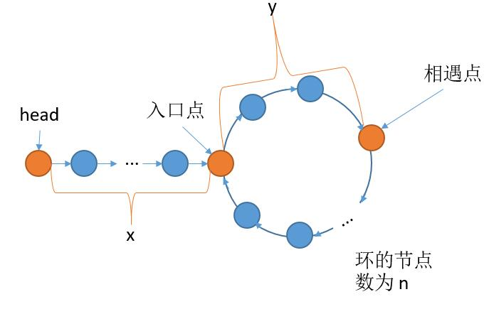

# 142. Linked List Cycle II
<https://leetcode.com/problems/linked-list-cycle-ii/>
Medium

Given a linked list, return the node where the cycle begins. If there is no cycle, return null.

To represent a cycle in the given linked list, we use an integer pos which represents the position (0-indexed) in the linked list where tail connects to. If pos is -1, then there is no cycle in the linked list.

Note: Do not modify the linked list.

 

**Example 1:**
    
    Input: head = [3,2,0,-4], pos = 1
    Output: tail connects to node index 1
    Explanation: There is a cycle in the linked list, where tail connects to the second node.
    

**Example 2:**

    Input: head = [1,2], pos = 0
    Output: tail connects to node index 0
    Explanation: There is a cycle in the linked list, where tail connects to the first node.
    

**Example 3:**

    Input: head = [1], pos = -1
    Output: no cycle
    Explanation: There is no cycle in the linked list.
    


**Follow-up:**
Can you solve it without using extra space?

Related Topics: Linked List; Two Pointers

Simlar Questions: 
* Easy [Linked List Cycle](https://leetcode.com/problems/linked-list-cycle/)
* Medium [Find the Duplicate Number](https://leetcode.com/problems/find-the-duplicate-number/)


## Slow and Fast Pointers
还是之前的思想，学数据结构课程的时候，应该都用过这个方法，很巧妙，快慢指针。原理也很好理解，想象一下圆形跑道，两个人跑步，如果一个人跑的快，一个人跑的慢，那么不管两个人从哪个位置出发，跑的过程中两人一定会相遇。
所以这里我们用两个指针 fast 和 slow。fast 每次走两步，slow 每次走一步，如果 fast 到达了 null 就说明没有环。如果 fast 和 slow 相遇了就说明有环。
但是这道题，我们需要找到入口点，而快慢指针相遇的点可能并不是入口点，而是环中的某一个点，所以需要一些数学上的推导，参考了 这里-solution-by-using-two-pointers-without-change-anything) 。

如下图，我们明确几个位置。


从 head 到入口点的距离设为 x，入口点到相遇点的距离设为 y，环的的长度设为 n。假设 slow 指针走过的距离为 t，那么 fast 指针走过的一定是 slow 指针的 2 倍，也就是 2t。slow 指针从 head 出发走了 x 的距离到达入口点，然后可能走了 k1 圈，然后再次回到入口点，再走了 y 的距离到达相遇点和 fast 指针相遇。
    t = x + k1 * n + y
fast 指针同理，fast 指针从 head 出发走了 x 的距离到达入口点，然后可能走了 k2 圈，然后再次回到入口点，再走了 y 的距离到达相遇点和 slow 指针相遇。
    2t = x + k2 * n + y
上边两个等式做一个差，可以得到
    t = (k2 - k1) * n
设 k = k2 - k1 ，那么 t = k * n。把 t = k * n 代入到第一个式子 t = x + k1 * n + y 中。
    k * n = x + k1 * n + y
移项，x = (k - k1) * n - y
取出一个 n 和 y 结合，x = (k - k1 - 1) * n + (n - y)
左边的含义就是从 head 到达入口点。
右边的含义， n - y 就是从相遇点到入口点的距离，(k - k1 - 1) * n 就是转 (k - k1 - 1) 圈。
左边右边的含义结合起来就是，从相遇点走到入口点，然后转 (k - k1 - 1) 圈后再次回到入口点的这段时间，刚好就等于从 head 走向入口点的时间。
所以代码的话，我们只需要 meet 指针从相遇点出发的同时，让 head 指针也出发， head 指针和 meet 指针相遇的位置就是入口点了。

```java
/**
 * Definition for singly-linked list.
 * class ListNode {
 *     int val;
 *     ListNode next;
 *     ListNode(int x) {
 *         val = x;
 *         next = null;
 *     }
 * }
 */
public class Solution {
    public ListNode detectCycle(ListNode head) {
        ListNode slow = head, fast = head, meet = null;
        while(fast != null && fast.next != null){
            slow = slow.next;
            fast = fast.next.next;
            if(slow == fast){
                meet = fast;
                break;
            }
        }
        if(fast == null || fast.next == null || meet == null) return null;
        slow = head;
        while(slow != meet){
            slow = slow.next;
            meet = meet.next;
        }
        return meet;
    }
}
```