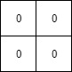

# 1428. Leftmost Column with at Least a One
<https://leetcode.com/problems/leftmost-column-with-at-least-a-one/>
Medium

(This problem is an interactive problem.)

A **row-sorted binary matrix** means that all elements are 0 or 1 and each row of the matrix is sorted in non-decreasing order.

Given a **row-sorted binary matrix binaryMatrix**, return the index (0-indexed) of the **leftmost column** with a 1 in it. If such an index does not exist, return -1.

**You can't access the Binary Matrix directly.** You may only access the matrix using a BinaryMatrix interface:

* BinaryMatrix.get(row, col) returns the element of the matrix at index (row, col) (0-indexed).
* BinaryMatrix.dimensions() returns the dimensions of the matrix as a list of 2 elements [rows, cols], which means the matrix is rows x cols.
Submissions making more than 1000 calls to BinaryMatrix.get will be judged Wrong Answer. Also, any solutions that attempt to circumvent the judge will result in disqualification.

For custom testing purposes, the input will be the entire binary matrix mat. You will not have access to the binary matrix directly.

**Example 1:**

Input: mat = [[0,0],[1,1]]
Output: 0

**Example 2:**

Input: mat = [[0,0],[0,1]]
Output: 1

**Example 3:**

Input: mat = [[0,0],[0,0]]
Output: -1

**Example 4:**

Input: mat = [[0,0,0,1],[0,0,1,1],[0,1,1,1]]
Output: 1

**Constraints:**
  * rows == mat.length
  * cols == mat[i].length
  * 1 <= rows, cols <= 100
  * mat[i][j] is either 0 or 1.
  * mat[i] is sorted in non-decreasing order.

Related Topics: Array;

## Explanation:
输入矩阵每行不是递减的，找到最左的包含1的的列。最多只能查1000次坐标值。一般查询有序数据都是想到 binary search。

## Binary Search Solution: 
因为每行是非递减的。所以用binary search 查询每列。如果当前列有1，则查询左半部分，否则查询右半部分。

Time: O(MlogN) M - number of rows; N - number of columns
Space: O(1)

```java
/**
 * // This is the BinaryMatrix's API interface.
 * // You should not implement it, or speculate about its implementation
 * interface BinaryMatrix {
 *     public int get(int row, int col) {}
 *     public List<Integer> dimensions {}
 * };
 */

class Solution {
    public int leftMostColumnWithOne(BinaryMatrix binaryMatrix) {
        List<Integer> dimen = binaryMatrix.dimensions();
        int m = dimen.get(0), n = dimen.get(1);
        int left = 0, right = n - 1, ans = -1;
        while (left <= right) {
            int mid = left + (right - left) / 2;
            if (existOneInColumn(binaryMatrix, m, mid)) {
                ans = mid;          // record as current ans
                right = mid - 1;    // try to find in the left side
            } else {
                left = mid + 1;     // try to find in the right side
            }
        }
        return ans;
    }
    
    public boolean existOneInColumn(BinaryMatrix binaryMatrix, int m, int c) {
        for (int r = 0; r < m; r++) if (binaryMatrix.get(r, c) == 1) return true;
        return false;
    }
}
```

## Start at Top Right, Move Only Left and Down Solution:
不需要搜索所有行，只需要记录1的最小列。所以从最大列开始，即右上角开始。分两种情况讨论：
1. 左边为1，则往左移
2. 左边不为1，则往下移。
如图：


Time: O(M+N) N - number of rows; M - number of columns
Space: O(1)

```java
/**
 * // This is the BinaryMatrix's API interface.
 * // You should not implement it, or speculate about its implementation
 * interface BinaryMatrix {
 *     public int get(int row, int col) {}
 *     public List<Integer> dimensions {}
 * };
 */

class Solution {
    public int leftMostColumnWithOne(BinaryMatrix binaryMatrix) {
        List<Integer> dimen = binaryMatrix.dimensions();
        int m = dimen.get(0), n = dimen.get(1);
        int ans = -1, r = 0, c = n - 1;
        while (r < m && c >= 0) {
            if (binaryMatrix.get(r, c) == 1) {
                ans = c; // record as current ans
                c--;
            } else {
                r++;
            }
        }
        return ans;
    }
}
```