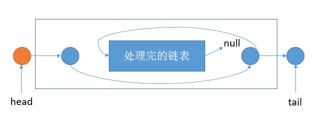

# 143. Reorder List
<https://leetcode.com/problems/reorder-list/>
Medium

Given a singly linked list L: L0→L1→…→Ln-1→Ln,
reorder it to: L0→Ln→L1→Ln-1→L2→Ln-2→…

You may not modify the values in the list's nodes, only nodes itself may be changed.

**Example 1:**

    Given 1->2->3->4, reorder it to 1->4->2->3.

**Example 2:**

    Given 1->2->3->4->5, reorder it to 1->5->2->4->3.

Related Topics: Linked List


## Combine From Both End Solution: 

主要是三步，举个例子。
    1 -> 2 -> 3 -> 4 -> 5 -> 6
第一步，将链表平均分成两半
    1 -> 2 -> 3
    4 -> 5 -> 6

第二步，将第二个链表逆序
    1 -> 2 -> 3
    6 -> 5 -> 4

第三步，依次连接两个链表
    1 -> 6 -> 2 -> 5 -> 3 -> 4

第一步找中点的话，可以应用 19 题 的方法，快慢指针。快指针一次走两步，慢指针一次走一步，当快指针走到终点的话，慢指针会刚好到中点。如果节点个数是偶数的话，slow 走到的是左端点，利用这一点，我们可以把奇数和偶数的情况合并，不需要分开考虑。
第二步链表逆序的话，在 第 2 题 讨论过了，有迭代和递归的两种方式，迭代的话主要利用两个指针，依次逆转。
第三步的话就很简单了，两个指针分别向后移动就可以。


```java
/**
 * Definition for singly-linked list.
 * public class ListNode {
 *     int val;
 *     ListNode next;
 *     ListNode(int x) { val = x; }
 * }
 */
class Solution {
    public void reorderList(ListNode head) {
        if (head == null || head.next == null || head.next.next == null) {
            return;
        }
        //找中点，链表分成两个
        ListNode slow = head;
        ListNode fast = head;
        while (fast.next != null && fast.next.next != null) {
            slow = slow.next;
            fast = fast.next.next;
        }
        ListNode newHead = slow.next;
        slow.next = null;
        //第二个链表倒置
        newHead = reverseList(newHead);
        //链表节点依次连接
        while (newHead != null) {
            ListNode temp = newHead.next;
            newHead.next = head.next;
            head.next = newHead;
            head = newHead.next;
            newHead = temp;
        }
    }
    
    private ListNode reverseList(ListNode head) {
        if (head == null) {
            return null;
        }
        ListNode tail = head;
        head = head.next;
        tail.next = null;
        while (head != null) {
            ListNode temp = head.next;
            head.next = tail;
            tail = head;
            head = temp;
        }
        return tail;
    }
}
```

## Recursive Solution: 
我们的问题就是取尾元素的时候，需要遍历一遍链表。如果我们的递归函数能够返回当前头元素对应的尾元素，并且将头元素和尾元素之间的链表按要求完成，那就变得简单了。

如上图，我们只需要将 head 指向 tail，tail 指向处理完的链表头即可。

然后我们把之前的 tail.next 返回就是外层 head 对应的 tail 了。递归出口的话，如果只有一个节点，那么我们只需要将 head.next 返回。
```
    if (len == 1) {
        ListNode outTail = head.next;
        head.next = null;
        return outTail;
    }
```
如果是两个节点，我们需要将 head.next.next 返回。
```
    if (len == 2) {
        ListNode outTail = head.next.next;
        head.next.next = null;
        return outTail;
    }
```

```java
/**
 * Definition for singly-linked list.
 * public class ListNode {
 *     int val;
 *     ListNode next;
 *     ListNode(int x) { val = x; }
 * }
 */
class Solution {
    public void reorderList(ListNode head) {
        if (head == null || head.next == null || head.next.next == null) {
            return;
        }
        int len = 0;
        ListNode h = head;
        //求出节点数
        while (h != null) {
            len++;
            h = h.next;
        }

        helper(head, len);
    }
    
    public ListNode helper(ListNode head, int len){
        if (len == 1) {
            ListNode outTail = head.next;
            head.next = null;
            return outTail;
        }
        if (len == 2) {
            ListNode outTail = head.next.next;
            head.next.next = null;
            return outTail;
        }
        //得到对应的尾节点，并且将头结点和尾节点之间的链表通过递归处理
        ListNode tail = helper(head.next, len - 2);
        ListNode subHead = head.next;//中间链表的头结点
        head.next = tail;
        ListNode outTail = tail.next;  //上一层 head 对应的 tail
        tail.next = subHead;
        return outTail;
    }
}
```