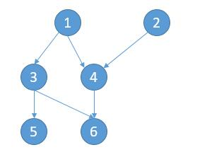
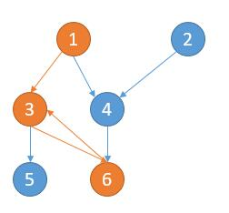
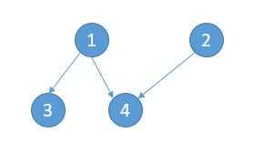

# 207. Course Schedule
<https://leetcode.com/problems/course-schedule/>
Medium

There are a total of numCourses courses you have to take, labeled from 0 to numCourses-1.

Some courses may have prerequisites, for example to take course 0 you have to first take course 1, which is expressed as a pair: [0,1]

Given the total number of courses and a list of prerequisite pairs, is it possible for you to finish all courses?

 

Example 1:

    Input: numCourses = 2, prerequisites = [[1,0]]
    Output: true
    Explanation: There are a total of 2 courses to take. 
                To take course 1 you should have finished course 0. So it is possible.

Example 2:

    Input: numCourses = 2, prerequisites = [[1,0],[0,1]]
    Output: false
    Explanation: There are a total of 2 courses to take. 
                To take course 1 you should have finished course 0, and to take course 0 you should
                also have finished course 1. So it is impossible.
 

Constraints:

* The input prerequisites is a graph represented by a list of edges, not adjacency matrices. Read more about how a graph is represented.
* You may assume that there are no duplicate edges in the input prerequisites.
* 1 <= numCourses <= 10^5


Related Topics: Depth-first Search; Breadth-first Search; Graph; Topological Sort

Similar Questions: 
* Medium [Course Schedule II](https://leetcode.com/problems/course-schedule-ii/)
* Medium [Graph Valid Tree](https://leetcode.com/problems/graph-valid-tree/)
* Medium [Minimum Height Trees](https://leetcode.com/problems/minimum-height-trees/)
* Hard [Course Schedule III](https://leetcode.com/problems/course-schedule-iii/)

## Explaination: 
这道课程清单的问题对于我们学生来说应该不陌生，因为在选课的时候经常会遇到想选某一门课程，发现选它之前必须先上了哪些课程，这道题给了很多提示，第一条就告诉了这道题的本质就是在有向图中检测环。 LeetCode 中关于图的题很少，有向图的仅此一道，还有一道关于无向图的题是 Clone Graph。个人认为图这种数据结构相比于树啊，链表啊什么的要更为复杂一些，尤其是有向图，很麻烦。第二条提示是在讲如何来表示一个有向图，可以用边来表示，边是由两个端点组成的，用两个点来表示边。第三第四条提示揭示了此题有两种解法，DFS 和 BFS 都可以解此题。
## DFS Solution: 
从某门课开始遍历，我们通过 DFS 一条路径一条路径的判断，保证过程中没有遇到环。

深度优先遍历 1，相当于 3 条路径
    1 -> 3 -> 5，1 -> 3 -> 6，1 -> 4 -> 6。
深度优先遍历 2，相当于 1 条路径
    2 -> 4 -> 6。
深度优先遍历 3，相当于 2 条路径
    3 -> 5，3 -> 6。
深度优先遍历 4，相当于 1 条路径
    4 -> 6。
深度优先遍历 5，相当于 1 条路径
    5。
深度优先遍历 6，相当于 1 条路径
    6。
什么情况下不能完成所有课程呢？某条路径出现了环，如下图。

出现了 1 -> 3 -> 6 -> 3。所以不能学完所有课程。

用HashMap graph 保存可完成课和其前置课。用HashSet finishSet 保存可完成课。建立邻接图。通过递归实现 DFS。在 DFS 函数中，用 visited 存储当前路径上的节点来检查是否有环。同时用 visitedFinish 表示可以学完的课程，起到优化算法的作用。先检查是否有环。然后把当前节点加入当前路径 visited，并对其前置课程调用 DFS 函数。最后更新结果。注意要把当前节点从 visited 移除。

```java
class Solution {
    public boolean canFinish(int numCourses, int[][] prerequisites) {
        Map<Integer, List<Integer>> graph = new HashMap<>();
        Set<Integer> finishSet = new HashSet<>();
        //建立Graph
        for(int i = 0; i<prerequisites.length; i++){
            int finished = prerequisites[i][0];
            int prereq = prerequisites[i][1];
            finishSet.add(finished);
            //存储当前节点的所有先修课程
            List<Integer> list = graph.getOrDefault(finished, new ArrayList<>());
            list.add(prereq);
            graph.put(finished, list);
        }
        
        Set<Integer> visitedFinish = new HashSet<>();
        //判断每一门课
        for(int f : finishSet){
            if(!dfs(f, graph, new HashSet<>(), visitedFinish)) return false;
            visitedFinish.add(f);
        }
        return true;
    }
    
    public boolean dfs(Integer start, Map<Integer, List<Integer>> graph, Set<Integer> visited, Set<Integer> visitedFinish){
        // 跳过已经处理过节点
        if(visitedFinish.contains(start) || !graph.containsKey(start)) return true;
        // 出现了环
        if(visited.contains(start)) return false;
        // 将当前节点加入路径
        visited.add(start);
        for(Integer pre : graph.get(start)){
            if(!dfs(pre, graph, visited, visitedFinish)) return false;
        }
        // 从当前路径删除以检查其他路径
        visited.remove(start);
        return true;
    }
}
```

## BFS Solution: 
把所有的关系可以看做图的边，所有的边构成了一个有向图。对于[[1,3],[1,4],[2,4],[3,5],[3,6],[4,6]] 就可以看做下边的图，箭头指向的是需要先上的课。

想法很简单，要想上完所有的课，一定会有一些课没有先修课，比如上图的 5、6。然后我们可以把 5 和 6 节点删去。

然后 3 和 4 就可以上了，同样的道理再把 3 和 4 删去。接下来就可以去学 1 和 2 了。因此可以完成所有的课。代码的话，用邻接表表示图。此外，我们不需要真的去删除节点，我们可以用 outNum 变量记录所有节点的先修课门数。当删除一个节点的时候，就将相应节点的先修课个数减一即可。最后只需要判断所有的节点的先修课门数是否全部是 0 即可。

```java
class Solution {
    public boolean canFinish(int numCourses, int[][] prerequisites) {
        //保存每个节点的先修课个数，也就是出度
        HashMap<Integer, Integer> outNum = new HashMap<>();
        //保存以 key 为先修课的列表，也就是入度的节点
        HashMap<Integer, ArrayList<Integer>> inNodes = new HashMap<>();
        //保存所有节点
        HashSet<Integer> set = new HashSet<>();
        int rows = prerequisites.length;
        for (int i = 0; i < rows; i++) {
            int key = prerequisites[i][0];
            int value = prerequisites[i][1];
            set.add(key);
            set.add(value);
            if (!outNum.containsKey(key)) {
                outNum.put(key, 0);
            }
            if (!outNum.containsKey(value)) {
                outNum.put(value, 0);
            }
            //当前节点先修课个数加一
            int num = outNum.get(key);
            outNum.put(key, num + 1);

            if (!inNodes.containsKey(value)) {
                inNodes.put(value, new ArrayList<>());
            }
            //更新以 value 为先修课的列表
            ArrayList<Integer> list = inNodes.get(value);
            list.add(key);
        }

        //将当前先修课个数为 0 的课加入到队列中
        Queue<Integer> queue = new LinkedList<>();
        for (int k : set) {
            if (outNum.get(k) == 0) {
                queue.offer(k);
            }
        }
        while (!queue.isEmpty()) {
            //队列拿出来的课代表要删除的节点
            //要删除的节点的 list 中所有课的先修课个数减一
            int v = queue.poll();
            ArrayList<Integer> list = inNodes.getOrDefault(v, new ArrayList<>());

            for (int k : list) {
                int num = outNum.get(k);
                //当前课的先修课要变成 0, 加入队列
                if (num == 1) {
                    queue.offer(k);
                }
                //当前课的先修课个数减一
                outNum.put(k, num - 1);
            }
        }

        //判断所有课的先修课的个数是否为 0 
        for (int k : set) {
            if (outNum.get(k) != 0) {
                return false;
            }
        }
        return true;
    }
}
```