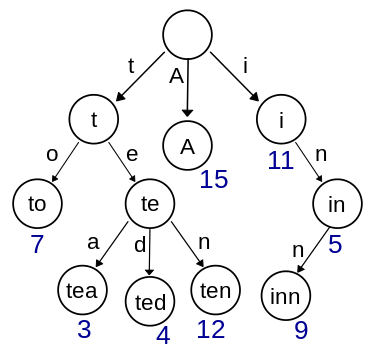

# 208. Implement Trie (Prefix Tree)
<https://leetcode.com/problems/implement-trie-prefix-tree/>
Medium

Implement a trie with insert, search, and startsWith methods.

**Example:**

    Trie trie = new Trie();

    trie.insert("apple");
    trie.search("apple");   // returns true
    trie.search("app");     // returns false
    trie.startsWith("app"); // returns true
    trie.insert("app");   
    trie.search("app");     // returns true

**Note:**

    * You may assume that all inputs are consist of lowercase letters a-z.
    * All inputs are guaranteed to be non-empty strings.

Related Topics: Desgin; Trie

Similar Questions: 
* Medium [Add and Search Word - Data structure design](https://leetcode.com/problems/add-and-search-word-data-structure-design/)
* Hard [Design Search Autocomplete System](https://leetcode.com/problems/design-search-autocomplete-system/)
* Medium [Replace Words](https://leetcode.com/problems/replace-words/)
* Medium [Implement Magic Dictionary](https://leetcode.com/problems/implement-magic-dictionary/)


## Explaination: 
这道题让我们实现一个重要但又有些复杂的数据结构-字典树， 又称前缀树或单词查找树，详细介绍可以参见网友董的博客，例如，一个保存了8个键的trie结构，"A", "to", "tea", "ted", "ten", "i", "in", and "inn"，如下图所示：

字典树主要有如下三点性质：
1. 根节点不包含字符，除根节点意外每个节点只包含一个字符。
2. 从根节点到某一个节点，路径上经过的字符连接起来，为该节点对应的字符串。
3. 每个节点的所有子节点包含的字符串不相同。
三种方法，各有特点。第一种易实现，但实际的空间要求较大；第二种，较易实现，空间要求相对较小，但比较费时；第三种，空间要求最小，但相对费时且不易写。 

## Solution: 
我们这里只来实现第一种方法，这种方法实现起来简单直观，字母的字典树每个节点要定义一个大小为 26 的子节点指针数组，然后用一个标志符用来记录到当前位置为止是否为一个词，初始化的时候讲 26 个子节点都赋为空。那么 insert 操作只需要对于要插入的字符串的每一个字符算出其的位置，然后找是否存在这个子节点，若不存在则新建一个，然后再查找下一个。查找词和找前缀操作跟 insert 操作都很类似，不同点在于若不存在子节点，则返回 false。查找次最后还要看标识位，而找前缀直接返回 true 即可。

```java
class Trie {
    class TrieNode {
        TrieNode[] children;
        boolean isWord;
        public TrieNode(){
            children = new TrieNode[26];
            isWord = false;
            for(int i = 0; i<26; i++) children[i] = null;
        }
    }
    
    TrieNode root;
    /** Initialize your data structure here. */
    public Trie() {
        root = new TrieNode();
    }
    
    /** Inserts a word into the trie. */
    public void insert(String word) {
        TrieNode cur = root;
        for(char c : word.toCharArray()){
            if(cur.children[c - 'a'] == null){
                cur.children[c - 'a'] = new TrieNode();
            }
            cur = cur.children[c - 'a'];
        }
        cur.isWord = true;
    }
    
    /** Returns if the word is in the trie. */
    public boolean search(String word) {
        TrieNode cur = root;
        for(char c : word.toCharArray()){
            if(cur.children[c - 'a'] == null) return false;
            cur = cur.children[c - 'a'];
        }
        return cur.isWord;
    }
    
    /** Returns if there is any word in the trie that starts with the given prefix. */
    public boolean startsWith(String prefix) {
        TrieNode cur = root;
        for(char c : prefix.toCharArray()){
            if(cur.children[c - 'a'] == null) return false;
            cur = cur.children[c - 'a'];
        }
        return true;
    }
}

/**
 * Your Trie object will be instantiated and called as such:
 * Trie obj = new Trie();
 * obj.insert(word);
 * boolean param_2 = obj.search(word);
 * boolean param_3 = obj.startsWith(prefix);
 */
```