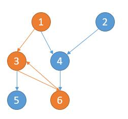
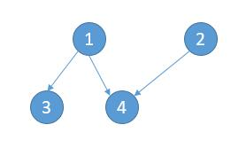

# 210. Course Schedule II
<https://leetcode.com/problems/course-schedule-ii/>
Medium

There are a total of n courses you have to take, labeled from 0 to n-1.

Some courses may have prerequisites, for example to take course 0 you have to first take course 1, which is expressed as a pair: [0,1]

Given the total number of courses and a list of prerequisite pairs, return the ordering of courses you should take to finish all courses.

There may be multiple correct orders, you just need to return one of them. If it is impossible to finish all courses, return an empty array.

**Example 1:**

    Input: 2, [[1,0]] 
    Output: [0,1]
    Explanation: There are a total of 2 courses to take. To take course 1 you should have finished   
                course 0. So the correct course order is [0,1] .

**Example 2:**

    Input: 4, [[1,0],[2,0],[3,1],[3,2]]
    Output: [0,1,2,3] or [0,2,1,3]
    Explanation: There are a total of 4 courses to take. To take course 3 you should have finished both     
                courses 1 and 2. Both courses 1 and 2 should be taken after you finished course 0. 
                So one correct course order is [0,1,2,3]. Another correct ordering is [0,2,1,3] .

**Note:**

    1. The input prerequisites is a graph represented by a list of edges, not adjacency matrices. Read more about how a graph is represented.
    2. You may assume that there are no duplicate edges in the input prerequisites.

Related Topics: Depth-first Search; Breadth-first Search; Graph; Topological Sort

Similar Questions: 
* Medium [Course Schedule](https://leetcode.com/problems/course-schedule/)
* Hard [Alien Dictionary](https://leetcode.com/problems/alien-dictionary/)
* Medium [Minimum Height Trees](https://leetcode.com/problems/minimum-height-trees/)
* Medium [Sequence Reconstruction](https://leetcode.com/problems/sequence-reconstruction/)
* Hard [Course Schedule III](https://leetcode.com/problems/course-schedule-iii/)
* Medium [Parallel Courses](https://leetcode.com/problems/parallel-courses/)
* Medium [Find All Possible Recipes from Given Supplies](https://leetcode.com/problems/find-all-possible-recipes-from-given-supplies/)

## Explaination: 

这题是之前那道 Course Schedule 的扩展，那道题只让我们判断是否能完成所有课程，即检测有向图中是否有环，而这道题我们得找出要上的课程的顺序，即有向图的拓扑排序 Topological Sort。

## DFS Solution: 
我们只需要一门课一门课的判断。从某门课开始遍历，我们通过 DFS 一条路径一条路径的判断，保证过程中没有遇到环。

深度优先遍历 1，相当于 3 条路径
    1 -> 3 -> 5，1 -> 3 -> 6，1 -> 4 -> 6。
深度优先遍历 2，相当于 1 条路径
    2 -> 4 -> 6。
深度优先遍历 3，相当于 2 条路径
    3 -> 5，3 -> 6。
深度优先遍历 4，相当于 1 条路径
    4 -> 6。
深度优先遍历 5，相当于 1 条路径
    5。
深度优先遍历 6，相当于 1 条路径
    6。

什么情况下不能完成所有课程呢？某条路径出现了环，如下图。出现了 1 -> 3 -> 6 -> 3。所以不能学完所有课程。

用HashMap graph 保存可完成课和其前置课。用HashSet finishSet 保存可完成课。建立邻接图。通过递归实现 DFS。在 DFS 函数中，用 visited 存储当前路径上的节点来检查是否有环。同时用 visitedFinish 表示可以学完的课程，起到优化算法的作用。用int[] res 来保存结果。用HashSet resSet 来避免加入重复节点。不能单用 HashSet 因为结果是有顺序的。如果是叶子节点，则加入结果并返回。否则先检查是否有环。然后把当前节点加入当前路径 visited，并对其前置课程调用 DFS 函数。最后更新结果。注意要把当前节点从 visited 移除。

Time: O(V+E) where V represents the number of vertices and EE represents the number of edges
Space O(V+E) where V represents the number of vertices and EE represents the number of edges

```java
class Solution {
    private int count = 0;
    public int[] findOrder(int numCourses, int[][] prerequisites) {
        Map<Integer, List<Integer>> graph = new HashMap<>();
        Set<Integer> finishSet = new HashSet<>();
        //建立Graph
        for(int i = 0; i < prerequisites.length; i++){
            int finished = prerequisites[i][0];
            int prereq = prerequisites[i][1];
            finishSet.add(finished);
            //存储当前节点的所有先修课程
            List<Integer> list = graph.getOrDefault(finished, new ArrayList<>());
            list.add(prereq);
            graph.put(finished, list);
        }
        int[] res = new int[numCourses];
        Set<Integer> resSet = new HashSet<>(); //防止重复的节点加入，存的和res一样。
        Set<Integer> visitedFinish = new HashSet<>();
        // 判断每一门课
        for (int f : finishSet) {
            if (!dfs(f, graph, new HashSet<>(), visitedFinish, res, resSet)) {
                return new int[0];
            }
            visitedFinish.add(f);
        }
        
        //和之前一样，把独立的课加入
        for (int i = 0; i < numCourses; i++) {
            if (!resSet.contains(i)) {
                res[count++] = i;
            }
        }
        return res;
    }
    
    public boolean dfs(Integer start, Map<Integer, List<Integer>> graph, Set<Integer> visited, Set<Integer> visitedFinish, int[] res, Set<Integer> resSet){
        //跳过已经处理过节点
        if(visitedFinish.contains(start)) return true;
        // 到了叶子节点，把节点加入结果。
        if (!graph.containsKey(start)) {
            if (!resSet.contains(start)) {
                resSet.add(start);
                res[count++] = start;
            }
            return true;
        }
        // 出现了环
        if (visited.contains(start)) {
            return false;
        }
        // 将当前节点加入路径
        visited.add(start);
        for(Integer pre : graph.get(start)){
            if(!dfs(pre, graph, visited, visitedFinish, res, resSet)) return false;
        }
        // 当前节点有路径，将其加入结果。
        if (!resSet.contains(start)) {
            resSet.add(start);
            res[count++] = start;
        }
        // 从当前路径删除以检查其他路径
        visited.remove(start);
        return true;
    }
}
```

## BFS Solution: 
把所有的关系可以看做图的边，所有的边构成了一个有向图。对于[[1,3],[1,4],[2,4],[3,5],[3,6],[4,6]] 就可以看做下边的图，箭头指向的是需要先上的课。

想法很简单，要想上完所有的课，一定会有一些课没有先修课，比如上图的 5、6。然后我们可以把 5 和 6 节点删去。

然后 3 和 4 就可以上了，同样的道理再把 3 和 4 删去。接下来就可以去学 1 和 2 了。因此可以完成所有的课。代码的话，用邻接表表示图。此外，我们不需要真的去删除节点，我们可以用 outNum 变量记录所有节点的先修课门数。当删除一个节点的时候，就将相应节点的先修课个数减一即可。最后只需要判断所有的节点的先修课门数是否全部是 0 即可。在这道题的话，改之前的代码也很简单，只需要把每次出队的元素保存起来即可。

```java
class Solution {
    public int[] findOrder(int numCourses, int[][] prerequisites) {
        // 保存每个节点的先修课个数，也就是出度
        HashMap<Integer, Integer> outNum = new HashMap<>();
        // 保存以 key 为先修课的列表，也就是入度的节点
        HashMap<Integer, ArrayList<Integer>> inNodes = new HashMap<>();
        // 保存所有节点
        HashSet<Integer> set = new HashSet<>();
        int rows = prerequisites.length;
        for (int i = 0; i < rows; i++) {
            int key = prerequisites[i][0];
            int value = prerequisites[i][1];
            set.add(key);
            set.add(value);
            if (!outNum.containsKey(key)) {
                outNum.put(key, 0);
            }
            if (!outNum.containsKey(value)) {
                outNum.put(value, 0);
            }
            // 当前节点先修课个数加一
            int num = outNum.get(key);
            outNum.put(key, num + 1);

            if (!inNodes.containsKey(value)) {
                inNodes.put(value, new ArrayList<>());
            }
            // 更新以 value 为先修课的列表
            ArrayList<Integer> list = inNodes.get(value);
            list.add(key);
        }

        // 将当前先修课个数为 0 的课加入到队列中
        Queue<Integer> queue = new LinkedList<>();
        for (int k : set) {
            if (outNum.get(k) == 0) {
                queue.offer(k);
            }
        }
        int[] res = new int[numCourses];
        int count = 0;
        while (!queue.isEmpty()) {
            // 队列拿出来的课代表要删除的节点
            // 要删除的节点的 list 中所有课的先修课个数减一
            int v = queue.poll();
            //**************主要修改的地方********************//
            res[count++] = v;
            //**********************************************//
            ArrayList<Integer> list = inNodes.getOrDefault(v, new ArrayList<>());

            for (int k : list) {
                int num = outNum.get(k);
                // 当前课的先修课要变成 0, 加入队列
                if (num == 1) {
                    queue.offer(k);
                }
                // 当前课的先修课个数减一
                outNum.put(k, num - 1);
            }
        }
        for (int k : set) {
            if (outNum.get(k) != 0) {
                //有课没有完成，返回空数组
                return new int[0];
            }
        }
        //**************主要修改的地方********************//
        HashSet<Integer> resSet = new HashSet<>();
        for (int i = 0; i < count; i++) {
            resSet.add(res[i]);
        }
        //有些课是独立存在的，这些课可以随时上，添加进来
        for (int i = 0; i < numCourses; i++) {
            if (!resSet.contains(i)) {
                res[count++] = i;
            }
        }
        //**********************************************//
        return res;
    }
}
```