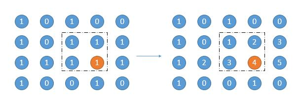
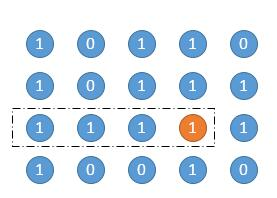
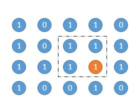
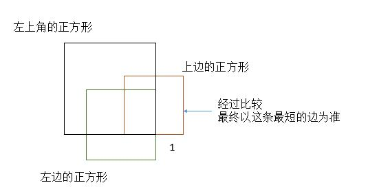
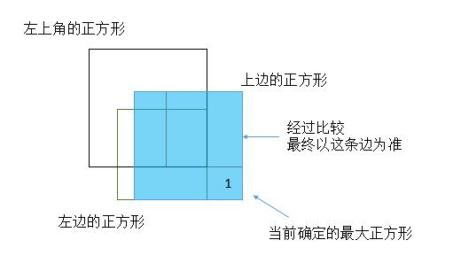

# 221. Maximal Square
<https://leetcode.com/problems/maximal-square/>
Medium

Given a 2D binary matrix filled with 0's and 1's, find the largest square containing only 1's and return its area.

**Example:**

Input: 

    1 0 1 0 0
    1 0 1 1 1
    1 1 1 1 1
    1 0 0 1 0

Output: 4

Related Topics: Dynamic Programming

Similar Questions: 

* Hard [Maximal Rectangle](https://leetcode.com/problems/maximal-rectangle/)
* Medium [Largest Plus Sign](https://leetcode.com/problems/largest-plus-sign/)


## Brutal Force Solution: 

如果我们知道了以这个点结尾的连续 1 的个数的话，问题就变得简单了。

1. 首先求出高度是 1 的矩形面积，也就是它自身的数，也就是上图以橙色的 4 结尾的 「1234」的那个矩形，面积就是 4。
2. 然后向上扩展一行，高度增加一，选出当前列最小的数字，作为矩阵的宽，如上图，当前列中有 2 和 4 ，那么就将 2 作为矩形的宽，求出面积，对应上图的矩形圈出的部分。
3. 然后继续向上扩展，重复步骤 2。
按照上边的方法，遍历所有的点，以当前点为矩阵的右下角，求出所有的矩阵就可以了。下图是某一个点的过程。以橙色的点为右下角，高度为 1。

高度为 2。

高度为 3。

代码的话，把求每个点累计的连续 1 的个数用 width 保存，同时把求最大矩形的面积和求 width融合到同一个循环中。首先因为正方形的面积是边长乘边长，所以上边的 maxArea 是没有意义的，我们只记录最大边长即可。

```java
class Solution {
    public int maximalSquare(char[][] matrix) {
        if (matrix.length == 0) {
            return 0;
        }
        // 保存以当前数字结尾的连续 1 的个数
        int[][] width = new int[matrix.length][matrix[0].length];
        // 记录最大边长
        int maxSide = 0;
        // 遍历每一行
        for (int row = 0; row < matrix.length; row++) {
            for (int col = 0; col < matrix[0].length; col++) {
                // 更新 width
                if (matrix[row][col] == '1') {
                    if (col == 0) {
                        width[row][col] = 1;
                    } else {
                        width[row][col] = width[row][col - 1] + 1;
                    }
                } else {
                    width[row][col] = 0;
                }
                // 当前点作为正方形的右下角进行扩展
                int curWidth = width[row][col];
                // 向上扩展行
                for (int up_row = row; up_row >= 0; up_row--) {
                    int height = row - up_row + 1;
                    if (width[up_row][col] <= maxSide || height > curWidth) {
                        break;
                    }
                    maxSide = Math.max(height, maxSide);
                }
            }
        }
        return maxSide * maxSide;
    }
}
```


## DP Solution: 

我们求每个点的最大边长时，没有考虑到之前的解，事实上之前的解完全可以充分利用。用 dp[i][j] 表示以 matrix[i][j] 为右下角正方形的最大边长。那么递推式如下。初始条件，那就是第一行和第一列的 dp[i][j] = matrix[i][j] - '0'，也就意味着 dp[i][j] 要么是 0 要么是 1。然后就是递推式。

    dp[i][j] = Min(dp[i-1][j],dp[i][j-1],dp[i-1][j-1]) + 1。

也就是当前点的左边，上边，左上角的三个点中选一个最小值，然后加 1。首先要明确 dp[i][j] 表示以 matrix[i][j] 为右下角的正方形的最大边长。然后我们从当前点向左和向上扩展，可以参考下边的图。

向左最多能扩展多少呢？dp[i][j-1] 和 dp[i-1][j-1]，当前点左边和左上角选一个较小的。也就是它左边最大的正方形和它左上角最大的正方形的，边长选较小的。向上能能扩展多少呢？dp[i-1][j] 和 dp[i-1][j-1]，当前点上边和左上角选一个较小的。也就是它上边最大的正方形和它左上角最大的正方形，边长选较小的。然后向左扩展和向上扩展两个最小值中再选一个较小的，最后加上 1 就是最终的边长了。最终其实是从三个正方形中最小的边长。


```java
class Solution {
    public int maximalSquare(char[][] matrix) {
        if(matrix.length == 0) return 0;
        int m = matrix.length, n = matrix[0].length, maxSide = 0;
        int[][] dp = new int[m+1][n+1];
        for(int i = 1; i<=m; i++){
            for(int j = 1; j<=n; j++){
                if(matrix[i-1][j-1] == '1'){
                    dp[i][j] = Math.min(Math.min(dp[i-1][j-1], dp[i-1][j]), dp[i][j-1])+1;
                    maxSide = Math.max(dp[i][j], maxSide);
                }
            }
        }
        return maxSide*maxSide;
    }
}
```