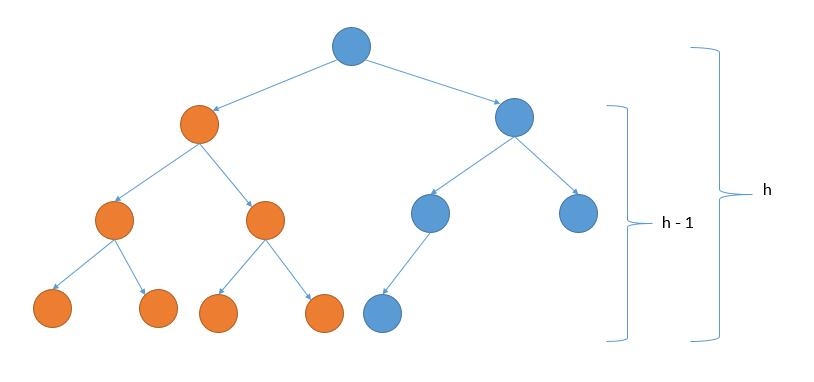
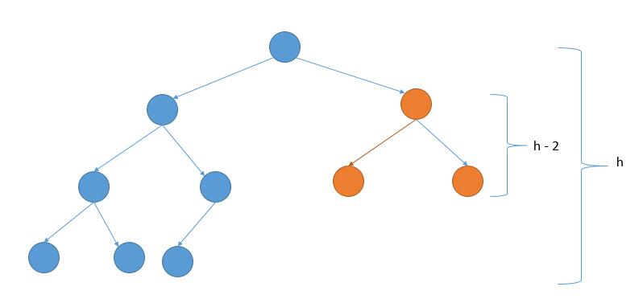

# 222. Count Complete Tree Nodes
<https://leetcode.com/problems/count-complete-tree-nodes/>
Medium

Given a complete binary tree, count the number of nodes.

**Note:**

Definition of a complete binary tree from Wikipedia:
In a complete binary tree every level, except possibly the last, is completely filled, and all nodes in the last level are as far left as possible. It can have between 1 and 2h nodes inclusive at the last level h.

**Example:**

    Input: 
        1
       / \
      2   3
     / \  /
    4   5 6

    Output: 6

Related Topics: Binary Search; Tree

Similar Questions: 
* Easy [Closest Binary Search Tree Value](https://leetcode.com/problems/closest-binary-search-tree-value/)


## Explaination: 
完全二叉树 (Complete Binary Tree)：

    A Complete Binary Tree （CBT) is a binary tree in which every level, except possibly the last, is completely filled, and all nodes are as far left as possible.
    对于一颗二叉树，假设其深度为d（d>1）。除了第d层外，其它各层的节点数目均已达最大值，且第d层所有节点从左向右连续地紧密排列，这样的二叉树被称为完全二叉树；
    换句话说，完全二叉树从根结点到倒数第二层满足完美二叉树，最后一层可以不完全填充，其叶子结点都靠左对齐。

完美二叉树 (Perfect Binary Tree)：

    A Perfect Binary Tree(PBT) is a tree with all leaf nodes at the same depth. All internal nodes have degree 2.
    二叉树的第i层至多拥有 2^{i-1} 个节点数；深度为k的二叉树至多总共有 {\displaystyle 2^{\begin{aligned}k+1\end{aligned}}-1} 个节点数，而总计拥有节点数匹配的，称为“满二叉树”；

完满二叉树 (Full Binary Tree):

    A Full Binary Tree (FBT) is a tree in which every node other than the leaves has two children.
    换句话说，所有非叶子结点的度都是2。（只要你有孩子，你就必然是有两个孩子。）


## Tree Height Solution: 

通过上面对完全二叉树跟完美二叉树的定义比较，可以看出二者的关系是，完美二叉树一定是完全二叉树，而完全二叉树不一定是完美二叉树。那么这道题给的完全二叉树就有可能是完美二叉树，若是完美二叉树，节点个数很好求，为2的h次方减1，h为该完美二叉树的高度。若不是的话，只能老老实实的一个一个数结点了。思路是由 root 根结点往下，分别找最靠左边和最靠右边的路径长度，如果长度相等，则证明二叉树最后一层节点是满的，是满二叉树，直接返回节点个数，如果不相等，则节点个数为左子树的节点个数加上右子树的节点个数再加1(根节点)，其中左右子树节点个数的计算可以使用递归来计算。这里通过高度算节点数用了位运算，1 << h1 等价于 2^hi，记得加上括号，因为 << 运算的优先级比加减还要低。

Time: O(log²(n))

```java
/**
 * Definition for a binary tree node.
 * public class TreeNode {
 *     int val;
 *     TreeNode left;
 *     TreeNode right;
 *     TreeNode(int x) { val = x; }
 * }
 */
class Solution {
    public int countNodes(TreeNode root) {
        if(root == null) return 0;
        //因为当前树是 complete binary tree
        //所以可以通过从最左边和从最右边得到的高度判断当前是否是 perfect binary tree
        TreeNode left = root, right = root;
        int hLeft = 0, hRight = 0;
        while(left != null){
            hLeft++;
            left = left.left;
        }
        while(right != null){
            hRight++;
            right = right.right;
        }
        //如果是 perfect binary tree 就套用公式求解
        if(hLeft == hRight){
            return (1<<hLeft)-1;
        } else{
            return countNodes(root.left) + countNodes(root.right)+1;
        }
    }
}
```

## Count Half Solution: 
通过判断整个树的高度和右子树的高度的关系，从而推断出左子树是 perfect binary tree 还是右子树是 perfect binary tree。

如果右子树的高度等于整个树的高度减 1，说明左边都填满了，所以左子树是 perfect binary tree，如下图。

否则的话，右子树是 perfect binary tree ，如下图。

代码的话，因为是 complete binary tree，所以求高度的时候，可以一直向左遍历。


```java
/**
 * Definition for a binary tree node.
 * public class TreeNode {
 *     int val;
 *     TreeNode left;
 *     TreeNode right;
 *     TreeNode(int x) { val = x; }
 * }
 */
class Solution {
    public int countNodes(TreeNode root) {
        if (root == null) {
            return 0;
        }
        int height = getHeight(root);
        int rightHeight = getHeight(root.right);
        // 左子树是 perfect binary tree
        if (rightHeight == height - 1) {
            // 左子树高度和右子树高度相等
            // 左子树加右子树加根节点
            //return (1 << rightHeight) - 1  + countNodes(root.right) + 1;
            return (1 << rightHeight) + countNodes(root.right);
        // 右子树是 perfect binary tree
        } else {
            // 左子树加右子树加根节点
            //return countNodes(root.left) + (1 << rightHeight) - 1 + 1;
            return countNodes(root.left) + (1 << rightHeight);
        }
    }
    
    private int getHeight(TreeNode root) {
        if (root == null) {
            return 0;
        } else {
            return getHeight(root.left) + 1;
        }
    }
}
```


## Count Nodes Solution: 
直接用递归来统计结点的个数，根本不需要考虑什么完全二叉树还是完美二叉树，递归在手，遇 tree 不愁。直接一行搞定。

```java
/**
 * Definition for a binary tree node.
 * public class TreeNode {
 *     int val;
 *     TreeNode left;
 *     TreeNode right;
 *     TreeNode(int x) { val = x; }
 * }
 */
class Solution {
    public int countNodes(TreeNode root) {
        return root == null? 0 : (1+countNodes(root.left)+countNodes(root.right));
    }
}
```