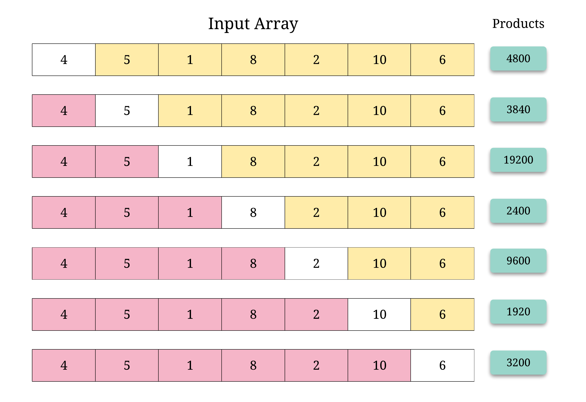

# 238. Product of Array Except Self
<https://leetcode.com/problems/product-of-array-except-self/>
Medium

Given an array nums of n integers where n > 1,  return an array output such that output[i] is equal to the product of all the elements of nums except nums[i].

Example:

Input:  [1,2,3,4]
Output: [24,12,8,6]
Constraint: It's guaranteed that the product of the elements of any prefix or suffix of the array (including the whole array) fits in a 32 bit integer.

Note: Please solve it without division and in O(n).

Follow up:
Could you solve it with constant space complexity? (The output array does not count as extra space for the purpose of space complexity analysis.)

Related Topics: Array;

Similar Questions: 
* Hard [Trapping Rain Water](https://leetcode.com/problems/trapping-rain-water/)
* Medium [Maximum Product Subarray](https://leetcode.com/problems/maximum-product-subarray/)
* Hard [Paint House II](https://leetcode.com/problems/paint-house-ii/)


## Solution: 


白色部分表示当前准备求解的位置，其结果就是粉色部分数字的累乘再乘上黄色部分数字的累乘。换句话说，其实就是左右两部分的累乘结果再相乘所以我们只需要把所有粉色结果和黄色结果提前保存起来，然后可以直接去计算结果了。

假设数组个数是 n。我们用 left[i]存储下标是 0 ~ i - 1 的数累乘的结果。用 right[i] 存储下标是 i + 1 ~ n - 1 的数累乘的结果。那么 res[i] = left[i] * right[i]。至于边界情况，我们把 left[0] 和 right[n - 1]初始化为 1 即可。我们可以省去 left 和 right 数组，先用 res 存储 left 数组的结果，然后边更新 right ，边和 res 相乘。


```java
class Solution {
    public int[] productExceptSelf(int[] nums) {
        int n = nums.length;
        int res[] = new int[n];
        res[0] = 1;
        for (int i = 1; i < n; i++) {
            res[i] = res[i - 1] * nums[i - 1];
        }
        int right = 1;
        for (int i = n - 2; i >= 0; i--) {
            right = right * nums[i + 1];
            res[i] = res[i] * right;
        }
        return res;
    }
}
```