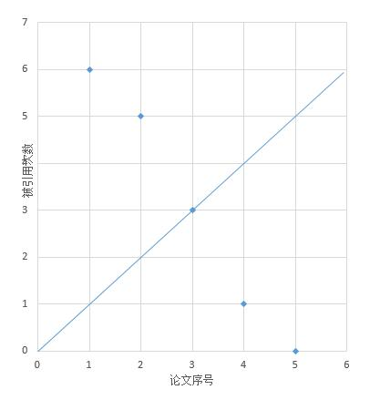
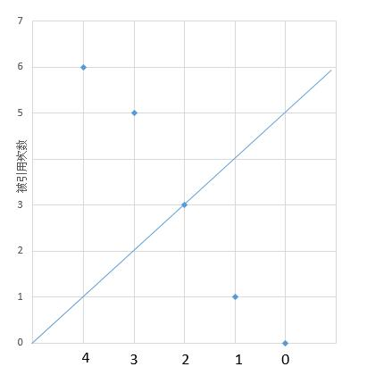

# 274. H-Index
<https://leetcode.com/problems/h-index/>
Medium

Given an array of citations (each citation is a non-negative integer) of a researcher, write a function to compute the researcher's h-index.

According to the definition of h-index on Wikipedia: "A scientist has index h if h of his/her N papers have at least h citations each, and the other N − h papers have no more than h citations each."

**Example:**

    Input: citations = [3,0,6,1,5]
    Output: 3 
    Explanation: [3,0,6,1,5] means the researcher has 5 papers in total and each of them had 
                received 3, 0, 6, 1, 5 citations respectively. 
                Since the researcher has 3 papers with at least 3 citations each and the remaining 
                two with no more than 3 citations each, her h-index is 3.

**Note:** If there are several possible values for h, the maximum one is taken as the h-index.

Related Topics: Hash Table; Sort

Similar Questions: 

* Medium [H-Index II](https://leetcode.com/problems/h-index-ii/)


## Explaination: 

H指数的计算基于其研究者的论文数量及其论文被引用的次数。赫希认为：一个人在其所有学术文章中有N篇论文分别被引用了至少N次，他的H指数就是N。如美国耶鲁大学免疫学家理查德·弗来沃发表的900篇文章中，有107篇被引用了107次以上，他的H指数是107。

可以按照如下方法确定某人的H指数：
* 将其发表的所有SCI论文按被引次数从高到低排序；
* 从前往后查找排序后的列表，直到某篇论文的序号大于该论文被引次数。所得序号减一即为H指数。

## Sort Solution: 
我们结合下图理解一下上边的算法，把 [3,0,6,1,5] 从大到小排序，画到图中。



上边的 H-Index 是 3，在图中表现的话就是有 3 个点在直线上方（包括在直线上），其他点在直线下方。我们从大到小排序后，其实就是依次判断点是否在直线上方（包括在直线上），如果出现了点在直线下方，那么前一个点的横坐标就是我们要找的 H-Index。我们也可以从小到大遍历，结合下图。



我们从 0 开始遍历，依次判断点是否在直线下方，如果出现了点在直线上方（包括在直线上），那么当前点的垂线与直线交点的纵坐标就是 H-Index 了。点的垂线与直线交点的纵坐标的求法是 n - i，n 是数组长度，i 是数组下标。

```
class Solution {
    public int hIndex(int[] citations) {
        Arrays.sort(citations);
        for(int i = 0; i<citations.length; i++){
            // 点在直线上方
            if(citations[i] >= citations.length-i) return citations.length-i;
        }
        return 0;
    }
}
```