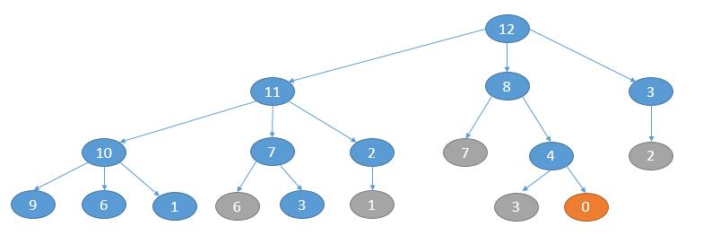

# 279. Perfect Squares
<https://leetcode.com/problems/perfect-squares/>
Medium

Given a positive integer n, find the least number of perfect square numbers (for example, 1, 4, 9, 16, ...) which sum to n.

**Example 1:**

    Input: n = 12
    Output: 3 
    Explanation: 12 = 4 + 4 + 4.

**Example 2:**

    Input: n = 13
    Output: 2
    Explanation: 13 = 4 + 9.

Related Topics: Math; Dynmaic Programming; Breadth-first Search

Similar Questions: 
* Easy [Count Primes](https://leetcode.com/problems/count-primes/)
* Medium [Ugly Number II](https://leetcode.com/problems/ugly-number-ii/)

## Math Solution: 
这个解法就不是编程的思想了，需要一些预备的数学知识。

四平方和定理)，意思是任何正整数都能表示成四个平方数的和。少于四个平方数的，像 12 这种，可以补一个 0 也可以看成四个平方数，12 = 4 + 4 + 4 + 0。知道了这个定理，对于题目要找的解，其实只可能是 1, 2, 3, 4 其中某个数。

Legendre's three-square theorem ，这个定理表明，如果正整数 n 被表示为三个平方数的和，那么 n 不等于 4^a*(8*b+7)，a 和 b 都是非负整数。换言之，如果 n == 4^a*(8*b+7)，那么他一定不能表示为三个平方数的和，同时也说明不能表示为一个、两个平方数的和，因为如果能表示为两个平方数的和，那么补个 0，就能凑成三个平方数的和了。

一个、两个、三个都排除了，所以如果 n == 4^a*(8*b+7)，那么 n 只能表示成四个平方数的和了。

所以代码的话，我们采取排除的方法。

    首先考虑答案是不是 1，也就是判断当前数是不是一个平方数。
    然后考虑答案是不是 4，也就是判断 n 是不是等于 4^a*(8*b+7)。
    然后考虑答案是不是 2，当前数依次减去一个平方数，判断得到的差是不是平方数。

以上情况都排除的话，答案就是 3。

```java
class Solution {
    public int numSquares(int n) {
        //判断是否是 1
        if (isSquare(n)) {
            return 1;
        }

        //判断是否是 4
        int temp = n;
        while (temp % 4 == 0) {
            temp /= 4;
        }
        if (temp % 8 == 7) {
            return 4;
        }

        //判断是否是 2
        for (int i = 1; i * i < n; i++) {
            if (isSquare(n - i * i)) {
                return 2;
            }
        }

        return 3;
    }

    //判断是否是平方数
    private boolean isSquare(int n) {
        int sqrt = (int) Math.sqrt(n);
        return sqrt * sqrt == n;
    }
}
```


## Dynamic Programming Solution: 
考虑所有的分解方案，找出最小的解，举个例子:

    n = 12
    先把 n 减去一个平方数，然后求剩下的数分解成平方数和所需的最小个数

    把 n 减去 1, 然后求出 11 分解成平方数和所需的最小个数,记做 n1
    那么当前方案总共需要 n1 + 1 个平方数

    把 n 减去 4, 然后求出 8 分解成平方数和所需的最小个数,记做 n2
    那么当前方案总共需要 n2 + 1 个平方数

    把 n 减去 9, 然后求出 3 分解成平方数和所需的最小个数,记做 n3
    那么当前方案总共需要 n3 + 1 个平方数

    下一个平方数是 16, 大于 12, 不能再分了。

    接下来我们只需要从 (n1 + 1), (n2 + 1), (n3 + 1) 三种方案中选择最小的个数, 
    此时就是 12 分解成平方数和所需的最小个数了

    至于求 11、8、3 分解成最小平方数和所需的最小个数继续用上边的方法去求

    直到如果求 0 分解成最小平方数的和的个数, 返回 0 即可

初始化了整个长度为 n+1 的 dp 数字，初始化了第一个值为0，那么在循环里计算，每次增加一个 dp 数组的长度，里面那个 for 循环一次循环结束就算好下一个数由几个完全平方数组成，直到增加到第 n+1 个，返回即可。动态规划的转移方程: dp[i] = Math.min(dp[i], dp[i-j*j]+1)

```java
class Solution {
    public int numSquares(int n) {
        int[] dp = new int[n+1];
        Arrays.fill(dp, Integer.MAX_VALUE);
        dp[0] = 0;
        //依次求出 1, 2... 直到 n 的解
        for(int i = 1; i<=n; i++){
            //依次减去一个平方数
            for(int j = 1; j*j<=i; j++){
                dp[i] = Math.min(dp[i], dp[i-j*j]+1);
            }
        }
        return dp[n];
    }
}
```

## BFS Solution: 
BFS 的话，我们可以一层一层的算。第一层依次减去一个平方数得到第二层，第二层依次减去一个平方数得到第三层。直到某一层出现了 0，此时的层数就是我们要找到平方数和的最小个数。
举个例子，n = 12，每层的话每个节点依次减 1, 4, 9...。如下图，灰色表示当前层重复的节点，不需要处理。



如上图，当出现 0 的时候遍历就可以停止，此时是第 3 层（从 0 计数），所以最终答案就是 3。实现的话当然离不开队列，此外我们需要一个 set 来记录重复的解。

```java
class Solution {
    public int numSquares(int n) {
        Queue<Integer> queue = new LinkedList<>();
        HashSet<Integer> visited = new HashSet<>();
        int level = 0;
        queue.add(n);
        while (!queue.isEmpty()) {
            int size = queue.size();
            level++; // 开始生成下一层
            for (int i = 0; i < size; i++) {
                int cur = queue.poll();
                //依次减 1, 4, 9... 生成下一层的节点
                for (int j = 1; j * j <= cur; j++) {
                    int next = cur - j * j;
                    if (next == 0) {
                        return level;
                    }
                    if (!visited.contains(next)) {
                        queue.offer(next);
                        visited.add(next);
                    }
                }
            }
        }
        return -1;
    }
}
```