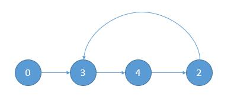

# 287. Find the Duplicate Number
<https://leetcode.com/problems/find-the-duplicate-number/>
Medium 

Given an array nums containing n + 1 integers where each integer is between 1 and n (inclusive), prove that at least one duplicate number must exist. Assume that there is only one duplicate number, find the duplicate one.

Example 1:

Input: [1,3,4,2,2]
Output: 2
Example 2:

Input: [3,1,3,4,2]
Output: 3

Example 3:

Input: nums = [1,1]
Output: 1
Example 4:

Input: nums = [1,1,2]
Output: 1

**Constraints:**

* 2 <= n <= 3 * 104
* nums.length == n + 1
* 1 <= nums[i] <= n
* All the integers in nums appear only once except for precisely one integer which appears two or more times.
 

**Follow up:**

* How can we prove that at least one duplicate number must exist in nums?
* Can you solve the problem without modifying the array nums?
* Can you solve the problem using only constant, O(1) extra space?
* Can you solve the problem with runtime complexity less than O(n2)?

Related Topics: Array; Two Pointers; Binary Search

Similar Questions: 
* Hard [First Missing Positive](https://leetcode.com/problems/first-missing-positive/)
* Easy [Single Number](https://leetcode.com/problems/single-number/)
* Medium [Linked List Cycle II](https://leetcode.com/problems/linked-list-cycle-ii/)
* Easy [Missing Number](https://leetcode.com/problems/missing-number/)
* Easy [Set Mismatch](https://leetcode.com/problems/set-mismatch/)

## Explanation:
这道题给了我们 n+1 个数，所有的数都在 [1, n] 区域内，首先让证明必定会有一个重复数。题目要求不能改变原数组，即不能给原数组排序，又不能用多余空间，那么哈希表神马的也就不用考虑了，又说时间小于 O(n2)，也就不能用 brute force 的方法。

## Binary Search Solution: 
用二分搜索法了，在区间 [1, n] 中搜索，首先求出中点 mid，然后遍历整个数组，统计所有小于等于 mid 的数的个数，如果个数小于等于 mid，则说明重复值在 [mid+1, n] 之间，反之，重复值应在 [1, mid-1] 之间，然后依次类推，直到搜索完成，此时的 low 就是我们要求的重复值。

Time: O(nlog(n))

```java
class Solution {
    public int findDuplicate(int[] nums) {
        int lo = 1, hi = nums.length;
        while(lo < hi){
            int mid = lo + (hi-lo)/2, count = 0;
            for(int num : nums){
                if(num <= mid) count++;
            }
            if(count <= mid) lo = mid + 1;
            else hi = mid;
        }
        return lo;
    }
}
```

## Fast and Slow Pointers Solution: 
把数组的值看成 next 指针，数组的下标看成节点的索引。因为数组中至少有两个值一样，也说明有两个节点指向同一个位置，所以一定会出现环。举个例子，3 1 3 4 2 可以看成下图的样子。

    nums[0] = 3
    nums[3] = 4
    nums[4] = 2
    nums[2] = 3
所以我们要做的就是找到上图中有环链表的入口点 3，也就是 142 题。具体证明不说了，只介绍方法，感兴趣的话可以到 142 题 看一下。我们需要快慢指针，同时从起点出发，慢指针一次走一步，快指针一次走两步，然后记录快慢指针相遇的点。之后再用两个指针，一个指针从起点出发，一个指针从相遇点出发，当他们再次相遇的时候就是入口点了。

Time: O(n)

```java
class Solution {
    public int findDuplicate(int[] nums) {
        int slow = nums[0];
        int fast = nums[nums[0]];
        while(slow != fast){
            slow = nums[slow];
            fast = nums[nums[fast]];
        }
        slow = 0;
        while(slow != fast){
            slow = nums[slow];
            fast = nums[fast];
        }
        return slow;
    }
}
```

## Bit Manipulation Solution: 

依次统计数组中每一位 1 的个数，记为 a[i]。再依次统计 1 到 n 中每一位 1 的个数，记为 b[i]。i 代表的是哪一位，因为是 int，所以范围是 0 到 32。记重复的数字是 res。如果 a[i] > b[i] 也就意味着 res 当前位是 1。否则的话，res 当前位就是 0。举个例子吧，1 3 4 2 2。

    1 3 4 2 2 写成 2 进制
    1 [0 0 1]
    3 [0 1 1]
    4 [1 0 0]
    2 [0 1 0]
    2 [0 1 0]

    把 1 到 n,也就是 1 2 3 4 也写成 2 进制
    1 [0 0 1]
    2 [0 1 0]
    3 [0 1 1]
    4 [1 0 0]

    依次统计每一列 1 的个数, res = XXX

    原数组最后一列 1 的个数是 2
    1 到 4 最后一列 1 的个数是 2
    2 不大于 2,所以当前位是 0, res = XX0

    原数组倒数第二列 1 的个数是 3
    1 到 4 倒数第二列 1 的个数是 2
    3 大于 2,所以当前位是 1, res = X10

    原数组倒数第三列 1 的个数是 1
    1 到 4 倒数第三列 1 的个数是 1
    1 不大于 1,所以当前位是 0, res = 010

    所以 res = 010, 也就是 2

上边是重复数字的重复次数是 2 的情况，如果重复次数大于 2 的话上边的结论依旧成立。简单的想一下，1 3 4 2 2 ，因为 2 的倒数第二位的二进制位是 1，所以原数组在倒数第二列中 1 的个数会比1 到 4 这个序列倒数第二列中 1 的个数多 1 个。如果原数组其他的数变成了 2 呢？也就2 的重复次数大于 2。

    如果是 1 变成了 2，数组变成 2 3 4 2 2 ， 那么倒数第二列中 1 的个数又会增加 1。
    如果是 3 变成了 2，数组变成 1 2 4 2 2 ， 那么倒数第二列中 1 的个数不会变化。

所以不管怎么样，如果重复数字的某一列是 1，那么当前列 1 的个数一定会比 1 到 n 序列中 1 的个数多。

```java
class Solution {
    public int findDuplicate(int[] nums) {
        int res = 0;
        int n = nums.length; 
        //统计每一列 1 的个数
        for (int i = 0; i < 32; i++) {
            int a = 0;
            int b = 0;
            int mask = (1 << i);
            for (int j = 0; j < n; j++) {
                //统计原数组当前列 1 的个数
                if ((nums[j] & mask) > 0) {
                    a++;
                }
                //统计 1 到 n 序列中当前列 1 的个数
                if ((j & mask) > 0) {
                    b++;
                }
            }
            if (a > b) {
                res = res | mask;
            }
        }
        return res;
    }
}
```