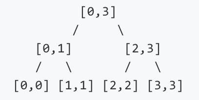
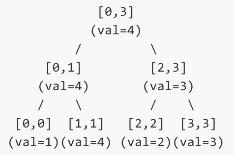
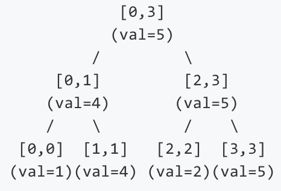

# 307. Range Sum Query - Mutable
<https://leetcode.com/problems/range-sum-query-mutable/>
Medium

Given an integer array nums, find the sum of the elements between indices i and j (i ≤ j), inclusive.

The update(i, val) function modifies nums by updating the element at index i to val.

**Example:**

    Given nums = [1, 3, 5]

    sumRange(0, 2) -> 9
    update(1, 2)
    sumRange(0, 2) -> 8

**Note:**

    1. The array is only modifiable by the update function.
    2. You may assume the number of calls to update and sumRange function is distributed evenly.

Related Topics: Binary Indexed Tree; Segment Tree

Similar Questions: 
* Easy [Range Sum Query - Immutable](https://leetcode.com/problems/range-sum-query-immutable/)
* Hard [Range Sum Query 2D - Mutable](https://leetcode.com/problems/range-sum-query-2d-mutable/)


## Explaination: 
这道题是之前那道 Range Sum Query - Immutable 的延伸，之前那道题由于数组的内容不会改变，所以我们只需要建立一个累计数组就可以支持快速的计算区间值了，而这道题说数组的内容会改变，如果我们还是用之前的方法建立累计和数组，那么每改变一个数字，之后所有位置的数字都要改变，这样如果有很多更新操作的话会OJ。

区域和不高效，如果数组很大很大，每次求一个巨型的区间的和，都要一个一个的遍历去累加，累啊～但是一般的累加数组又无法应对这里的 update 操作，随便修改一个数字的话，那么其之后的所有累加和都会发生改变。所以解决方案就是二者折中一下，分块累加，各不干预。

## Segment Tree Solution: 
使用了 线段树 Segment Tree 来做, 线段树可以参考[链接](https://www.cnblogs.com/grandyang/p/4985506.html)

一颗线段树的构造就是根据区间的性质的来构造的, 如下是一棵区间[0, 3]的线段树，每个[start, end]都是一个二叉树中的节点。
    
    [0, 3]的线段树
区间划分大概就是上述的区间划分。可以看出每次都将区间的长度一分为二,数列长度为n,所以线段树的高度是log(n),这是很多高效操作的基础。上述的区间存储的只是区间的左右边界。我们可以将区间的最大值加入进来,也就是树中的Node需要存储left，right左右子节点外，还需要存储start, end, val区间的范围和区间内表示的值。**可以储存不同的值，例如区间内的最大值，最小值，区间的求和等等。**
      
    将区间的最大值加入进来 

因为每次将区间的长度一分为二,所有创造的节点个数，即底层有n个节点，那么倒数第二次约n/2个节点，倒数第三次约n/4个节点，依次类推：
    ```
    n + 1/2 * n + 1/4 * n + 1/8 * n + ...
    =   (1 + 1/2 + 1/4 + 1/8 + ...) * n
    =   2n    
    ```
所以构造线段树的时间复杂度和空间复杂度都为O(n)。

**线段树中的Node如何定义**：二叉树的节点区间定义，[start, end]代表节点的区间范围，sum 是[start, end]区间的和。left , right 是当前节点区间划分之后的左右节点区间。

**线段树创建**：给定一个区间，我们要维护线段树中存在的区间中最大的值。这将有利于我们高效的查询任何区间的最大值。给出A数组，基于A数组构建一棵维护最大值的线段树，我们可以在O(logN)的复杂度内查询任意区间的最大值：
    比如原数组 A = [1, 4, 2, 3]
     
    原数组 A = [1, 4, 2, 3]

使用递归的方法，递归函数的参数 nums 是原输入数组，start 和 end 是节点代表的区间。如果 start > end, 则返回null。如果 start == end，则是叶子节点。然后从区间中点分左右节点并调用递归。
Time: O(logn)

**线段树节点更新**： 
     
    原线段树

更新序列中的一个节点，如何把这种变化体现到线段树中去，例如，将序列中的第4个点A[3]更新为5, 要变动3个区间中的值,分别为[3,3],[2,3],[0,3]

     
    A[3] 更新为5
要更新所有覆盖点的区间的节点，所以需要从叶子节点一路走到根节点, 去更新线段树上的值。

使用递归的方法。找到 pos 所在的叶子节点。所以如果root.start == root.end, 找到叶子节点，更新值为 sum = val。否则对比 mid 和 pos，如果 pos <= mid, 则对左子树调用递归，否则对右子树调用递归。最后更新 root 的 sum。
Time: O(logn)

**线段树区间查询**：线段树的区间查询操作就是将当前区间分解为较小的子区间,然后由子区间的最大值就可以快速得到需要查询区间的最大值。如果查询区间的[start, end] 等于当前 root 的区间，则直接返 root.sum。否则对比 root 区间的中值 mid。如果查询区间在左子树（end <= mid），则对左子树递归。如果查询区间在右子树（start >= mid+1），则对右子树递归。如果查询区间横跨左右子树，则分段调用。


```java
class NumArray {

    class SegmentTreeNode {
        int start, end;
        SegmentTreeNode left, right;
        int sum;

        // 节点区间定义
        // [start, end] 代表节点的区间范围
        // sum 是在(start,end)区间上的和
        // left , right 是当前节点区间划分之后的左右节点区间
        public SegmentTreeNode(int start, int end) {
            this.start = start;
            this.end = end;
            this.left = null;
            this.right = null;
            this.sum = 0;
        }
    }
    
    SegmentTreeNode root = null;
    
    public NumArray(int[] nums) {
        root = buildTree(nums, 0, nums.length-1);
    }
    
    private SegmentTreeNode buildTree(int[] nums, int start, int end){
        if(start > end) return null;
        else {
            SegmentTreeNode ret = new SegmentTreeNode(start, end);
            if(start == end) {
                ret.sum = nums[start];
            }else{
                int mid = start + (end-start)/2;
                ret.left = buildTree(nums, start, mid);
                ret.right = buildTree(nums, mid+1, end);
                ret.sum = ret.left.sum + ret.right.sum;
            }
            return ret;
        }
    }
    
    public void update(int i, int val) {
        update(root, i, val);
    }
    
    public void update(SegmentTreeNode root, int pos, int val){
        if(root.start == root.end) {
            root.sum = val;
        }else{
            int mid = root.start + (root.end - root.start) / 2;
            if (pos <= mid) {
                 update(root.left, pos, val);
            } else {
                 update(root.right, pos, val);
            }
            root.sum = root.left.sum + root.right.sum;
        }
    }
    
    public int sumRange(int i, int j) {
        return sumRange(root, i, j);
    }
    
    public int sumRange(SegmentTreeNode root, int start, int end) {
        if (root.end == end && root.start == start) {
            return root.sum;
        } else {
            int mid = root.start + (root.end - root.start) / 2;
            if (end <= mid) {
                return sumRange(root.left, start, end);
            } else if (start >= mid+1) {
                return sumRange(root.right, start, end);
            }  else {    
                return sumRange(root.right, mid+1, end) + sumRange(root.left, start, mid);
            }
        }
    } 
}

/**
 * Your NumArray object will be instantiated and called as such:
 * NumArray obj = new NumArray(nums);
 * obj.update(i,val);
 * int param_2 = obj.sumRange(i,j);
 */
```


## Binary Indexed Tree Solution: 

利用分块区域和的思路，使用一种新的数据结构，叫做[树状数组Binary Indexed Tree](https://zh.wikipedia.org/wiki/树状数组)，又称 Fenwick Tree，这是一种查询和修改复杂度均为 O(logn) 的数据结构。这个树状数组比较有意思，所有的奇数位置的数字和原数组对应位置的相同，偶数位置是原数组若干位置之和，假如原数组 A(a1, a2, a3, a4 ...)，和其对应的树状数组 C(c1, c2, c3, c4 ...)有如下关系：
    
```
    C1 = A1
    C2 = A1 + A2
    C3 = A3
    C4 = A1 + A2 + A3 + A4
    C5 = A5
    C6 = A5 + A6
    C7 = A7
    C8 = A1 + A2 + A3 + A4 + A5 + A6 + A7 + A8
    ...
```
那么是如何确定某个位置到底是有几个数组成的呢，原来是根据坐标的最低位 Low Bit 来决定的，所谓的最低位，就是二进制数的最右边的一个1开始，加上后面的0(如果有的话)组成的数字，例如1到8的最低位如下面所示：
```
    坐标          二进制       最低位

    1               0001          1

    2               0010          2

    3               0011          1

    4               0100          4

    5               0101          1

    6               0110          2

    7               0111          1

    8               1000          8

    ...
```
最低位的计算方法有两种，一种是 x&(x^(x–1))，另一种是利用补码特性 x&-x。

这道题我们先根据给定输入数组建立一个树状数组 bit，比如，对于 nums = {1, 3, 5, 9, 11, 13, 15, 17}，建立出的 bit 数组为：

    bit -> 0 1 4 5 18 11 24 15 74

注意到我们给 bit 数组开头 padding 了一个0，这样我们在利用上面的树状数组的性质时就不用进行坐标转换了。可以发现bit数组中奇数位上的数字跟原数组是相同的，参见上面标记蓝色的数字。偶数位则是之前若干位之和，符合上图中的规律。

现在我们要更新某一位数字时，比如将数字5变成2，即 update(2, 2)，那么现求出差值 diff = 2 - 5 = -3，然后我们需要更新树状数组 bit，根据最低位的值来更新后面含有这一位数字的地方，一般只需要更新部分偶数位置的值即可。由于我们在开头 padding了个0，所以我们的起始位置要加1，即 j=3，然后现将 bit[3] 更新为2，然后更新下一位，根据图中所示，并不是 bit[3] 后的每一位都需要更新的，下一位需要更新的位置的计算方法为 j += (j&-j)，这里我们的j是3，则 (j&-j) = 1，所以下一位需要更新的是 bit[4]，更新为15，现在j是4，则 (j&-j) = 4，所以下一位需要更新的是 bit[8]，更新为71，具体的变换过程如下所示：
```
    0 1 4 5 18 11 24 15 74

    0 1 4 2 18 11 24 15 74

    0 1 4 2 15 11 24 15 74

    0 1 4 2 15 11 24 15 71
```
接下来就是求区域和了，直接求有些困难，我们需要稍稍转换下思路。比如若我们能求出前i-1个数字之和，跟前j个数字之和，那么二者的差值就是要求的区间和了。所以我们先实现求前任意i个数字之和，当然还是要利用树状数组的性质，此时正好跟 update 函数反过来，我们的j从位置i开始，每次将 bit[j] 累加到 sum，然后更新j，通过 j -= (j&-j)，这样就能快速的求出前i个数字之和了，从而也就能求出任意区间之和了。

```java
class NumArray {
    int[] nums;
	int[] BIT;
	int n;

	public NumArray(int[] nums) {
		this.nums = nums;

		n = nums.length;
		BIT = new int[n + 1];
		for (int i = 0; i < n; i++)
			init(i, nums[i]);
	}

	public void init(int i, int val) {
		i++;
		while (i <= n) {
			BIT[i] += val;
			i += (i & -i);
		}
	}

	void update(int i, int val) {
		int diff = val - nums[i];
		nums[i] = val;
		init(i, diff);
	}

	public int getSum(int i) {
		int sum = 0;
		i++;
		while (i > 0) {
			sum += BIT[i];
			i -= (i & -i);
		}
		return sum;
	}

	public int sumRange(int i, int j) {
		return getSum(j) - getSum(i - 1);
	}
}

/**
 * Your NumArray object will be instantiated and called as such:
 * NumArray obj = new NumArray(nums);
 * obj.update(i,val);
 * int param_2 = obj.sumRange(i,j);
 */
```