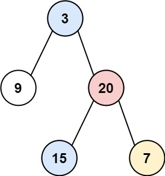
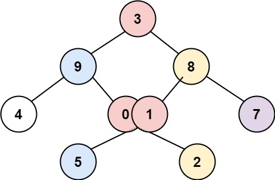

# 314. Binary Tree Vertical Order Traversal
<https://leetcode.com/problems/binary-tree-vertical-order-traversal/>
Medium

Given the root of a binary tree, return the vertical order traversal of its nodes' values. (i.e., from top to bottom, column by column).

If two nodes are in the same row and column, the order should be from left to right.

 

Example 1:


    Input: root = [3,9,20,null,null,15,7]
    Output: [[9],[3,15],[20],[7]]

Example 2:


    Input: root = [3,9,20,null,null,15,7]
    Output: [[9],[3,15],[20],[7]]

Example 3:


    Input: root = [3,9,8,4,0,1,7,null,null,null,2,5]
    Output: [[4],[9,5],[3,0,1],[8,2],[7]]

Constraints:

    * The number of nodes in the tree is in the range [0, 100].
    * -100 <= Node.val <= 100

Related Topics: Hash Table; Tree; Depth-First Search; Breadth-First Search; Binary Tree

Similar Questions:
* Medium [Binary Tree Vertical Order Traversal](https://leetcode.com/problems/binary-tree-vertical-order-traversal/)
  
## Explanation:
这道题让我们竖直遍历二叉树，并把每一列存入一个二维数组，看题目中给的第一个例子，3和 15 属于同一列，3在前，第二个例子中，3,5,2 在同一列，3在前，5和2紧随其后。


## BFS Solution: 
用层序遍历。如何确定列的顺序呢？可以给根节点序号0，然看开始层序遍历。凡是左子节点则序号减1，右子节点则序号加1，这样可以通过序号来把相同列节点值放到一起。用 TreeMap 来建立序号和其对应节点值的映射。用 TreeMap 的另一个好处是其自动排序功能可以让列从左到右排序。层序遍历需要用到 queue，此时 queue 里需要不仅保持节点，还要保持节点的序号。这样每次取出就可以操作序号，而且排入队中的节点也赋上其正确的序号。

Time: O(NlogN)
Space: O(N)

```java
/**
 * Definition for a binary tree node.
 * public class TreeNode {
 *     int val;
 *     TreeNode left;
 *     TreeNode right;
 *     TreeNode() {}
 *     TreeNode(int val) { this.val = val; }
 *     TreeNode(int val, TreeNode left, TreeNode right) {
 *         this.val = val;
 *         this.left = left;
 *         this.right = right;
 *     }
 * }
 */
class Solution {
    public List<List<Integer>> verticalOrder(TreeNode root) {
        List<List<Integer>> resList = new ArrayList();
        if(root == null) return resList;
        int column = 0;
        TreeMap<Integer, List<Integer>> columnMap = new TreeMap();
        Queue<Pair<TreeNode, Integer>> queue = new LinkedList();
        queue.offer(new Pair(root, column));
        while(!queue.isEmpty()){
            Pair<TreeNode, Integer> p = queue.poll();
            root = p.getKey();
            column = p.getValue();
            if(root != null){
                if(!columnMap.containsKey(column)){
                    columnMap.put(column, new ArrayList());
                }
                columnMap.get(column).add(root.val);
                queue.offer(new Pair(root.left, column-1));
                queue.offer(new Pair(root.right, column+1));
            }
        }
        for(Integer key : columnMap.keySet()){
            resList.add(columnMap.get(key));
        }
        return resList;
    }
}
```