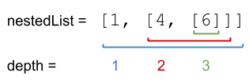

# 339. Nested List Weight Sum
<https://leetcode.com/problems/nested-list-weight-sum/>
Medium

You are given a nested list of integers nestedList. Each element is either an integer or a list whose elements may also be integers or other lists.

The depth of an integer is the number of lists that it is inside of. For example, the nested list [1,[2,2],[[3],2],1] has each integer's value set to its depth.

Return the sum of each integer in nestedList multiplied by its depth.

 

**Example 1:**


Input: nestedList = [[1,1],2,[1,1]]
Output: 10
Explanation: Four 1's at depth 2, one 2 at depth 1. 1*2 + 1*2 + 2*1 + 1*2 + 1*2 = 10.

**Example 2:**


Input: nestedList = [1,[4,[6]]]
Output: 27
Explanation: One 1 at depth 1, one 4 at depth 2, and one 6 at depth 3. 1*1 + 4*2 + 6*3 = 27.

**Example 3:**

Input: nestedList = [0]
Output: 0
 

**Constraints:**

1 <= nestedList.length <= 50
The values of the integers in the nested list is in the range [-100, 100].
The maximum depth of any integer is less than or equal to 50.


Related Topics: Depth-first Search; Breadth-first Search

Similar Questions: 
* Medium [Nested List Weight Sum II](https://leetcode.com/problems/nested-list-weight-sum-ii/)
* Medium [Array Nesting](https://leetcode.com/problems/array-nesting/)
* Easy [Employee Importance](https://leetcode.com/problems/employee-importance/)

## Explanation: 
这道题定义了一种嵌套链表的结构，链表可以无限往里嵌套，规定每嵌套一层，深度加1，让我们求权重之和，就是每个数字乘以其权重，再求总和。

## DFS Solution: 
对于每个嵌套链表的对象，调用DFS函数，并赋深度值1，累加起来返回。在DFS函数中，用变量 total 保存总值。遍历给的嵌套链表的数组。首先判断其是否为整数，如果是，则把当前深度乘以整数加到 total 中。如果不是，那么我们再对其调用DFS函数，将返回值加入 total。最后返回 total。

Time: O(N)
Space: O(N)

```java
/**
 * // This is the interface that allows for creating nested lists.
 * // You should not implement it, or speculate about its implementation
 * public interface NestedInteger {
 *     // Constructor initializes an empty nested list.
 *     public NestedInteger();
 *
 *     // Constructor initializes a single integer.
 *     public NestedInteger(int value);
 *
 *     // @return true if this NestedInteger holds a single integer, rather than a nested list.
 *     public boolean isInteger();
 *
 *     // @return the single integer that this NestedInteger holds, if it holds a single integer
 *     // Return null if this NestedInteger holds a nested list
 *     public Integer getInteger();
 *
 *     // Set this NestedInteger to hold a single integer.
 *     public void setInteger(int value);
 *
 *     // Set this NestedInteger to hold a nested list and adds a nested integer to it.
 *     public void add(NestedInteger ni);
 *
 *     // @return the nested list that this NestedInteger holds, if it holds a nested list
 *     // Return empty list if this NestedInteger holds a single integer
 *     public List<NestedInteger> getList();
 * }
 */
class Solution {
    public int depthSum(List<NestedInteger> nestedList) {
        return dfs(nestedList, 1);
    }
    
    private int dfs(List<NestedInteger> list, int depth){
        int total = 0;
        for(NestedInteger nested : list){
            if(nested.isInteger()){
                total += nested.getInteger()*depth;
            }else{
                total += dfs(nested.getList(), depth+1);
            }
        }
        return total;
    }
}
```