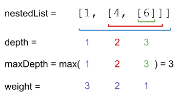

# 364. Nested List Weight Sum II
<https://leetcode.com/problems/nested-list-weight-sum-ii/>
Medium

You are given a nested list of integers nestedList. Each element is either an integer or a list whose elements may also be integers or other lists.

The depth of an integer is the number of lists that it is inside of. For example, the nested list [1,[2,2],[[3],2],1] has each integer's value set to its depth. Let maxDepth be the maximum depth of any integer.

The weight of an integer is maxDepth - (the depth of the integer) + 1.

Return the sum of each integer in nestedList multiplied by its weight.

 

**Example 1:**


Input: nestedList = [[1,1],2,[1,1]]
Output: 8
Explanation: Four 1's with a weight of 1, one 2 with a weight of 2.
1*1 + 1*1 + 2*2 + 1*1 + 1*1 = 8

**Example 2:**


Input: nestedList = [1,[4,[6]]]
Output: 17
Explanation: One 1 at depth 3, one 4 at depth 2, and one 6 at depth 1.
1*3 + 4*2 + 6*1 = 17
 

**Constraints:**

* 1 <= nestedList.length <= 50
* The values of the integers in the nested list is in the range [-100, 100].
* The maximum depth of any integer is less than or equal to 50.

Related Topics: Stack; Depth-first Search; Breadth-First Search

Similar Questions: 
* Medium [Nested List Weight Sum](https://leetcode.com/problems/nested-list-weight-sum/)
* Medium [Array Nesting](https://leetcode.com/problems/array-nesting/)

## Explanation: 
这道题是之前那道 Nested List Weight Sum 的拓展，与其不同的是，这里的深度越深，权重越小，和之前刚好相反。

## DFS Solution: 
先用DFS来计算最大深度。实现 helper() 来计算深度，遍历 nestedList，如果当前nestedList 是整数，到当前最后一层，更新 max。否则对当前nestedList 调用helper()，用返回的高度+1并更新max。实现 getSum(), 需要参数 layer 来记录当前高度，然后和helper()一样的逻辑。

Time: O(n)
Space: O(n)

```java
/**
 * // This is the interface that allows for creating nested lists.
 * // You should not implement it, or speculate about its implementation
 * public interface NestedInteger {
 *     // Constructor initializes an empty nested list.
 *     public NestedInteger();
 *
 *     // Constructor initializes a single integer.
 *     public NestedInteger(int value);
 *
 *     // @return true if this NestedInteger holds a single integer, rather than a nested list.
 *     public boolean isInteger();
 *
 *     // @return the single integer that this NestedInteger holds, if it holds a single integer
 *     // Return null if this NestedInteger holds a nested list
 *     public Integer getInteger();
 *
 *     // Set this NestedInteger to hold a single integer.
 *     public void setInteger(int value);
 *
 *     // Set this NestedInteger to hold a nested list and adds a nested integer to it.
 *     public void add(NestedInteger ni);
 *
 *     // @return the nested list that this NestedInteger holds, if it holds a nested list
 *     // Return empty list if this NestedInteger holds a single integer
 *     public List<NestedInteger> getList();
 * }
 */
class Solution {
    public int depthSumInverse(List<NestedInteger> nestedList) {
        if(nestedList == null || nestedList.size() == 0) return 0;
        int h = helper(nestedList);
        return getSum(nestedList, h);
    }
    // Calculate the sum
    private int getSum(List<NestedInteger> l, int layer) {
        int sum = 0;
        if(l == null || l.size() == 0) return sum;
        for(NestedInteger n : l) {
            if(n.isInteger()) sum += n.getInteger() * layer;
            else sum += getSum(n.getList(), layer - 1);
        }
        return sum;
    }
    // Get the height
    private int helper(List<NestedInteger> l) {
        if(l == null || l.size() == 0) return 0;
        int max = 0;
        for(NestedInteger n : l) {
            if(n.isInteger()) max = Math.max(max, 1);
            else max = Math.max(max, helper(n.getList()) + 1);
        }
        return max;
    }
}
```

## Unweighted and weighted Solution:
用两个变量 unweighted 和 weighted，非权重和跟权重和，初始化均为0，然后如果 nestedList 不为空开始循环，先声明一个空数组 nextLevel，遍历 nestedList 中的元素，如果是数字，则非权重和加上这个数字，如果是数组，就加入 nextLevel，这样遍历完成后，第一层的数字和保存在非权重和 unweighted 中了，其余元素都存入了 nextLevel 中，此时将 unweighted 加到 weighted 中，将 nextLevel 赋给 nestedList，这样再进入下一层计算，由于上一层的值还在 unweighted 中，所以第二层计算完将 unweighted 加入 weighted 中时，相当于第一层的数字和被加了两次，这样就完美的符合要求了。

```java
/**
 * // This is the interface that allows for creating nested lists.
 * // You should not implement it, or speculate about its implementation
 * public interface NestedInteger {
 *     // Constructor initializes an empty nested list.
 *     public NestedInteger();
 *
 *     // Constructor initializes a single integer.
 *     public NestedInteger(int value);
 *
 *     // @return true if this NestedInteger holds a single integer, rather than a nested list.
 *     public boolean isInteger();
 *
 *     // @return the single integer that this NestedInteger holds, if it holds a single integer
 *     // Return null if this NestedInteger holds a nested list
 *     public Integer getInteger();
 *
 *     // Set this NestedInteger to hold a single integer.
 *     public void setInteger(int value);
 *
 *     // Set this NestedInteger to hold a nested list and adds a nested integer to it.
 *     public void add(NestedInteger ni);
 *
 *     // @return the nested list that this NestedInteger holds, if it holds a nested list
 *     // Return empty list if this NestedInteger holds a single integer
 *     public List<NestedInteger> getList();
 * }
 */
class Solution {
    public int depthSumInverse(List<NestedInteger> nestedList) {
        int unweighted = 0, weighted = 0;
        while (!nestedList.isEmpty()) {
            List<NestedInteger> nextLevel = new ArrayList<>();
            for (NestedInteger ni : nestedList) {
                if (ni.isInteger())
                    unweighted += ni.getInteger();
                else
                    nextLevel.addAll(ni.getList());
            }
            weighted += unweighted;
            nestedList = nextLevel;
        }
        return weighted;
    }
}
```