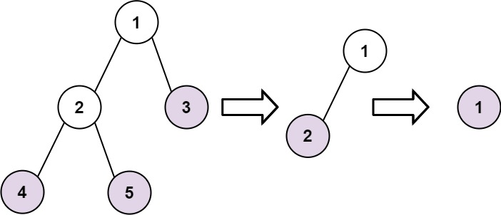

# 366. Find Leaves of Binary Tree
<https://leetcode.com/problems/find-leaves-of-binary-tree/>
Medium

Given the root of a binary tree, collect a tree's nodes as if you were doing this:

Collect all the leaf nodes.
Remove all the leaf nodes.
Repeat until the tree is empty.
 

**Example 1:**


    Input: root = [1,2,3,4,5]
    Output: [[4,5,3],[2],[1]]
    Explanation:
    [[3,5,4],[2],[1]] and [[3,4,5],[2],[1]] are also considered correct answers since per each level it does not matter the order on which elements are returned.


**Example 2:**

    Input: root = [1]
    Output: [[1]]

**Constraints:**
    * The number of nodes in the tree is in the range [1, 100].
    * -100 <= Node.val <= 100

Related Topics: Tree; Depth-First Search; Binary Tree


## Explanation: 
这道题给了我们一个二叉树，让我们返回其每层的叶节点，就像剥洋葱一样，将这个二叉树一层一层剥掉，最后一个剥掉根节点。


## DFS Solution: 
用DFS来做, 从左子节点和右子节点分开走可以得到两个深度，由于成为叶节点的条件是左右子节点都为空，所以我们取左右子节点中较大值加1为当前节点的深度值，知道了深度值就可以将节点值加入到结果res中的正确位置了。

Time: O(n)
Space: O(n)

```java
/**
 * Definition for a binary tree node.
 * public class TreeNode {
 *     int val;
 *     TreeNode left;
 *     TreeNode right;
 *     TreeNode() {}
 *     TreeNode(int val) { this.val = val; }
 *     TreeNode(int val, TreeNode left, TreeNode right) {
 *         this.val = val;
 *         this.left = left;
 *         this.right = right;
 *     }
 * }
 */
class Solution {
    public List<List<Integer>> findLeaves(TreeNode root) {
        List<List<Integer>> res = new ArrayList<>();
        height(root, res);
        return res;
    }
    
    private int height(TreeNode node, List<List<Integer>> res){
        if(node == null) return -1;
        int level = 1 + Math.max(height(node.left, res), height(node.right, res));
        if(res.size() == level){
            res.add(new ArrayList<>());
        }
        res.get(level).add(node.val);
        return level;
    }
}
```
