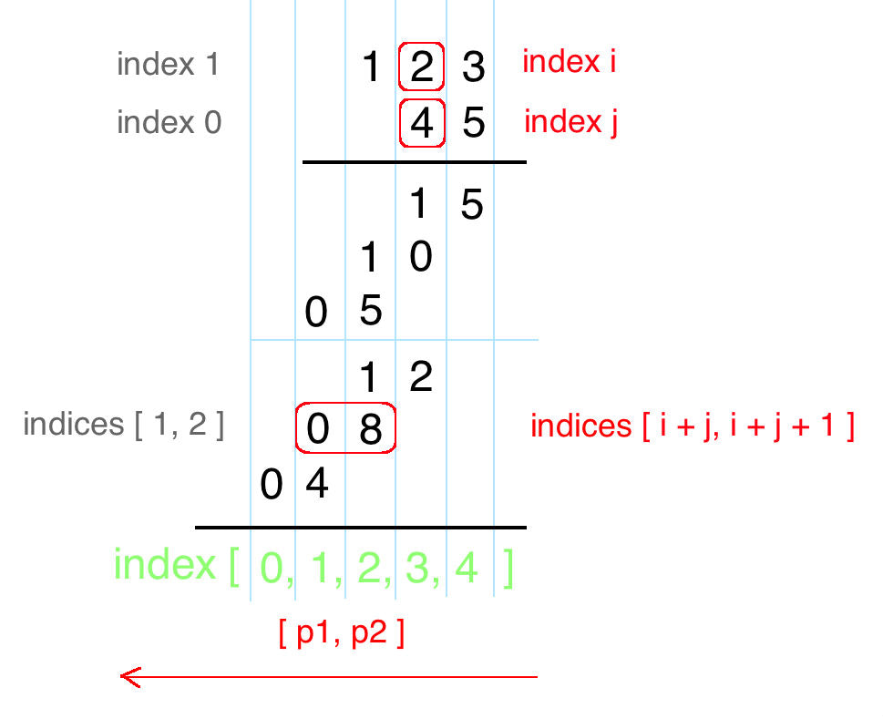

# 43. Multiply Strings
<https://leetcode.com/problems/multiply-strings/>
Medium

Given two non-negative integers num1 and num2 represented as strings, return the product of num1 and num2, also represented as a string.

**Example 1:**

    Input: num1 = "2", num2 = "3"
    Output: "6"

**Example 2:**

    Input: num1 = "123", num2 = "456"
    Output: "56088"

**Note:**

    1. The length of both num1 and num2 is < 110.
    2. Both num1 and num2 contain only digits 0-9.
    3. Both num1 and num2 do not contain any leading zero, except the number 0 itself.
    4. You must not use any built-in BigInteger library or convert the inputs to integer directly.

Related Topics: Math; String

Similar Questions: 
* Medium [Add Two Numbers](https://leetcode.com/problems/add-two-numbers/)
* Easy [Plus One](https://leetcode.com/problems/plus-one/)
* Easy [Add Binary](https://leetcode.com/problems/add-binary/)
* Easy [Add Strings](https://leetcode.com/problems/add-strings/)

## Explaination:
这道题让我们求两个字符串数字的相乘，输入的两个数和返回的数都是以字符串格式储存的，这样做的原因可能是这样可以计算超大数相乘，可以不受 int 或 long 的数值范围的约束。可以尝试写个乘法，乘法过程都是每位相乘然后错位相加，如下：


不难发现两点： 
* 两数相乘得到的乘积的长度其实其实不会超过两个数字的长度之和，若 num1 长度为m，num2 长度为n，则 num1 x num2 的长度不会超过 m+n。
* 理解错位相加，比如2x5得到10，3x5得到15，因为2是十位上的数字，所以本身相当于20。
* num1 和 num2 中任意位置的两个数字相乘，得到的两位数在最终结果中的位置是确定的，比如 num1 中位置为i的数字乘以 num2 中位置为j的数字，那么得到的两位数字的位置为 i+j 和 i+j+1。

## Math Solution: 
从个位上开始相乘，所以从 num1 和 num2 字符串的尾部开始往前遍历，分别提取出对应位置上的字符，将其转为整型后相乘。然后确定相乘后的两位数所在的位置 p1 和 p2，由于 p2 相较于 p1 是低位，所以将得到的两位数 mul 先加到 p2 位置上去，这样可能会导致 p2 位上的数字大于9，所以将十位上的数字要加到高位 p1 上去，只将余数留在 p2 位置，这样每个位上的数字都变成一位。然后要做的是从高位开始，将数字存入结果 StringBuilder sb 中，记住 leading zeros 要跳过，最后处理下 corner case，即若结果 sb 为空，则返回 "0"，否则返回结果 sb.toString()。

```java
class Solution {
    public String multiply(String num1, String num2) {
        int[] res = new int[num1.length() + num2.length()];
        for(int i = num1.length()-1; i>= 0; i--){
            int val1 = Character.getNumericValue(num1.charAt(i));
            for(int j = num2.length()-1; j>=0; j--){
                int val2 = Character.getNumericValue(num2.charAt(j));
                int sum = val1*val2 + res[i+j+1];
                res[i+j+1] = sum%10;
                res[i+j] += sum/10;
            }
        }
        StringBuilder sb = new StringBuilder();
        for(int r : res) if(!(sb.length() == 0 && r == 0)) sb.append(r);
        return sb.length() == 0? "0":sb.toString();
    }
}
```