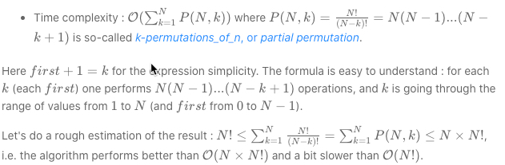

# 46. Permutations
<https://leetcode.com/problems/permutations/>
Medium

Given a collection of distinct integers, return all possible permutations.

**Example:**

    Input: [1,2,3]
    Output:
    [
        [1,2,3],
        [1,3,2],
        [2,1,3],
        [2,3,1],
        [3,1,2],
        [3,2,1]
    ]

Related Topics: Backtracking

Similar Questions: 
* Medium [Next Permutation](https://leetcode.com/problems/next-permutation/)
* Medium [Permutations II](https://leetcode.com/problems/permutations-ii/)
* Medium [Permutation Sequence](https://leetcode.com/problems/permutation-sequence/)
* Medium [Combinations](https://leetcode.com/problems/combinations/)


## Explaination:
这道题是求全排列问题，给的输入数组没有重复项，这跟之前的那道 [Combinations](https://leetcode.com/problems/combinations/) 和类似，解法基本相同，但是不同点在于那道不同的数字顺序只算一种，是一道典型的组合题，而此题是求全排列问题。见[Backtracking 常规解题方法](../summary/Backtracking%20常规解题方法.md)

## Backtracking Solution: 
用 backtracking 来解。递归函数需要3个变量。combos 记录所有结果组合，curr 记录当前组合，nums 是输入数组。如果 curr 的大小等于 nums，说明已经找到组合，将 curr 加入 combos。否则遍历 nums，如果 curr 已经有当前数字 nums[i]，跳过。否则将 nums[i] 加入 curr 并调用递归。当前递归结束删掉刚加的数字。

Time: 

Space: O(N!) , since one has to keep N! solutions.

```java
class Solution {
    public List<List<Integer>> permute(int[] nums) {
        List<List<Integer>> res = new ArrayList();
        helper(res, new ArrayList<Integer>(), nums);
        return res;
    }
    
    public void helper(List<List<Integer>> combos, List<Integer> curr, int[] nums){
        if(curr.size() == nums.length){
            combos.add(new ArrayList<Integer>(curr));
            return;
        }
        for(int i = 0; i<nums.length; i++){
            if(curr.contains(nums[i])) continue;
            curr.add(nums[i]);
            helper(combos, curr, nums);
            curr.remove(curr.size()-1);
        }
    }
}
```