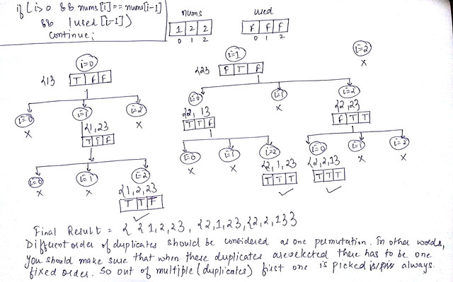
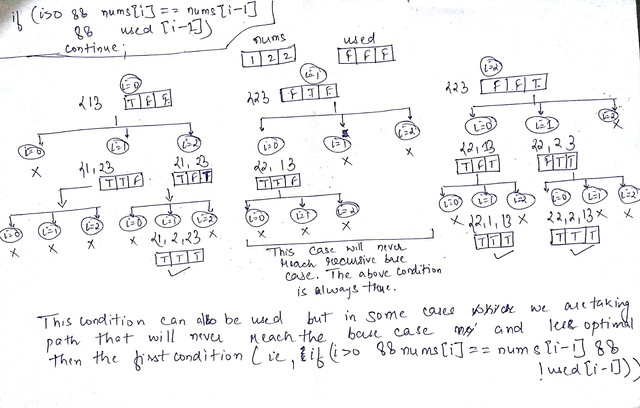

# 47. Permutations II

Given a collection of numbers that might contain duplicates, return all possible unique permutations.

Example:

    Input: [1,1,2]
    Output:
    [
        [1,1,2],
        [1,2,1],
        [2,1,1]
    ]

Related Topics: Backtracking

Similar Questions: 
* Medium [Next Permutation](https://leetcode.com/problems/next-permutation/)
* Medium [Permutations](https://leetcode.com/problems/permutations/)
* Medium [Palindrome Permutation II](https://leetcode.com/problems/palindrome-permutation-ii/)
* Hard [Number of Squareful Arrays](https://leetcode.com/problems/number-of-squareful-arrays/)

## Explaination: 
这道题是之前那道 Permutations 的延伸，由于输入数组有可能出现重复数字，如果按照之前的算法运算，会有重复排列产生，我们要避免重复的产生。见[Backtracking 常规解题方法](../summary/Backtracking%20常规解题方法.md)

## Backtracking Solution: 
用 backtracking 来解。首先对输入数组 nums 排序方便查重。递归函数需要4个变量。combos 记录所有结果组合，curr 记录当前组合，visitedIdxSet 记录已经访问过的索引，nums 是输入数组。如果 curr 的大小等于 nums，说明已经找到组合，将 curr 加入 combos。否则遍历 nums，如果已经访问过或者当前数字等于前一个数字而且前一个数字没有用过，则跳过。否则将 nums[i] 加入 curr，更新 visitedIdxSet 并调用递归。当前递归结束删掉刚加的数字，也要更新visitedIdxSet。

解释 (i>0 && nums[i] == nums[i-1] && !visitedIdxSet.contains(i-1)), 代表前一个相同数字如果用过，则使用当前相同数字。如果反过来判断 (i > 0 && nums[i] == nums[i - 1] && visitedIdxSet.contains(i-1))，代表前一个相同数字没用过，则使用当前相同数字。程序需要找到下一个相同数字并加入curr，然后 backtrack 到第一个相同数字再加入curr。这样结果要到 for 循环后面才返回。而前一个判断条件一开始就返回结果。具体请看下面两个流程图。

Condition one - if (i>0 && nums[i] == nums[i-1] && !visitedIdxSet.contains(i-1)) continue;


Condition two - if (i > 0 && nums[i] == nums[i - 1] && visitedIdxSet.contains(i-1)) continue; 


```java
class Solution {
    public List<List<Integer>> permuteUnique(int[] nums) {
        List<List<Integer>> res = new ArrayList<>();
        Arrays.sort(nums);
        helper(res, new ArrayList<Integer>(), new HashSet<Integer>(), nums);
        return res;
    }
    
    public void helper(List<List<Integer>> combos, List<Integer> curr, Set<Integer> visitedIdxSet, int[] nums){
        if(curr.size() == nums.length){
            combos.add(new ArrayList<Integer>(curr));
            return;
        }
        for(int i = 0; i<nums.length; i++){
            if(visitedIdxSet.contains(i) || (i>0 && nums[i] == nums[i-1] && !visitedIdxSet.contains(i-1)) ) continue;
            curr.add(nums[i]);
            visitedIdxSet.add(i);
            helper(combos, curr, visitedIdxSet, nums);
            curr.remove(curr.size()-1);
            visitedIdxSet.remove(i);
        }
    }
}
```