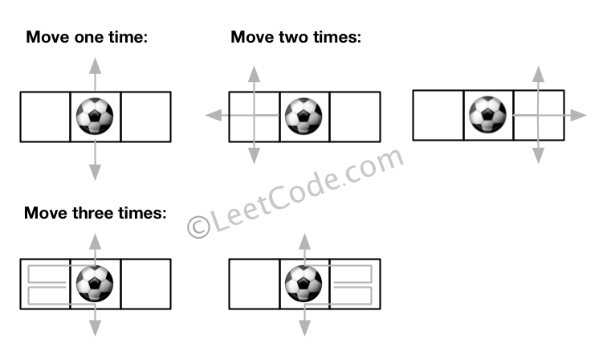

# 576. Out of Boundary Paths
<https://leetcode.com/problems/out-of-boundary-paths/>
Medium

There is an m by n grid with a ball. Given the start coordinate (i,j) of the ball, you can move the ball to adjacent cell or cross the grid boundary in four directions (up, down, left, right). However, you can at most move N times. Find out the number of paths to move the ball out of grid boundary. The answer may be very large, return it after mod 109 + 7.

**Example 1:**

Input: m = 2, n = 2, N = 2, i = 0, j = 0
Output: 6
Explanation:


**Example 2:**

Input: m = 1, n = 3, N = 3, i = 0, j = 1
Output: 12
Explanation:

 

**Note:**

1. Once you move the ball out of boundary, you cannot move it back.
2. The length and height of the grid is in range [1,50].
3. N is in range [0,50].

Related Topics: Dynamic Programming; Depth-first Search

Similar Questions: 
* Medium [Knight Probability in Chessboard](https://leetcode.com/problems/knight-probability-in-chessboard/)


## Explanation: 
这道题给了我们一个二维的数组，某个位置放个足球，每次可以在上下左右四个方向中任意移动一步，总共可以移动N步，问我们总共能有多少种移动方法能把足球移除边界，由于结果可能是个巨大的数，所以让我们对一个大数取余。那么我们知道对于这种结果很大的数如果用递归解法很容易爆栈，所以最好考虑使用DP来解。

## DP Solution: 
相当于使用了BFS搜索，以(i, j)为起始点，其中dp[k][x][y]表示用了k步，进入(x, y)位置的路径数，由于dp[k][x][y]只依赖于dp[k-1][x][y]，所以我们可以用一个二维dp数组来代替，初始化dp[i][j]为1，总共N步，进行N次循环，每次都新建一个mxn大小的临时数组t，然后就是对于遍历到的每个位置，都遍历其四个相邻位置，如果相邻位置越界了，那么我们用当前位置的dp值更新结果res，因为此时dp值的意义就是从(i,j)到越界位置的路径数。如果没有，我们将当前位置的dp值赋给t数组的对应位置，这样在遍历完所有的位置时，将数组t整个赋值给dp，然后进入下一步的循环。

```java
class Solution {
    public int findPaths(int m, int n, int N, int i, int j) {
        if (N <= 0) return 0;
        
        final int MOD = 1000000007;
        int[][] count = new int[m][n];
        count[i][j] = 1;
        int result = 0;
        
        int[][] dirs = {{-1, 0}, {1, 0}, {0, -1}, {0, 1}};
        
        for (int step = 0; step < N; step++) {
            int[][] temp = new int[m][n];
            for (int r = 0; r < m; r++) {
                for (int c = 0; c < n; c++) {
                    for (int[] d : dirs) {
                        int nr = r + d[0];
                        int nc = c + d[1];
                        if (nr < 0 || nr >= m || nc < 0 || nc >= n) {
                            result = (result + count[r][c]) % MOD;
                        }
                        else {
                            temp[nr][nc] = (temp[nr][nc] + count[r][c]) % MOD;
                        }
                    }
                }
            }
            count = temp;
        }
        
        return result;
    }
}
```