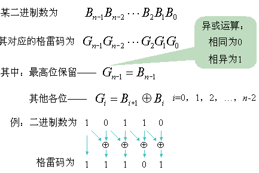
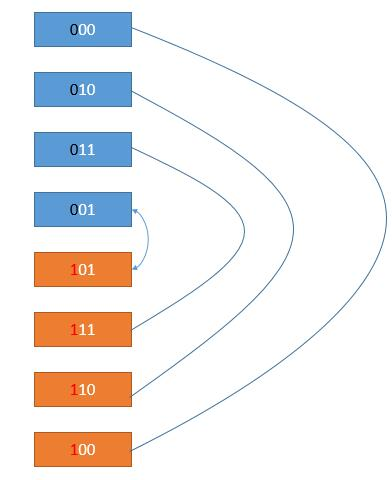

# 89. Gray Code


The gray code is a binary numeral system where two successive values differ in only one bit.

Given a non-negative integer n representing the total number of bits in the code, print the sequence of gray code. A gray code sequence must begin with 0.

**Example 1:**

    Input: 2
    Output: [0,1,3,2]
    Explanation:
    00 - 0
    01 - 1
    11 - 3
    10 - 2

    For a given n, a gray code sequence may not be uniquely defined.
    For example, [0,2,3,1] is also a valid gray code sequence.

    00 - 0
    10 - 2
    11 - 3
    01 - 1

**Example 2:**

    Input: 0
    Output: [0]
    Explanation: We define the gray code sequence to begin with 0.
                 A gray code sequence of n has size = 2n, which for n = 0 the size is 20 = 1.
                 Therefore, for n = 0 the gray code sequence is [0].

Related Topics: Backtracking

Similar Questions:  
* Easy [1-bit and 2-bit Characters](https://leetcode.com/problems/1-bit-and-2-bit-characters/)

## Explaination: 
维基百科，上面说格雷码是一种循环二进制单位距离码，主要特点是两个相邻数的代码只有一位二进制数不同的编码，格雷码的处理主要是位操作 Bit Operation，LeetCode中关于位操作的题也挺常见，比如 Repeated DNA Sequences 求重复的DNA序列， Single Number 单独的数字, 和  Single Number II 单独的数字之二 等等。三位的格雷码和二进制数如下：
```
Int    Grey Code    Binary
 　　   000          000
 　　   001          001
  　 　 011          010
  　 　 010          011
  　 　 110          100
  　 　 111          101
  　 　 101          110
  　　  100          111
```


## Gray Code Convertion Formula Solution: 
二进制转成格雷码有一个公式。

所以我们遍历 0 到 2^n - 1，然后利用公式转换即可。即最高位保留，其它位是当前位和它的高一位进行异或操作。

```java
class Solution {
    public List<Integer> grayCode(int n) {
        List<Integer> result = new LinkedList<>();
        for (int i = 0; i < 1<<n; i++) result.add(i ^ i>>1);
        return result;
    }
}
```

## DFS Backtracking Solution: 
递归函数中需要三个变量， codes记录所有结果组合， curr记录当前结果， size是可能组合的个数，n是bits个数。因为最多只能n位1，所以组合个数为 2^n == 1 << n 。
    * 如果codes已经到组合个数，返回
    * 否则从 0 开始到 n，依次把 curr 的每一位变成1，新的值为 el。
    * 如果 codes 没有 el，把 el 加入结果，并继续调用递归函数。

```java
class Solution {
    public List<Integer> grayCode(int n) {
        List<Integer> res = new LinkedList<>();
        res.add(0);
        helper(res, 0, 1<<n, n);
        return res;
    }
    
    public void helper(List<Integer> codes, int curr, int size, int n){
        if(codes.size() == size) return;
        for(int i = 0; i<n; i++){
            int mask = 1<<i;
            int el = curr^mask;
            if(!codes.contains(el)){
                codes.add(el);
                helper(codes, el, size, n);
            }
        }
    }
}
```

## DP Solution: 
按照动态规划或者说递归的思路去想，也就是解决了小问题，怎么解决大问题。
我们假设我们有了 n = 2 的解，然后考虑怎么得到 n = 3 的解。
```
n = 2 的解
00 - 0
10 - 2
11 - 3
01 - 1
```
如果再增加一位，无非是在最高位增加 0 或者 1，考虑先增加 0。由于加的是 0，其实数值并没有变化。
```
n = 3 的解，最高位是 0
000 - 0
010 - 2
011 - 3
001 - 1
```
再考虑增加 1，在 n = 2 的解基础上在最高位把 1 丢过去？
```
n = 3 的解
000 - 0
010 - 2
011 - 3
001 - 1  
------------- 下面的是新增的
100 - 4
110 - 6
111 - 7
101 - 5
```
似乎没这么简单哈哈，第 4 行 001 和新增的第 5 行 100，有 3 个 bit 位不同了，当然不可以了。怎么解决呢？
很简单，第 5 行新增的数据最高位由之前的第 4 行的 0 变成了 1，所以其它位就不要变化了，直接把第 4 行的其它位拉过来，也就是 101。
接下来，为了使得第 6 行和第 5 行只有一位不同，由于第 5 行拉的第 4 行的低位，而第 4 行和第 3 行只有一位不同。所以第 6 行可以把第 3 行的低位拿过来。其他行同理，如下图。

蓝色部分由于最高位加的是 0 ，所以它的数值和 n = 2 的所有解的情况一样。而橙色部分由于最高位加了 1，所以值的话，就是在其对应的值上加 4，也就是 2^2,
2
​2
​​ ，即
2
3
−
1
2
​3−1
​​ ，也就是 1 << ( n - 1) 。所以我们的算法可以用迭代求出来了。

所以如果知道了 n = 2 的解的话，如果是 { 0, 1, 3, 2}，那么 n = 3 的解就是 { 0, 1, 3, 2, 2 + 4, 3 + 4, 1 + 4, 0 + 4 }，即 { 0 1 3 2 6 7 5 4 }。之前的解直接照搬过来，然后倒序把每个数加上 1 << ( n - 1) 添加到结果中即可。
