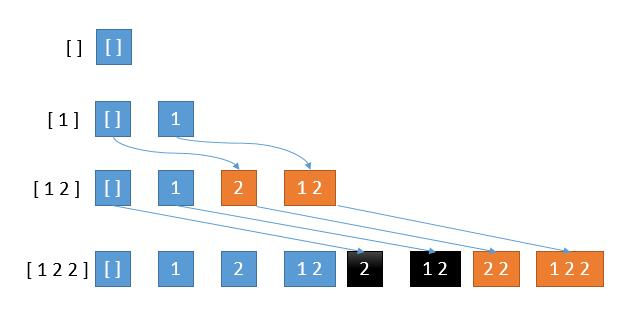

# 90. Subsets II
<https://leetcode.com/problems/subsets-ii/>
Medium

Given a collection of integers that might contain duplicates, nums, return all possible subsets (the power set).

Note: The solution set must not contain duplicate subsets.

**Example:**

    Input: [1,2,2]
    Output:
    [
        [2],
        [1],
        [1,2,2],
        [2,2],
        [1,2],
        []
    ]

Related Topics: Array; Backtracking

Similar Questions: 
* Medium [Subsets](https://leetcode.com/problems/subsets/)

## Explaination: 
这道子集合之二是之前那道 [Subsets](https://leetcode.com/problems/subsets/) 的延伸，这次输入数组允许有重复项，其他条件都不变。

## DFS Backtracking Solution: 
首先对输入数组 nums 进行排序，方便查重。递归函数中需要三个变量， combos记录所有结果组合， curr记录当前组合， pos 记录要处理的位置，nums 是 给定的范围。每次递归：
    * 把当前结果 curr 加入 combos。
    * 从 pos 开始遍历 nums 内的数。因为有重复的数，所以需要判断当前数是否和前一个数相同，相同跳过。
    * 不同的话把当前数 nums[i] 加入 curr。下一位调用递归。
    * 递归完后删除之前加的数，方便新的组合。


```java
class Solution {
    public List<List<Integer>> subsetsWithDup(int[] nums) {
        List<List<Integer>> res = new LinkedList<>();
        Arrays.sort(nums);
        helper(res, new ArrayList<>(), 0, nums);
        return res;
    }
    
    public void helper(List<List<Integer>> combos, List<Integer> curr, int pos, int[] nums){
        combos.add(new ArrayList<>(curr));
        for(int i = pos; i<nums.length; i++){
            if(i>pos && nums[i] == nums[i-1]) continue;
            curr.add(nums[i]);
            helper(combos, curr, i+1, nums);
            curr.remove(curr.size()-1);
        }
    }
}
```

## BFS Iteration Solution:  
我们看一下如果直接按照[Subsets](https://leetcode.com/problems/subsets/) 的思路会出什么问题。之前的思路是，先考虑 0 个数字的所有子串，再考虑 1 个的所有子串，再考虑 2 个的所有子串。而求 n 个的所有子串，就是 【n - 1 的所有子串】和 【n - 1 的所有子串加上 n】。例如，
```
数组 [ 1 2 3 ] 
[ ]的所有子串 [ ]
[ 1 ] 个的所有子串 [ ] [ 1 ] 
[ 1 2 ] 个的所有子串 [ ] [ 1 ] [ 2 ][ 1 2 ]
[ 1 2 3 ] 个的所有子串 [ ] [ 1 ] [ 2 ] [ 1 2 ] [ 3 ] [ 1 3 ] [ 2 3 ] [ 1 2 3 ]
```
但是如果有重复的数字，会出现什么问题呢
```
数组 [ 1 2 2 ] 
[ ] 的所有子串 [ ]
[ 1 ] 的所有子串 [ ] [ 1 ] 
[ 1 2 ] 的所有子串 [ ] [ 1 ] [ 2 ][ 1 2 ]
[ 1 2 2 ] 的所有子串 [ ] [ 1 ] [ 2 ] [ 1 2 ] [ 2 ] [ 1 2 ] [ 2 2 ] [ 1 2 2 ]
```

我们看到第 4 行黑色的部分，重复了，是怎么造成的呢？
第 4 行新添加的 2 要加到第 3 行的所有解中，而第 3 行的一部分解是旧解，一部分是新解。可以看到，我们黑色部分是由第 3 行的旧解产生的，橙色部分是由新解产生的。
而第 1 行到第 2 行，已经在旧解中加入了 2 产生了第 2 行的橙色部分，所以这里如果再在旧解中加 2 产生黑色部分就造成了重复。
所以当有重复数字的时候，我们只考虑上一步的新解，算法中用一个指针保存每一步的新解开始的位置即可。因此还需要知道上上次组合的个数。所以size依然是记录上次的组合个数。而pos记录的是上上次组合的个数。如果 nums[i] == nums[i-1], 那就从上上次开始，更新 pos 为 size，然后更新 size 为上次组合个数 res.size()。循环获取之前的组合，把当前值加入其中，然后放入 res 中。


```java
class Solution {
    public List<List<Integer>> subsetsWithDup(int[] nums) {
        Arrays.sort(nums);
        List<List<Integer>> res = new LinkedList<>();
        res.add(new ArrayList<Integer>());
        int size = 0, pos = 0;
        for(int i = 0; i<nums.length; i++){
            pos = (i>=1 && nums[i] == nums[i-1])? size : 0;
            size = res.size();
            for(int j = pos; j<size; j++){
                List<Integer> temp = new ArrayList<>(res.get(j));
                temp.add(nums[i]);
                res.add(temp);
            }
        }
        return res;
    }
}
```