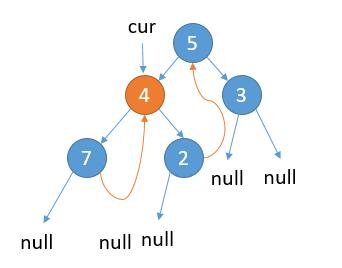
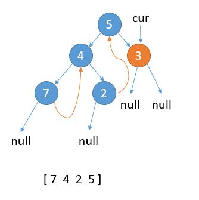
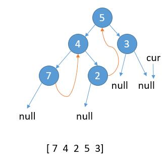

# 94. Binary Tree Inorder Traversal
<https://leetcode.com/problems/binary-tree-inorder-traversal/>
Medium

Given a binary tree, return the inorder traversal of its nodes' values.

Example:

    Input: [1,null,2,3]
    1
      \
        2
      /
    3

    Output: [1,3,2]

Follow up: Recursive solution is trivial, could you do it iteratively?

Related Topics: Hash Table; Stack; Tree

Similar Questions: 

* Medium [Validate Binary Search Tree](https://leetcode.com/problems/validate-binary-search-tree/)
* Medium [Binary Tree Preorder Traversal](https://leetcode.com/problems/binary-tree-preorder-traversal/)
* Hard [Binary Tree Postorder Traversal](https://leetcode.com/problems/binary-tree-postorder-traversal/)
* Medium [Binary Search Tree Iterator](https://leetcode.com/problems/binary-search-tree-iterator/)
* Medium [Kth Smallest Element in a BST](https://leetcode.com/problems/kth-smallest-element-in-a-bst/)
* Hard [Closest Binary Search Tree Value II](https://leetcode.com/problems/closest-binary-search-tree-value-ii/)
* Medium [Inorder Successor in BST](https://leetcode.com/problems/inorder-successor-in-bst/)
* Medium [Convert Binary Search Tree to Sorted Doubly Linked List](https://leetcode.com/problems/convert-binary-search-tree-to-sorted-doubly-linked-list/)
* Easy [Minimum Distance Between BST Nodes](https://leetcode.com/problems/minimum-distance-between-bst-nodes/)

## Explaination: 
二叉树的中序遍历顺序为左-根-右。

## Recursive Solution: 
递归函数参数 root 是当前结点，res是保存结果。
  * 如果结点不为null，先对左结点调用递归，然后把root 加入结果，最后对右结点调用。

```java
/**
 * Definition for a binary tree node.
 * public class TreeNode {
 *     int val;
 *     TreeNode left;
 *     TreeNode right;
 *     TreeNode(int x) { val = x; }
 * }
 */
class Solution {
    public List<Integer> inorderTraversal(TreeNode root) {
        List<Integer> res = new ArrayList<>();
        helper(root, res);
        return res;
    }

    private void helper(TreeNode root, List<Integer> res) {
        if (root != null) {
            helper(root.left, res);
            res.add(root.val);
            helper(root.right, res);
       }
   }
}
```

## Iterative with Stack Solution: 
用栈来做，思路是从根节点开始，先将根节点压入栈，然后再将其所有左子结点压入栈，然后取出栈顶节点，保存节点值，再将当前指针移到其右子节点上，若存在右子节点，则在下次循环时又可将其所有左子结点压入栈中。这样就保证了访问顺序为左-根-右。看一个具体的例子，想象一下吧。

```
        1
      /   \
     2     3
    / \   /
   4   5 6

 push   push   push   pop     pop    push     pop     pop 
|   |  |   |  |_4_|  |   |   |   |  |   |    |   |   |   |  
|   |  |_2_|  |_2_|  |_2_|   |   |  |_5_|    |   |   |   |
|_1_|  |_1_|  |_1_|  |_1_|   |_1_|  |_1_|    |_1_|   |   |
ans                  add 4   add 2           add 5   add 1
[]                   [4]     [4 2]           [4 2 5] [4 2 5 1]
 push   push   pop          pop 
|   |  |   |  |   |        |   |  
|   |  |_6_|  |   |        |   |  
|_3_|  |_3_|  |_3_|        |   |
              add 6        add 3
              [4 2 5 1 6]  [4 2 5 1 6 3]
```

Time: O(n)
Space: O(h) - h: 二叉树高度

```java
/**
 * Definition for a binary tree node.
 * public class TreeNode {
 *     int val;
 *     TreeNode left;
 *     TreeNode right;
 *     TreeNode(int x) { val = x; }
 * }
 */
class Solution {
    public List<Integer> inorderTraversal(TreeNode root) {
        List<Integer> ans = new ArrayList<>();
        Stack<TreeNode> stack = new Stack<>();
        TreeNode cur = root;
        while (cur != null || !stack.isEmpty()) {
            //节点不为空一直压栈
            while (cur != null) {
                stack.push(cur);
                cur = cur.left; //考虑左子树
            }
            //节点为空，就出栈
            cur = stack.pop();
            //当前值加入
            ans.add(cur.val);
            //考虑右子树
            cur = cur.right;
        }
        return ans;
    }
}
```
## Morris Traversal Solution: 
我们知道，左子树最后遍历的节点一定是一个叶子节点，它的左右孩子都是 null，我们把它右孩子指向当前根节点存起来，这样的话我们就不需要额外空间了。这样做，遍历完当前左子树，就可以回到根节点了。

当然如果当前根节点左子树为空，那么我们只需要保存根节点的值，然后考虑右子树即可。
所以总体思想就是：记当前遍历的节点为 cur。
1. cur.left 为 null，保存 cur 的值，更新 cur = cur.right
2. cur.left 不为 null，找到 cur.left 这颗子树最右边的节点记做 last
2.1. last.right 为 null，那么将 last.right = cur，更新 cur = cur.left
2.2. last.right 不为 null，说明之前已经访问过，第二次来到这里，表明当前子树遍历完成，保存 cur 的值，更新 cur = cur.right

结合图示：

如上图，cur 指向根节点。 当前属于 2.1 的情况，cur.left 不为 null，cur 的左子树最右边的节点的右孩子为 null，那么我们把最右边的节点的右孩子指向 cur。

接着，更新 cur = cur.left。

如上图，当前属于 2.1 的情况，cur.left 不为 null，cur 的左子树最右边的节点的右孩子为 null，那么我们把最右边的节点的右孩子指向 cur。

更新 cur = cur.left。

如上图，当前属于情况 1，cur.left 为 null，保存 cur 的值，更新 cur = cur.right。

如上图，当前属于 2.2 的情况，cur.left 不为 null，cur 的左子树最右边的节点的右孩子已经指向 cur，保存 cur 的值，更新 cur = cur.right。

如上图，当前属于情况 1，cur.left 为 null，保存 cur 的值，更新 cur = cur.right。

如上图，当前属于 2.2 的情况，cur.left 不为 null，cur 的左子树最右边的节点的右孩子已经指向 cur，保存 cur 的值，更新 cur = cur.right。

当前属于情况 1，cur.left 为 null，保存 cur 的值，更新 cur = cur.right。

cur 指向 null，结束遍历。

Time: O(n)
Space: O(1);

```java
/**
 * Definition for a binary tree node.
 * public class TreeNode {
 *     int val;
 *     TreeNode left;
 *     TreeNode right;
 *     TreeNode(int x) { val = x; }
 * }
 */
class Solution {
    public List<Integer> inorderTraversal(TreeNode root) {
        List<Integer> ans = new ArrayList<>();
        TreeNode cur = root;
        while (cur != null) {
            //情况 1
            if (cur.left == null) {
                ans.add(cur.val);
                cur = cur.right;
            } else {
                //找左子树最右边的节点
                TreeNode pre = cur.left;
                while (pre.right != null && pre.right != cur) {
                    pre = pre.right;
                }
                //情况 2.1
                if (pre.right == null) {
                    pre.right = cur;
                    cur = cur.left;
                }
                //情况 2.2
                if (pre.right == cur) {
                    pre.right = null; //这里可以恢复为 null
                    ans.add(cur.val);
                    cur = cur.right;
                }
            }
        }
        return ans;
    }
}
```


